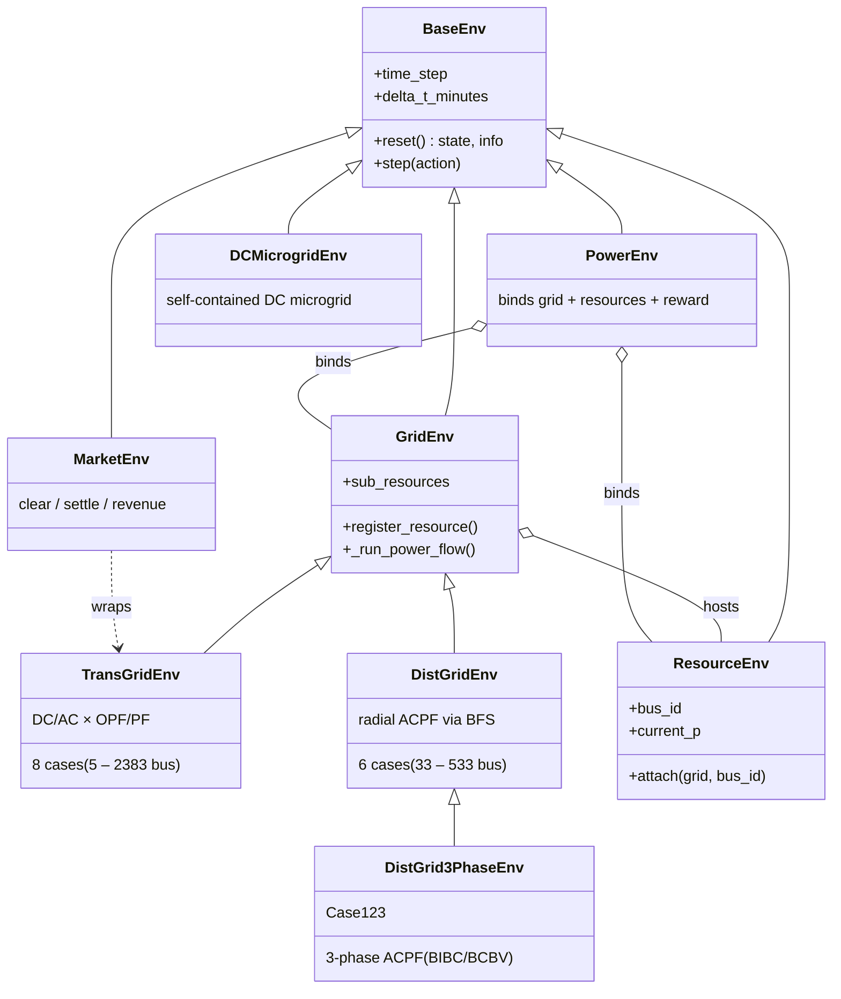

# PowerZoo

PowerZoo is a power-grid simulation library that exposes Gymnasium /
PettingZoo / RLlib-compatible environments for reinforcement-learning
research. It packages transmission and distribution grid simulations,
controllable resources (batteries, EVs, solar, wind, flexible loads, data
centers), DC microgrids, and electricity markets behind a single task-based
API, and ships fixed train/val/test splits drawn from real GB half-hourly
grid traces.

- Python: 3.10 – 3.12
- License: MIT
- Version: 0.2.0

## Install

PowerZoo uses [uv](https://github.com/astral-sh/uv) for dependency
management.

```bash
conda create -n powerzoo python=3.11 -y
conda activate powerzoo

pip install uv
git clone https://github.com/powerzoojax/PowerZooPy.git
cd PowerZooPy

uv sync --python "$(which python)"

# Optional: RL training stack (Stable-Baselines3, PyTorch, Gymnasium)
uv sync --python "$(which python)" --extra rl
```

The base install runs the environments and built-in power-flow / OPF
solvers. Optional extras (`rl`, `marl`, `rllib`, `gurobi`, `cvxpy`,
`charts`, `docs`, `dev`) are declared in `pyproject.toml`.

Verify:

```bash
uv run python -c "import powerzoo; print(powerzoo.__version__)"
```

## Quick start

The recommended entry point is `make_task_env`, which builds a benchmark
task with a fixed train/val/test split and the matching agent interface.

```python
from powerzoo.tasks import make_task_env

env = make_task_env("marl_opf", split="train", framework="pettingzoo")
obs, info = env.reset(seed=42)

while env.agents:
    actions = {a: env.action_space(a).sample() for a in env.agents}
    obs, rewards, terminations, truncations, info = env.step(actions)
```

Single-agent tasks (e.g. `battery_arbitrage`, `dc_scheduling`,
`dc_microgrid`) return a standard Gymnasium env and use the usual 5-tuple
loop. The same environments are also registered with Gymnasium under IDs
such as `PowerZoo/TransGrid-medium-v0`, `PowerZoo/DistGrid-easy-v0`, and
`PowerZoo/MARL-OPF-v0`; see [powerzoo/registration.py](powerzoo/registration.py)
for the full list.

A minimal training script lives at [examples/quickstart.py](examples/quickstart.py).

## What's included

**Grid environments** ([powerzoo/envs/grid/](powerzoo/envs/grid))

- `TransGridEnv` — transmission grid with four solver modes selected by
  two orthogonal flags (`physics`: `dc`/`ac`; `solver_mode`: `opf`/`pf`),
  giving DCOPF, ACOPF, DCPF, and ACPF. Built-in cases: Case5, Case14,
  Case29GB, Case118, Case300, Case552GB, Case1354pegase, Case2383wp.
- `DistGridEnv` — radial distribution feeder with forward–backward sweep
  AC power flow. Built-in cases: Case33bw, Case118zh, Case123, Case141,
  Case533mt (hi/lo).
- `DistGrid3PhaseEnv` — 3-phase unbalanced AC power flow (BIBC/BCBV) for
  Case123.

**Resources** ([powerzoo/envs/resource/](powerzoo/envs/resource))

- `BatteryEnv` — SOC bounds, charge/discharge limits, round-trip efficiency.
- `VehicleEnv` — EV with commute schedule, departure-SOC checks,
  home/away availability.
- `SolarEnv`, `WindEnv` — renewable generation from time-series profiles
  with optional curtailment.
- `FlexLoad` — controllable load with curtailment and demand shifting.
- `DataCenterEnv` — GPU IT power, COP cooling, first-order zone-temperature
  dynamics, EDF task queue.

**Markets** ([powerzoo/envs/market/](powerzoo/envs/market))

- `CostBasedMarketEnv` — LMP arbitrage on top of an OPF backend.
- `BidBasedMarketEnv` — bid-clearing market environment.
- `gencos_marl` — multi-agent generator bidding adapter.

**Microgrid** ([powerzoo/envs/microgrid/](powerzoo/envs/microgrid))

- `DCMicrogridEnv` — self-contained DC microgrid (no external grid),
  combining workload scheduling, cooling, battery, and a diesel generator.

## Tasks and benchmarks

Public benchmark suites (see `powerzoo/tasks/public.py`):

| Suite | Underlying env | Public tasks |
|---|---|---|
| GenCos — market bidding | Case5 + `BidBasedMarketEnv` | `gencos_bidding` |
| TSO — security dispatch | Case5 / Case118 + DC/AC OPF | `marl_uc`, `opf_118`, `comparison_tso_centralized` |
| DSO — distribution operations | Case33bw + 6× `FlexLoad` | `dso` (`make_dso_env`) |
| DERs — voltage / DER coordination | Case33bw / Case118zh + heterogeneous DERs | `marl_der_arbitrage`, `marl_ders_benchmark` |
| DC microgrid | `DCMicrogridEnv` | `dc_microgrid`, `dc_microgrid_safe` |

Smaller starter tasks (`battery_arbitrage`, `marl_opf`, `marl_ev_v2g`,
`dc_scheduling`) sit alongside these for quick iteration.

Reference policies and the evaluator live in
[powerzoo/benchmarks/](powerzoo/benchmarks):

```python
from powerzoo.benchmarks import evaluate, normalized_score
from powerzoo.benchmarks.policies import RandomPolicy, RuleBasedPolicy, OraclePolicy

result = evaluate(RandomPolicy(env.action_space), env, n_episodes=100,
                  task_id="marl_opf")
ns = normalized_score("marl_opf", result["mean_reward"])  # 0 = random, 1 = oracle
```

Constraint-aware tasks expose a separate cost channel via
`info["constraint_costs"]`; `SafeRLWrapper` surfaces it in the standard
6-tuple Safe-RL form.

## Solvers

- DCOPF — `solver_type` selects `scipy`, `cvxpy`, or `gurobi` (auto by
  default). Source: `powerzoo/envs/grid/cal_dcopf_trans.py`.
- ACOPF — built-in Newton–Raphson backend or a pandapower backend.
- DCPF — PTDF · injection.
- ACPF — Newton–Raphson.
- Distribution PF — forward–backward sweep, with a 3-phase variant for
  Case123.

## Architecture



Concrete `ResourceEnv` subclasses (`BatteryEnv`, `VehicleEnv`, `SolarEnv`,
`WindEnv`, `FlexLoad`, `DataCenterEnv`) and `MarketEnv` subclasses
(`CostBasedMarketEnv`, `BidBasedMarketEnv`) are listed under
[What's included](#whats-included) rather than in the diagram, to keep the
class graph readable.

`PowerEnv` is the orchestration façade: each `step` dispatches per-resource
actions, runs the grid power flow, and then composes reward and
observation. Resources register with their parent grid through `attach`,
which assigns a unique ID, stores the resource in `sub_resources`, and
refreshes the node–resource incidence matrix (`nodes_resources_map`) used
to aggregate injections per bus before solving.

## Repository layout

```
powerzoo/
├── envs/                  base, grid, resource, market, microgrid
├── case/                  ClearCase, transmission/, distribution/, registry
├── data/                  DataLoader, manifests, bundled parquet
├── tasks/                 benchmark tasks, adapters, observations, rewards
├── wrappers/              Gymnasium, MARL, Safe-RL, forecast, normalization
├── rl/                    make_env, Trainer, RLConfig, describe
├── benchmarks/            policies, evaluate(), normalized_score, viz
└── registration.py        gymnasium env IDs

examples/                  runnable scripts (case loading → MARL training)
tests/                     pytest suite (envs, tasks, RL paths, ref data)
docs/                      MkDocs source (English + 中文)
benchmarks/                throughput and offline benchmark scripts
agentic/                   reference DRL training scripts and notebook
```

## Documentation

```bash
./run_doc.sh        # mkdocs serve --livereload
./run_doc.sh --fast # skip notebook nbconvert for faster previews
```

The site covers Getting Started, Concepts, Architecture, Physics,
Benchmarks, Training, Examples, and an `mkdocstrings`-rendered API
reference. The English pages under `docs/en/` are the source of truth;
`docs/zh/` is a translation.

## Tests

```bash
uv run pytest                       # full suite
uv run pytest -m functional         # end-to-end functional tests only
uv run pytest tests/envs/           # one subdirectory
```

Reference outputs for power-flow tests are stored under
`tests/ref_data/`.

## Citation

See [CITATION.cff](CITATION.cff).

## License

This codebase is released under the MIT License. See [LICENSE](LICENSE).
