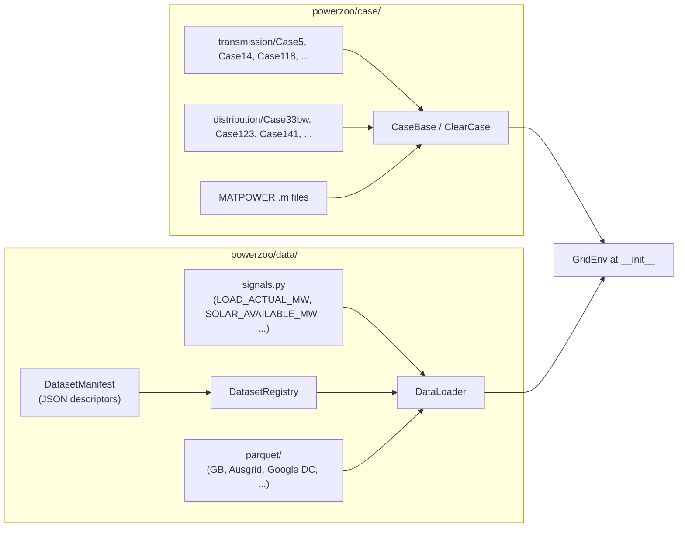

# Data pipeline

PowerZoo separates **case data** (static topology and per-asset parameters) from **time-series data** (loads, renewables, prices, workloads). They live under `powerzoo/case/` and `powerzoo/data/` respectively. Both are loaded once at env construction; the inner `step()` loop never touches disk.



## Case data

`load_case` is the public entry point:

```python
from powerzoo.case import load_case, list_cases

case = load_case(5)                        # integer shorthand
case = load_case("Case5")                  # explicit name
case = load_case("case33bw", grid_type="distribution")
case = load_case("path/to/case30.m")       # MATPOWER .m file

print(list_cases())                        # everything under transmission/ + distribution/
```

A loaded case is a `ClearCase` instance with four DataFrames (`nodes`, `lines`, `units`, `loads`); after `case.init()`, it also exposes pre-computed PTDF / incidence matrices. Built-in cases (≈ 14 today) are pure-Python files under `powerzoo/case/transmission/` or `…/distribution/`; MATPOWER `.m` files are converted on the fly to the same DataFrame schema.

The case object is owned by `GridEnv` and never mutated after construction; every reset re-uses the same case. See [API · Cases](../api/case.md) for the per-method signatures.

## Time-series data

`DataLoader` is the **single public data façade**. Two loading APIs are available:

- **Semantic API** (preferred): `load_signals` — loads data by signal name (e.g. `LOAD_ACTUAL_MW`, `SOLAR_AVAILABLE_MW`), with automatic alignment across heterogeneous sources.
- **Legacy API**: `load_data` — loads by raw column name; kept for backward compatibility.

Both support resampling, date-range filtering and linear interpolation:

```python
from powerzoo.data import DataLoader
from powerzoo.data.signals import LOAD_ACTUAL_MW, SOLAR_AVAILABLE_MW, WIND_AVAILABLE_MW

dl = DataLoader()
df = dl.load_signals(
    [LOAD_ACTUAL_MW, SOLAR_AVAILABLE_MW, WIND_AVAILABLE_MW],
    start_date="2024-01-01",
    end_date="2024-01-31",
    resample="30min",
)
```

Under the hood:

- **`signals.py`** — frozen string constants for every named signal (`LOAD_ACTUAL_MW`, `LOAD_FORECAST_DA_MW`, `SOLAR_AVAILABLE_MW`, `WIND_AVAILABLE_MW`, GB market MID price / volume, GPU utilisation, weather, …).
- **`manifest.py`** — `DatasetManifest` describes one dataset (parquet location, column → signal map, time index conventions).
- **`registry.py`** — `DatasetRegistry` indexes all manifests under `powerzoo/data/manifests/`.
- **`alignment.py`** — re-samples and aligns multi-source signals onto one common index.
- **`parquet/`** — the actual data files (GB demand, GB gen-by-type, GB market MID data, Ausgrid zone substations, Google DC 2019, …).
- **`dc_microgrid_profiles.py`** — convenience loader for the DC microgrid benchmark, including OOD transforms.

## How a `GridEnv` consumes the pipeline

At `__init__`:

1. The case is loaded into a `ClearCase` and `init()` is called (PTDF, incidence matrices, normalisations).
2. Required signals are loaded via `DataLoader` for the requested `start_date` / `end_date` and resampled to `delta_t_minutes`.
3. Per-node load ratios are derived from the case (`d_max / total_d_max`) and cached.

At `reset(day_id=None, randomize_start_time=False)`:

1. A `day_id` is sampled if not provided.
2. The corresponding slice of the time-series array is bound to the env state.
3. `time_step` is reset and the first observation is built.

At `step(action)`:

1. **No I/O** — only the cached time-series array is read by index.
2. The PF solve runs; resources update internal state.
3. `state` and `info` are returned.

This means the data pipeline runs once during construction and once per reset; the inner training loop is pure CPU (or GPU when wrapped in JAX, in the sibling project).

## Per-task data sources

| Task suite | Primary signals | Source |
|---|---|---|
| **GenCos / TSO / DERs (load)** | `LOAD_ACTUAL_MW`, `LOAD_FORECAST_DA_MW` | GB national demand 2023–2026 (30-min) |
| **DERs / TSO (renewable)** | `SOLAR_AVAILABLE_MW`, `WIND_AVAILABLE_MW` | GB gen-by-type (30-min) |
| **Market Lite / price studies** | `MARKET_MID_PRICE_APX`, `MARKET_MID_PRICE_N2EX`, `MARKET_MID_VOLUME_APX`, `MARKET_MID_VOLUME_N2EX` | GB MID market index data aligned to the GB forecast/actual demand timeline (30-min) |
| **DSO** | `LOAD_ACTUAL_MW` per Ausgrid zone substation | Ausgrid FY25 (15-min → 30-min) |
| **DC microgrid** | GPU utilisation, solar CF, outdoor temperature | Google DC 2019 + synthetic / public weather (5-min) |

## See also

- [Repository map](repo-map.md) — where the data files and loaders live.
- [API · Cases](../api/case.md), [API · Orchestration & data](../api/orchestration.md).
- [Benchmarks · DSO](../benchmarks/dso.md) — how Ausgrid feeder shapes are mapped onto `Case33bw`.
- [Benchmarks · DC microgrid](../benchmarks/dc-microgrid.md) — how Google DC traces drive the IT workload.
