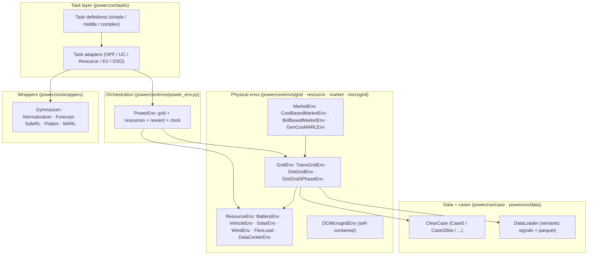
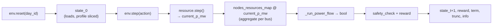
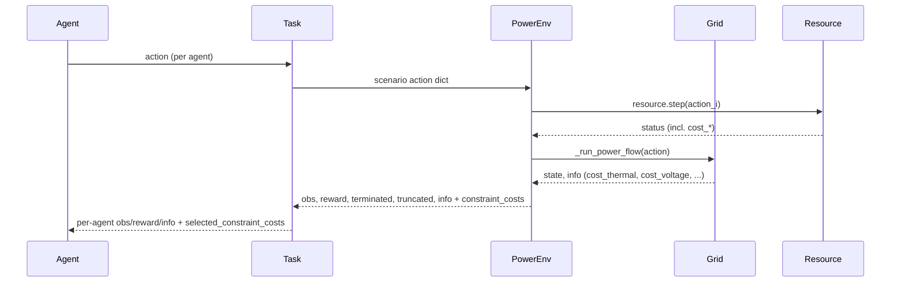

# Environment stack

PowerZoo is built as a **stack of layers** that can each be used in isolation. The lower layers know nothing about RL; the upper layers add the conventions that RL agents and benchmarks rely on. This page focuses on the runtime layers — see [Repository map](repo-map.md) for the source-tree view.

The rest of this page describes each runtime layer in 1–2 short paragraphs and links to the page that documents the details.

---

## 1. `BaseEnv` — common interface

`BaseEnv` (`powerzoo/envs/base.py`) is the abstract parent of every PowerZoo environment. It inherits from `gymnasium.Env` and adds two PowerZoo-specific attributes:

| Attribute / method | Purpose |
|---|---|
| `time_step` | Step counter inside the current episode. |
| `delta_t_minutes` | Step length in minutes (must divide 1440). Default 30. |
| `action_space` / `observation_space` | Filled in by subclasses. |
| `reset(seed, options)` | Resets `time_step` and returns `(state, info)` (subclass-specific). |
| `step(action)` | Subclass-specific. Returns Gymnasium-style 5-tuples at the task layer. |
| `obs()` / `reward()` / `cost()` | Hooks; `cost()` defaults to 0 (CMDP-friendly). |

Subclasses do not store mutable state in arbitrary attributes — `GridEnv` and `ResourceEnv` keep their state in well-defined fields (case data, `current_p_mw`, `soc`, …) so that resets are reproducible.

## 2. `GridEnv` — physical grids

`GridEnv` (`powerzoo/envs/grid/base.py`) is the abstract parent for transmission and distribution grids. Its job is to:

1. Hold a `ClearCase` (topology + per-asset parameters).
2. Maintain a registry of attached resources (`sub_resources`, `nodes_resources_map`).
3. Pull the next slice of demand / renewable time series from the bundled data.
4. Run a power-flow solve and produce a `state` dict plus a structured `info` dict.

The reset → step data flow is the same across all grid types:

Three concrete subclasses ship today:

| Class | Solver | Default case | Notes |
|---|---|---|---|
| `TransGridEnv` | DC / AC × OPF / PF (4 modes) | `Case5` | `physics ∈ {dc, ac}` × `solver_mode ∈ {opf, pf}`. The OPF LP backend is selected by `solver_type ∈ {auto, gurobi, scipy, cvxpy}`. |
| `DistGridEnv` | Single-phase BFS (DistFlow) | `Case33bw` | Resources modelled as PQ injections; non-radial inputs auto-pruned to spanning tree. |
| `DistGrid3PhaseEnv` | Three-phase BIBC/BCBV | `Case123` | Per-phase voltages, VUF and phase-aware thermal limits. |

The full per-class parameter table is in [Physics · Transmission](../physics/transmission.md) and [Physics · Distribution](../physics/distribution.md). The `info` schema and CMDP cost rules live in [Reward and cost split](../concepts/reward-cost-split.md).

## 3. `ResourceEnv` — controllable assets

`ResourceEnv` (`powerzoo/envs/resource/base.py`) is the parent of every controllable asset. **Resources are physical sub-components, not standalone RL envs**: a resource's `step()` updates internal state (SOC, temperature, queue, …) but does not produce a reward or termination signal on its own. The Gymnasium step tuple plus CMDP cost vector in `info` is assembled by `PowerEnv` plus a `Task`.

| Class | Action dim | Notes |
|---|---|---|
| `BatteryEnv` | 1D (or 2D with `enable_q_control`) | SOC integrator with charge/discharge efficiency; one-way `eta_charge=eta_discharge=0.95` by default. |
| `VehicleEnv` | 1D | Battery + commute schedule + departure SOC requirement (G2V / V2G). |
| `SolarEnv` / `WindEnv` | 1D (curtailment) | Profile-driven, optional reactive control. |
| `FlexLoad` | 2D | Curtailment + demand shifting with a deferred-demand buffer (DR resource). |
| `DataCenterEnv` | 3D | GPU train / finetune ratios + cooling setpoint, with first-order thermal dynamics. |

**Cost convention.** Any key in `resource.status()` whose name starts with `cost_` is treated as a non-negative CMDP cost component (in physical units). `PowerEnv` collects them and folds them into `info['cost_resource']` and the fixed-order `constraint_costs` vector; `info['cost_resource_violation']` is a legacy alias — see [Reward and cost split](../concepts/reward-cost-split.md). This is the only registration step needed when adding a new resource cost.

Detailed parameter tables live in [Physics · Resources](../physics/resources.md) and [API · Resources](../api/resource.md).

## 4. `PowerEnv` — orchestration

`PowerEnv` (`powerzoo/envs/power_env.py`) binds a grid and a list of resources into a single Gymnasium-style env. It owns the unified episode clock, builds dict observations (`grid` + per-resource observation + `time` features), accepts dict actions (`unit_power_mw` + per-resource), and produces a fully-augmented `info` dict that aggregates the cost contributions from both layers.

`PowerEnv.from_yaml(path)` builds the same object from a YAML scenario config. Most users never instantiate `PowerEnv` directly; they use `make_task_env(...)` or `powerzoo.rl.make_env(...)`, which build the appropriate `PowerEnv` and adapter automatically.

## 5. Tasks and adapters

A **task** (`powerzoo/tasks/`) is a benchmark preset: a scenario config (grid + resources), an agent design (per-agent obs / action), a reward / cost contract, an evaluation protocol and (when applicable) `SPLIT_DATES` for fixed train / val / test windows. Tasks are organised by difficulty:

- `simple/` — `battery_arbitrage`, `marl_opf`, `marl_der_arbitrage`, `marl_ders_benchmark`, `marl_ev_v2g`, `dc_scheduling`, `dc_microgrid`, `dc_microgrid_safe`, `gencos_bidding`.
- `middle/` — `marl_uc`, `comparison_tso_centralized`.
- `complex/` — `opf_118`, `opf_118_7d`, `joint_trans_dist*` (experimental).

A **task adapter** (`powerzoo/tasks/adapters/`) translates the task into a concrete RL-facing env (e.g. `TaskOPFMultiAgentEnv`, `TaskUCMultiAgentEnv`, `TaskResourceMultiAgentEnv`, `TaskEVMultiAgentEnv`).

The `envs / tasks / wrappers` boundary, per-task adapter routing, and the public benchmark set (stable vs experimental) are all documented in [Python contract](../concepts/python-contract.md) §6–§7. Per-task hyperparameter tables live in [API · Tasks](../api/tasks.md).

## 6. Wrappers

`powerzoo/wrappers/` provides generic env-API adapters. They assume the task contract is already satisfied and do not own task semantics. The full set — `GymnasiumWrapper`, `NormalizationWrapper`, `ForecastWrapper`, `SafeRLWrapper`, `GymnasiumSafeWrapper`, `MARLWrapper`, `TaskPettingZooWrapper`, `FlattenWrapper` — is documented in [Training · Wrappers](../training/wrappers.md); per-class signatures are in [API · Wrappers](../api/wrappers.md).

## 7. Optional layers

The layers above describe the default benchmark stack. Several optional layers extend it:

- **Markets** — `CostBasedMarketEnv`, `BidBasedMarketEnv` and `GenCosMARLEnv` add LMP-driven settlement on top of `TransGridEnv`. See [Physics · Markets](../physics/markets.md) and [Benchmarks · GenCos](../benchmarks/gencos.md).
- **DC microgrid** — `DCMicrogridEnv` is a self-contained behind-the-meter benchmark with no external grid; it composes `DataCenterEnv` + `BatteryEnv` + inline PV + diesel. See [Physics · Microgrid](../physics/microgrid.md) and [Benchmarks · DC microgrid](../benchmarks/dc-microgrid.md).
- **DSO benchmark** — `make_dso_env(...)` is a separate factory that assembles `Case33bw` + 6× `FlexLoad` + Ausgrid time series for distribution-system-operator research. See [Benchmarks · DSO](../benchmarks/dso.md).
- **RL trainer** — `powerzoo.rl` provides `make_env`, `RLConfig`, `Trainer`, `RewardWrapper` and `describe` / `info` for a one-line training workflow. See [Training · Trainers](../training/trainers.md).

---

## See also

- [Repository map](repo-map.md) — source-tree view of the same layers.
- [Data pipeline](data-pipeline.md) — how `case/` and `data/` actually feed an env.
- [Training pipeline](training-pipeline.md) — env → wrappers → trainer flow.
- [Python contract](../concepts/python-contract.md), [Reward and cost split](../concepts/reward-cost-split.md).
