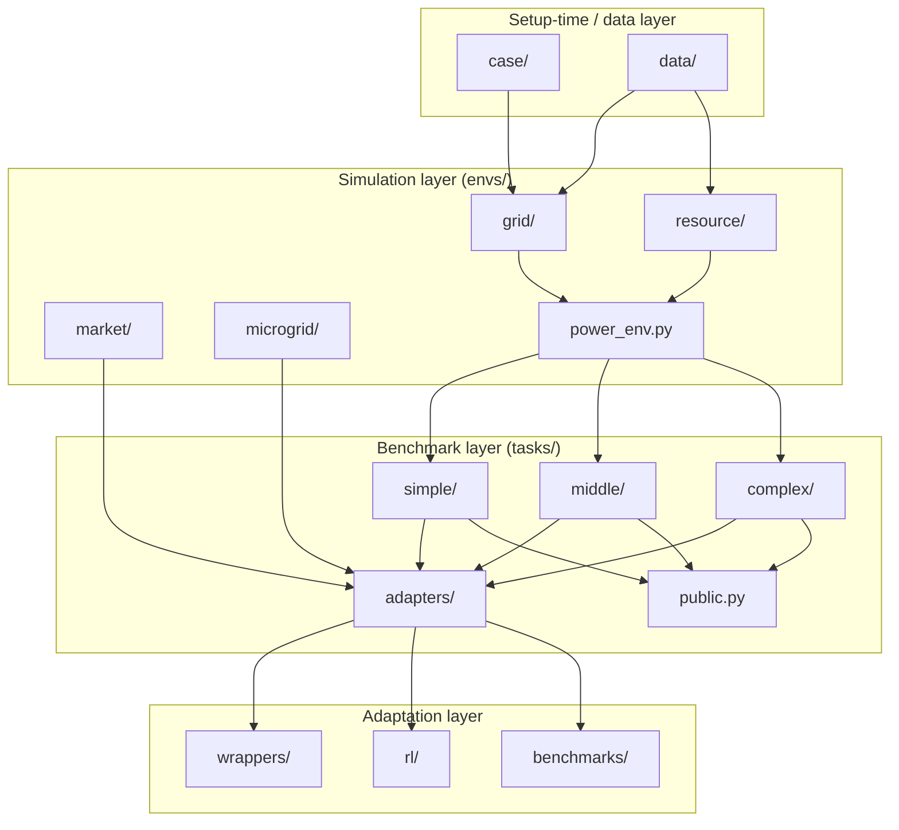

# Repository map

This page is a tour of the source tree. Read it once when you start working with PowerZoo; afterwards you should know where to find any feature.

## Top-level layout

```
PowerZoo/
├── powerzoo/            <- the package itself
│   ├── case/            <- network data and case loaders (Case5, Case33bw, ...)
│   ├── data/            <- DataLoader, semantic signals, parquet manifests
│   ├── envs/            <- physical environments (the simulation core)
│   │   ├── grid/        <- TransGridEnv, DistGridEnv, DistGrid3PhaseEnv + solvers
│   │   ├── resource/    <- BatteryEnv, VehicleEnv, SolarEnv, WindEnv, FlexLoad, DataCenterEnv
│   │   ├── market/      <- CostBasedMarketEnv, BidBasedMarketEnv, GenCosMARLEnv
│   │   ├── microgrid/   <- DCMicrogridEnv (self-contained)
│   │   ├── base.py      <- BaseEnv abstract class
│   │   └── power_env.py <- PowerEnv orchestration façade
│   ├── tasks/           <- benchmark presets, adapters, registry, public task set
│   │   ├── simple/      <- battery_arbitrage, marl_opf, marl_der_arbitrage, ...
│   │   ├── middle/      <- marl_uc, ...
│   │   ├── complex/     <- opf_118, opf_118_7d, joint_trans_dist*
│   │   ├── adapters/    <- TaskOPFMultiAgentEnv, TaskUCMultiAgentEnv, ...
│   │   ├── registry.py  <- register_task, make_task_env, list_tasks
│   │   └── public.py    <- PUBLIC_TASKS, list_public_tasks, get_public_task_catalog
│   ├── wrappers/        <- Gymnasium, Normalization, Forecast, SafeRL, Flatten, MARL
│   ├── benchmarks/      <- evaluate, normalized_score, policies, viz, offline
│   ├── rl/              <- powerzoo.rl: make_env, RLConfig, Trainer, RewardWrapper, describe
│   └── registration.py  <- gym.register entries (PowerZoo/...-v0)
├── examples/            <- runnable scripts (single-file recipes)
├── tests/               <- pytest suite
├── docs/                <- this documentation (en + zh)
├── pyproject.toml       <- dependency manifest
└── mkdocs.yml           <- documentation build config
```

`PowerZooJax/` (a sibling project) is the JAX reimplementation of the same five benchmark suites; it is not a runtime dependency.

## What lives in each top-level layer



The arrows are one-directional. Lower layers do not import upper layers — `envs/` works without `tasks/`, `tasks/` works without `wrappers/`, and so on. This keeps each layer testable in isolation.

## Where to look for…

| If you want to … | Look in |
|---|---|
| Add a new IEEE / MATPOWER case | `powerzoo/case/transmission/` or `…/distribution/` |
| Load real time-series (GB demand, Ausgrid, Google DC) | `powerzoo/data/` (`DataLoader`, `signals.py`, `manifests/`, `parquet/`) |
| Implement a new physical solver | `powerzoo/envs/grid/` (e.g. `cal_dcopf_trans.py`, `_dist_pf.py`) |
| Implement a new controllable resource | `powerzoo/envs/resource/` (subclass `ResourceEnv`) |
| Add a new benchmark task | `powerzoo/tasks/<difficulty>/` + `register_task(...)` in the package `__init__.py` |
| Add a task adapter | `powerzoo/tasks/adapters/` |
| Add a generic env wrapper | `powerzoo/wrappers/` |
| Add a training entry point | `powerzoo/rl/` (`env.py`, `trainer.py`, `config.py`, `reward.py`, `describe.py`) |
| Run a built-in policy / evaluation | `powerzoo/benchmarks/` (`evaluate`, `RandomPolicy`, `OraclePolicy`) |

## Setup-time vs runtime

Two top-level layers are setup-only and never appear in the inner training loop:

- `powerzoo/case/` builds the static topology and parameter tables (`ClearCase`).
- `powerzoo/data/` resolves manifests and reads parquet files into memory.

Everything under `powerzoo/envs/` is on the **hot path**: every `step()` call goes through it. The `wrappers/` and `rl/` layers wrap the hot path but do not duplicate it.

## See also

- [Environment stack](env-stack.md) — how the runtime layers fit together.
- [Data pipeline](data-pipeline.md) — how `case/` and `data/` actually feed an env.
- [Training pipeline](training-pipeline.md) — env → wrappers → trainer flow.
