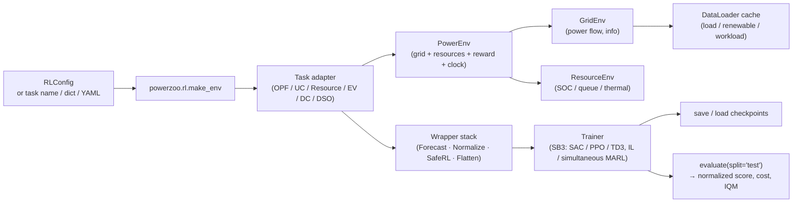

# Training pipeline

This page is the **end-to-end view** of how an RL agent calls one PowerZoo env, receives a reward and a cost, and updates its weights. It collects the moving parts that the [Environment stack](env-stack.md), [Data pipeline](data-pipeline.md) and [Training](../training/trainers.md) pages document individually.

## The full pipeline



Read it left-to-right when designing a new experiment, right-to-left when debugging a finished one.

## Single-agent flow (Gymnasium)

```python
from powerzoo.rl import Trainer

t = Trainer("battery_arbitrage", algorithm="SAC", total_timesteps=200_000)
t.train()
results = t.evaluate(split="test")
t.save("./results/")
```

What happens internally:

1. `Trainer.__init__` resolves the input (task name / dict / YAML / `RLConfig`) into a single `RLConfig` and calls `cfg.validate()`.
2. SB3 is imported lazily; `ALGORITHMS = {SAC, PPO, TD3}` is populated.
3. `t.train()` calls `self.get_env()` → `make_env(...)` → task adapter → `PowerEnv` → grid + resources, then wraps the result with the requested wrappers.
4. The SB3 model is constructed with `cfg.policy` (`'MlpPolicy'` by default), `cfg.hyperparams`, `seed`, and `model.learn(total_timesteps, progress_bar, callback)` runs.
5. `t.evaluate(split='test')` rebuilds the env on the test split and calls `powerzoo.benchmarks.evaluate`, returning mean reward, normalized score, mean episode cost and cost-violation rate.

## Multi-agent flow (PettingZoo Parallel)

```python
from powerzoo.rl import Trainer

t = Trainer("marl_opf", framework="pettingzoo")
t.train_il(total_timesteps=50_000)

t = Trainer("marl_opf", framework="pettingzoo", algorithm="SAC")
t.train_marl_simultaneous(total_timesteps=200_000)
```

- `train_il` runs sequential SB3 `.learn()` per agent (others act with their default policy). Requires homogeneous agent spaces.
- `train_marl_simultaneous` performs one PettingZoo step per env step and updates all agents at once (SAC only). Implementation lives in `powerzoo/rl/marl_simultaneous_sb3.py`.
- For other frameworks (EPyMARL, MAPPO, custom loops), call `t.get_env()` and plug it in directly.

## Wrapper stack

`make_env(...)` accepts a small set of keyword arguments that map to wrappers (applied to single-agent envs only; silently ignored for MARL):

| Argument | Effect |
|---|---|
| `reward=...` | `RewardWrapper` replaces the reward (callable or reward-type dict). |
| `forecast_horizon=N` | `ForecastWrapper` appends `N` future demand values. |
| `normalize=True` | `NormalizationWrapper` rescales obs (and optionally action) to `[-1, 1]`. |
| `safe_rl=True` | `GymnasiumSafeWrapper` injects `info['cost']` from `info['cost_sum']`. |
| `cost_threshold=...` | Forwarded to `GymnasiumSafeWrapper`. |
| `seed=...` | Calls `env.reset(seed=...)` immediately. |

The full per-wrapper reference (including stacking order, `SafeRLWrapper` 6-tuple vs `GymnasiumSafeWrapper` 5-tuple, `ForecastWrapper`'s `perfect`/`noisy`/`none` modes) is in [Training · Wrappers](../training/wrappers.md).

## Where each piece is documented

- [Environment stack](env-stack.md) — `BaseEnv`, `GridEnv`, `ResourceEnv`, `PowerEnv` semantics.
- [Data pipeline](data-pipeline.md) — `DataLoader`, signals, parquet, alignment.
- [Python contract](../concepts/python-contract.md) — what `step()` returns, the 5 observation modes, `framework='auto' / 'pettingzoo' / 'rllib'`.
- [Reward and cost split](../concepts/reward-cost-split.md) — reward vs CMDP cost, the `cost_*` prefix rule.
- [Training · Trainers](../training/trainers.md) — `Trainer.train`, `train_il`, `train_marl_simultaneous`, `evaluate`, `save`, `load`.
- [Training · Wrappers](../training/wrappers.md) — every wrapper signature.
- [Training · Presets](../training/presets.md) — ready-to-use YAML configs.
- [Training · Custom loops](../training/custom-loops.md) — bypass `Trainer` and write your own loop.

## Performance notes

- The hot path (env + wrappers) is pure CPU. PowerZoo does not vectorise envs by itself — use SB3's `make_vec_env` or RLlib's worker pool for batched rollouts.
- The data pipeline runs once at construction and once per reset; nothing in the inner loop touches parquet or disk.
- The OPF LP backend (`solver_type ∈ {auto, gurobi, scipy, cvxpy}`) dominates step time on large cases. Prefer `gurobi` for `Case118` and above when available; `scipy` (HiGHS) is the next best free option.
- For GPU-vectorised rollouts and `lax.scan`-based pipelines, use the sibling [PowerZooJax](https://github.com/powerzoojax/PowerZooJax) project, which reimplements the same five benchmark suites in pure JAX.
