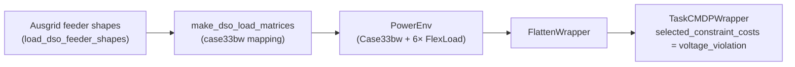

# DSO — Distribution operations

The DSO benchmark assembles `Case33bw` + 6× `FlexLoad` + Ausgrid zone-substation load shapes into one ready-to-train environment. The unifying RL question is **non-stationary single-agent RL**: episodes are driven by real Ausgrid feeder shapes that drift across seasons and across substations, and the agent must use flexible loads to keep voltages in band while minimising network loss.

> **Vocabulary check.** A *DSO* (Distribution System Operator) runs the medium- and low-voltage feeders that connect end customers; its main RL question is "use flexible loads to keep voltages in band while upstream demand follows real exogenous shapes". *FlexLoad* is PowerZoo's demand-response resource: each device has a curtailment quota and a deferred-demand buffer. *Ausgrid* is an Australian distribution utility that publishes 30-minute zone-substation load shapes used as exogenous drivers here.

The benchmark is built as an **independent factory** (`powerzoo.tasks.dso_task.make_dso_env`) instead of a `register_task` entry, because it has its own data pipeline (Ausgrid feeder shapes) and its own task-level CMDP selection (voltage-only from the full distribution-grid cost vector).



## Why this suite

- The only suite driven by **real distribution-level zone-substation loads**, not by transmission-system aggregates.
- Built-in **time-driven distribution shift**: train, IID-test, summer-OOD-test and zone-holdout splits cover season and substation OOD.
- Reward is **operational quality** (network loss + curtailment) rather than safety or cost — a different objective surface from the other four suites.

## Physical setup

| Aspect | Default value |
|---|---|
| Underlying env | `Case33bw` (33-bus single-phase BFS distribution). |
| Resources | 6× `FlexLoad` at buses `[6, 14, 18, 22, 28, 33]`. |
| Voltage limits | `v_min = 0.94 pu`, `v_max = 1.06 pu`. |
| Episode | 48 steps × 30 min = 1 day. |

Three feeder segments on `Case33bw` are driven by **distinct** Ausgrid feeder shapes (so the load shape varies along the feeder, not just in magnitude):

| Feeder | Bus range |
|---|---|
| `feeder_A` | 2 – 18 |
| `feeder_B` | 19 – 22 |
| `feeder_C` | 23 – 33 |

This matches the JAX implementation's feeder segmentation exactly.

## Agent design

| Item | Value |
|---|---|
| Action | `Box(2*N)` = `Box(12,)` — per device `[curtail_fraction, shift_out_fraction]`. |
| Observation | Flat (via `FlattenWrapper`) — bus voltages, branch loadings, time, per-device FlexLoad state. |
| Reward | `-loss_penalty_weight * p_loss_MW` (network loss only; default `loss_penalty_weight = 0.1`). |
| Core constraints | `constraint_names = ("voltage_violation", "thermal_overload", "resource")`; `info["constraint_costs"]` follows this order. |
| Task constraints | `selected_constraint_names = ("voltage_violation",)` with threshold `(5.0,)` and fallback weight `(1.0,)`. |
| Scalar compatibility | `info["cost"]` is produced only by safe-RL compatibility wrappers; it is not the core env contract. |

A 1-device variant exists for fast iteration:

```python
from powerzoo.tasks.dso_task import make_dso_1flex_env
env = make_dso_1flex_env(bus_id=18)   # action_space = Box(2,)
```

## Splits

The Ausgrid pool is split into four roles. `train` / `iid` / `summer_ood` are **time** splits; `zone_holdout` swaps in **held-out substations** on the same dates as `train`.

| Split | Date range | Feeder pool |
|---|---|---|
| `train` | 2024-05-01 – 2024-11-30 | 3 substations per feeder (A / B / C). |
| `iid` | 2024-12-01 – 2025-02-28 | Same substations as `train`. |
| `summer_ood` | 2025-03-01 – 2025-04-30 | Same substations as `train`. |
| `zone_holdout` | 2024-05-01 – 2024-11-30 | 2 different substations per feeder. |

This four-split design lets you measure pure time OOD (`summer_ood`), pure substation OOD (`zone_holdout`) and the in-distribution baseline (`iid`) on the same task.

## Code recipe

```python
from powerzoo.tasks.dso_task import make_dso_env, make_dso_1flex_env
from powerzoo.data import DataLoader

env = make_dso_env(split="train", data_loader=DataLoader())
obs, info = env.reset(seed=0)
obs, reward, terminated, truncated, info = env.step(env.action_space.sample())
```

## Baselines

`dso_task.py` ships three reference baselines and a metrics helper, so a baseline table needs no extra code:

```python
from powerzoo.tasks.dso_task import (
    make_dso_env,
    dso_no_control_rollout,
    dso_tou_heuristic_rollout,
    dso_droop_heuristic_rollout,
    compute_dso_metrics,
    rollout_dso,
)

env = make_dso_env(split="iid")
no_ctrl = dso_no_control_rollout(env)
tou     = dso_tou_heuristic_rollout(env)
droop   = dso_droop_heuristic_rollout(env)
metrics = compute_dso_metrics(no_ctrl, tou, droop)
```

`rollout_dso(env, policy_fn, n_steps=...)` runs a single episode with any callable policy and returns per-step diagnostics.

## Metrics to report

- `network_loss_reduction_pct` — `(loss_no_control - loss_rl) / loss_no_control`.
- `served_flexible_demand_ratio` — fraction of the FlexLoad buffer that is actually served (rather than overflowed).
- `peak_shaving_effectiveness` — `(peak_no_control - peak_rl) / peak_no_control`.
- `voltage_violation_rate` — derived from `selected_constraint_costs`, and should be near zero.
- `drift_tracking_gap` — `NormScore(iid) - NormScore(summer_ood)`; the primary robustness metric.
- `NormScore` — standard, against the no-control baseline.

## See also

- [Distribution physics](../physics/distribution.md) — the BFS solver that drives this benchmark.
- [Resources · FlexLoad](../physics/resources.md#flexload-demand-response) — the controllable asset used here.
- [Architecture · Data pipeline](../architecture/data-pipeline.md) — how Ausgrid traces flow into the env.
- `powerzoo/tasks/dso_task.py` — full source (factory + baselines + metrics).
