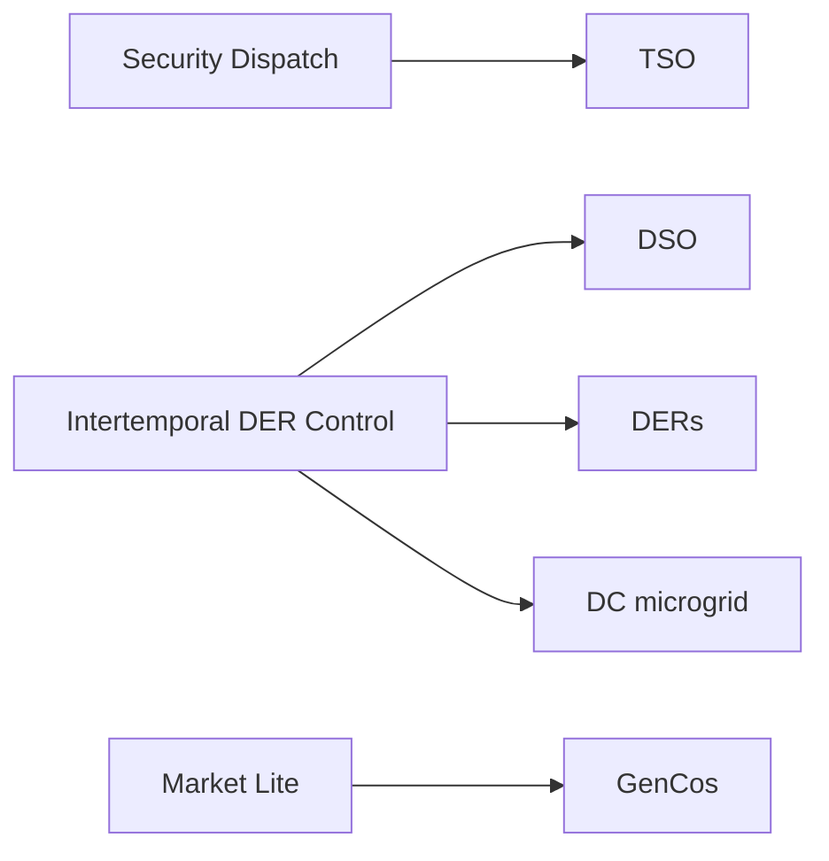

# Benchmarks overview

PowerZoo's public benchmark set is organised around **five agent-centric task suites**. Each suite targets a different RL research question and uses a different underlying environment, agent structure, action space and constraint regime; any two suites therefore differ on at least four of these dimensions.

## The five suites

| Suite | Pillar | Underlying env | Agents | Steps × Δt | RL paradigm |
|---|---|---|---|---|---|
| [TSO](tso.md) | Security dispatch | Transmission `Case5` / `Case118` | 1 (UC) / 54 (`opf_118`) | 48 × 30 min (336 × 30 min for 7d) | Safe RL with mixed discrete-continuous action |
| [DSO](dso.md) | DER control | Distribution `Case33bw` + 6× `FlexLoad` + Ausgrid | 1 | 48 × 30 min | Non-stationary RL (loss minimisation) |
| [DERs](ders.md) | DER control | Distribution `Case33bw` / `Case118zh` + heterogeneous DERs | 3 / 5 / 12 | 48 × 30 min (168 for EV) | Scalable safe MARL |
| [DC microgrid](dc-microgrid.md) | DER control | Self-contained DC microgrid | 1 | 288 × 5 min | Multi-objective robust RL |
| [GenCos](gencos.md) | Market lite | Transmission `Case5` + market clearing | 5 | 48 × 30 min | Competitive MARL |

Each suite targets a different RL paradigm, but all five share the same `make_task_env` interface and the same reward / cost split. No single algorithm performs best on all five suites; this is by design.



## Public PowerZoo task names per suite

| Suite | PowerZoo task(s) |
|---|---|
| TSO | [`marl_uc`](tso.md) (UC, `Case5`), [`opf_118`](tso.md), [`opf_118_7d`](tso.md) (large-scale ED, `Case118`) |
| DSO | [`make_dso_env(...)`](dso.md) factory (assembled outside the standard registry) |
| DERs | [`marl_der_arbitrage`](ders.md) (`Case33bw`, 3 batteries), [`marl_ders_benchmark`](ders.md) (`Case118zh`, 12 heterogeneous DERs), [`marl_ev_v2g`](ders.md) (5 EVs) |
| DC microgrid | [`dc_microgrid`](dc-microgrid.md), [`dc_microgrid_safe`](dc-microgrid.md) |
| GenCos | [`gencos_bidding`](gencos.md) |

Smaller starter tasks sit outside the main set but remain in the public API: `battery_arbitrage`, `marl_opf` (5-bus MARL ED), `dc_scheduling`. They are the recommended first targets for unit testing and quick iteration; see [Examples](../examples/index.md).

## How to read a benchmark page

Every per-suite page follows the same template:

1. **Design intent and research question** — what RL difficulty this suite is built for.
2. **Physical setup** — case, resources, constraints.
3. **Agent design** — observation, action, reward, cost.
4. **Variants** — the in-suite difficulty ladder.
5. **Splits** — train / val / test (or train / iid / OOD for DSO).
6. **Baselines** — random, rule-based, and any oracle reference.
7. **Metrics** — what to report.
8. **Code recipes** — `make_task_env(name)` + a minimal training stub.

## Difficulty axes across the five suites

The suites together span five orthogonal difficulty axes. You can cite this matrix in a paper to argue that the benchmark is diverse:

| Axis | Easiest | → | Hardest |
|---|---|---|---|
| Information structure | TSO (centralised full info) | DSO (single-agent non-stationary) → DERs (Dec-POMDP) | GenCos (private-info competition) |
| Action complexity | DSO (continuous) | DC (multi-dim continuous) → DERs (per-agent joint) → TSO (mixed) | GenCos (multi-agent strategic) |
| Safety regime | GenCos (profit-driven) | DSO (operational quality) → DC (SLA + thermal + power balance) | DERs (hard voltage) → TSO (full safety) |
| Exogenous uncertainty | TSO (intra-day variation) | DSO (drift) → DERs (renewable) | DC (workload + solar + thermal) → GenCos (+ adaptive opponents) |
| Objective complexity | GenCos (profit) | DSO (loss + serve) → TSO (cost + safety) | DERs (safety + fairness) → DC (3-vector + constraints) |

Each axis has a monotone ordering across the five suites, so picking different suites gives different RL difficulty rather than the same problem under different names.

## What the public-API helpers report

```python
from powerzoo.tasks import PUBLIC_TASKS, list_public_tasks, get_public_task_catalog

print(PUBLIC_TASKS)
print(list_public_tasks())
catalog = get_public_task_catalog()
print(catalog[0]['task_id'], catalog[0]['default_episode_horizon_steps'])
```

`PUBLIC_TASKS` includes the five main suites plus the smaller starter tasks. `make_dso_env(...)` is the only main task absent from `PUBLIC_TASKS`: it uses its own factory instead of the standard registry.

## See also

- [Concepts · Overview](../concepts/overview.md) — the three pillars view.
- [Python contract](../concepts/python-contract.md) — env API every benchmark obeys.
- [Reward and cost split](../concepts/reward-cost-split.md) — CMDP framing common to all benchmarks.
- [Training · Trainers](../training/trainers.md) — how to train an agent on any of these tasks in one line.
