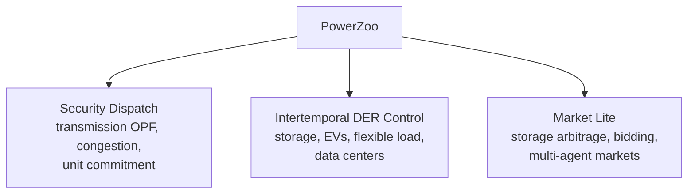
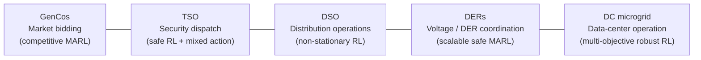

# Overview

PowerZoo is a power-system simulation framework for reinforcement learning (RL) research. It is not a general-purpose power simulator; the goal is to expose a small number of physically grounded benchmarks that ML researchers can train on with the Gymnasium / PettingZoo / RLlib pipelines they already use.

This page is the shortest mental-model sketch; the other pages in this section go deeper into each idea.

## Who this benchmark is for

Two audiences read this documentation:

- **ML readers** who want a Gymnasium-compatible benchmark with realistic physical dynamics, hard safety constraints, real time-series drivers, and a clean reward / cost interface.
- **Power-systems readers** who want to drive their existing physical models from PyTorch, RLlib, or Stable-Baselines3 without writing a new simulator.

Both want the same thing: physics that is intrinsically hard, and an API that does not get in the way.

## The three pillars

PowerZoo's environments split into three benchmark pillars. Each pillar is a different physical regime and produces a different kind of RL difficulty.

- **Security Dispatch** is built around shared network constraints — one generator's action changes the feasible set seen by every other generator through a power-flow solver.
- **Intertemporal DER Control** turns physical memory (state of charge, deferred demand, queued jobs, thermal inertia) into RL state, so credit assignment is delayed and partially observable.
- **Market Lite** overlays simplified nodal pricing on top of dispatch, so reward depends on both price timing and physical feasibility.

> **Vocabulary check.** *DER* (Distributed Energy Resource) — small generators, storage, EVs, or controllable loads at the distribution level. *SOC* (State Of Charge) — energy currently stored in a battery as a fraction of capacity. *LMP* (Locational Marginal Price) — marginal cost of one extra MWh at a specific bus. *CMDP* (Constrained MDP) — an MDP with explicit cost-budget constraints in addition to the reward objective.

## The five benchmark suites

The pillars correspond to **five agent-centric task suites**. Each suite has its own underlying environment, agent structure, action space and constraint regime; any two suites differ on at least four of these dimensions.

Each suite is reached via a stable PowerZoo task name (or factory). See [Benchmarks · Overview](../benchmarks/overview.md) for the summary table; each suite also has its own page.

## Where the difficulty actually comes from

Many "RL for power" benchmarks hide difficulty inside opaque solvers or inconsistent state. PowerZoo takes the opposite approach: difficulty should come from physics, not from the API. The four sources of difficulty are:

1. **Hard physical constraints.** Voltage, thermal, SOC and EV departure limits cannot be softened. Reward shaping cannot guarantee feasibility — Safe-RL is the standard framing.
2. **Coupled multi-agent decisions.** Generators share transmission lines; DERs share a feeder. One agent's action shifts every other agent's constraint set through power-flow physics, with no explicit communication channel.
3. **Long-horizon credit assignment.** A battery charged at 03:00 earns profit at 18:00; an EV must hit a departure SOC several hours ahead. Standard discount factors blur the signal.
4. **Non-stationary exogenous drivers.** Real GB demand, solar and wind traces (plus Ausgrid feeder shapes for DSO and Google / Azure / Alibaba traces for DC microgrid) make every episode different.

The next pages turn each of these into concrete contracts:

- [Python contract](python-contract.md) — what every PowerZoo env must implement and what an agent gets back from `step()`.
- [Reward and cost split](reward-cost-split.md) — how PowerZoo enforces the CMDP separation between economic objective and physical safety.
- [Power systems primer](power-systems-primer.md) — the underlying physics, written for an ML audience.
