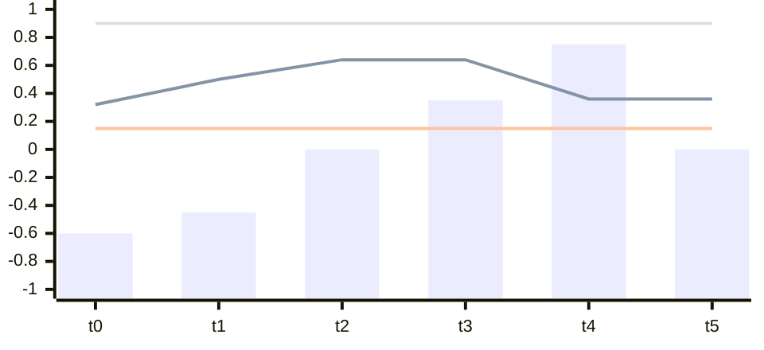

# Power Systems Primer for ML Researchers

This page introduces the essential power-system concepts that underpin PowerZoo's environments. No electrical-engineering background is assumed — every concept is motivated by its impact on the RL problem.

The intended reading order is: first build intuition for the network and power flow, then look at dispatch problems, then move to stateful devices such as batteries and EVs, and finally return to safety constraints and real time-series drivers.

The map below previews how each physical object in the next sections maps to a familiar RL concept. Use it as a quick reference while reading.

```mermaid
flowchart LR
    subgraph Phys ["Physical object"]
      P1[Bus / line / PF solve]
      P2[Generator + cost curve]
      P3[Battery / EV SOC]
      P4[Voltage / thermal limits]
      P5[Real load · solar · wind traces]
    end
    subgraph RL ["RL concept"]
      R1[Coupled state transition\n(physics-mediated agent coupling)]
      R2[Per-agent action + shared reward]
      R3[Hidden integrator state\n(long-horizon credit assignment)]
      R4[CMDP cost channel\n(safety constraint)]
      R5[Non-stationary exogenous process\n(distribution shift)]
    end
    P1 --> R1
    P2 --> R2
    P3 --> R3
    P4 --> R4
    P5 --> R5
```

If you are already comfortable with the physics, jump straight to [Python contract](python-contract.md) for the env API and to [Reward and cost split](reward-cost-split.md) for the CMDP framing. The deeper physics derivations live under [Physics](../physics/transmission.md).

---

## 1. Network and Physics

Start by building intuition for what the grid is and what the environment computes at each step. This section moves from static structure to the physical solve that ties all injections together.

<a id="1-the-power-grid-as-a-graph"></a>
### 1.1 The Power Grid as a Graph

A power grid can be represented as a **graph** where:

- **Buses** (nodes, labelled **B1–B4** in the diagram) are connection points — every resource injects or withdraws power at a bus.
- **Lines** (edges, labelled **L1–L4**) carry power between buses. Each line has a **thermal rating** (maximum MW) and an **impedance** (resistance + reactance).
- **Generators** (labelled **G**, drawn as a circle with a sine-wave symbol) inject power *into* a bus — the arrow points toward the bus bar.
- **Loads / demand** (labelled **D**) withdraw power *from* a bus — the arrow points away from the bus bar.

<div style="margin: 1.25rem 0 1rem;">
  <svg
    viewBox="0 0 760 500"
    role="img"
    aria-labelledby="power-grid-graph-title power-grid-graph-desc"
    style="display: block; width: 100%; max-width: 760px; height: auto; margin: 0 auto;"
  >
    <title id="power-grid-graph-title">4-bus power grid example</title>
    <desc id="power-grid-graph-desc">
      A 4-bus ring network: generator G1 and load D1 at Bus 1 (top-left), load D2 at Bus 2 (top-right),
      load D3 at Bus 3 (bottom-left), generator G2 and load D4 at Bus 4 (bottom-right).
      Lines L1 (B1–B2), L2 (B1–B3), L3 (B2–B4), and L4 (B3–B4) form the ring.
    </desc>
    <defs>
      <marker id="arr-en" viewBox="0 0 10 10" refX="9" refY="5" markerWidth="7" markerHeight="7" orient="auto">
        <path d="M 0 0 L 10 5 L 0 10 z" fill="currentColor"></path>
      </marker>
    </defs>

    <g style="color: var(--md-default-fg-color); font-family: var(--md-text-font, -apple-system, BlinkMacSystemFont, 'Segoe UI', sans-serif);">

      <!-- Transmission lines (behind bus bars) -->
      <!-- L1: B1–B2, U-path -->
      <path d="M 258,165 V 210 H 502 V 165" fill="none" stroke="currentColor" stroke-width="2" stroke-linecap="round" stroke-linejoin="round"></path>
      <!-- L2: B1–B3, vertical left -->
      <line x1="145" y1="165" x2="145" y2="370" stroke="currentColor" stroke-width="2" stroke-linecap="round"></line>
      <!-- L3: B2–B4, vertical right -->
      <line x1="615" y1="165" x2="615" y2="370" stroke="currentColor" stroke-width="2" stroke-linecap="round"></line>
      <!-- L4: B3–B4, U-path -->
      <path d="M 258,370 V 415 H 502 V 370" fill="none" stroke="currentColor" stroke-width="2" stroke-linecap="round" stroke-linejoin="round"></path>

      <!-- Bus bars -->
      <line x1="88" y1="165" x2="268" y2="165" stroke="currentColor" stroke-width="8" stroke-linecap="round"></line>
      <line x1="492" y1="165" x2="672" y2="165" stroke="currentColor" stroke-width="8" stroke-linecap="round"></line>
      <line x1="88" y1="370" x2="268" y2="370" stroke="currentColor" stroke-width="8" stroke-linecap="round"></line>
      <line x1="492" y1="370" x2="672" y2="370" stroke="currentColor" stroke-width="8" stroke-linecap="round"></line>

      <!-- G1: generator at B1 (top-left) -->
      <circle cx="112" cy="94" r="29" fill="var(--md-default-bg-color, white)" stroke="currentColor" stroke-width="2"></circle>
      <path d="M 98,94 C 104,83 120,105 126,94" fill="none" stroke="currentColor" stroke-width="1.8"></path>
      <line x1="112" y1="123" x2="112" y2="158" stroke="currentColor" stroke-width="2" stroke-linecap="round" marker-end="url(#arr-en)"></line>

      <!-- D1: demand arrow up from B1 -->
      <line x1="200" y1="165" x2="200" y2="65" stroke="currentColor" stroke-width="2" stroke-linecap="round" marker-end="url(#arr-en)"></line>

      <!-- D2: demand arrow up from B2 -->
      <line x1="570" y1="165" x2="570" y2="65" stroke="currentColor" stroke-width="2" stroke-linecap="round" marker-end="url(#arr-en)"></line>

      <!-- D3: demand arrow down from B3 -->
      <line x1="190" y1="370" x2="190" y2="455" stroke="currentColor" stroke-width="2" stroke-linecap="round" marker-end="url(#arr-en)"></line>

      <!-- G2: generator at B4 (bottom-right) -->
      <circle cx="648" cy="436" r="29" fill="var(--md-default-bg-color, white)" stroke="currentColor" stroke-width="2"></circle>
      <path d="M 634,436 C 640,425 656,447 662,436" fill="none" stroke="currentColor" stroke-width="1.8"></path>
      <line x1="648" y1="407" x2="648" y2="377" stroke="currentColor" stroke-width="2" stroke-linecap="round" marker-end="url(#arr-en)"></line>

      <!-- D4: demand arrow down from B4 -->
      <line x1="548" y1="370" x2="548" y2="455" stroke="currentColor" stroke-width="2" stroke-linecap="round" marker-end="url(#arr-en)"></line>

      <!-- Bus labels -->
      <text x="70" y="172" text-anchor="end" font-size="19" font-weight="600" fill="currentColor">B1</text>
      <text x="690" y="172" font-size="19" font-weight="600" fill="currentColor">B2</text>
      <text x="70" y="377" text-anchor="end" font-size="19" font-weight="600" fill="currentColor">B3</text>
      <text x="690" y="377" font-size="19" font-weight="600" fill="currentColor">B4</text>

      <!-- Component labels -->
      <text x="150" y="82" font-size="17" fill="currentColor">G1</text>
      <text x="212" y="58" font-size="17" fill="currentColor">D1</text>
      <text x="582" y="58" font-size="17" fill="currentColor">D2</text>
      <text x="202" y="473" font-size="17" fill="currentColor">D3</text>
      <text x="560" y="473" font-size="17" fill="currentColor">D4</text>
      <text x="686" y="454" font-size="17" fill="currentColor">G2</text>

      <!-- Line labels -->
      <text x="380" y="204" text-anchor="middle" font-size="17" fill="currentColor">L1</text>
      <text x="102" y="272" text-anchor="end" font-size="17" fill="currentColor">L2</text>
      <text x="628" y="272" font-size="17" fill="currentColor">L3</text>
      <text x="380" y="432" text-anchor="middle" font-size="17" fill="currentColor">L4</text>

    </g>
  </svg>
</div>

The diagram shows a 4-bus ring: two generators (G1 at B1, G2 at B4), four demand points (D1–D4, one per bus), and four lines (L1–L4) connecting adjacent buses. Every bus has at least one resource attached; every line is a physical path through which power can flow.

**Why this matters for RL:** No bus operates independently. Increasing generator G1's output raises flows on *both* L1 (B1 → B2) and L2 (B1 → B3) at the same time, changing conditions at B2, B3, and B4 — without any direct signal passing between those buses. This **physics-mediated coupling** is what makes multi-agent grid control fundamentally different from typical MARL benchmarks like StarCraft or traffic control, where agents interact only through explicit game mechanics.

---

<a id="2-power-flow-the-physics-engine"></a>
### 1.2 Power Flow: The Physics Engine

Power flow (load flow) is the grid's **physics step**. Given all injections (generation, load, storage), it computes:

- **Voltage** at every bus (magnitude and angle)
- **Current / power flow** on every line
- **Losses** (real power dissipated in line impedance)

#### DC Power Flow (Linear Approximation)

Assumes voltages are all 1.0 pu, ignores reactive power and losses:

$$P_{\text{line}} = \text{PTDF} \times P_{\text{injection}}$$

where PTDF (Power Transfer Distribution Factor) is a constant matrix derived from line impedances. This is a **single matrix-vector multiply** — fast and differentiable, but only approximate.

**RL implication:** DC power flow is a linear constraint. The feasible action set is a polytope. Constraint satisfaction can be verified analytically.

#### AC Power Flow (Nonlinear, Full Physics)

Solves the nonlinear power-balance equations at each bus:

$$P_i = V_i \sum_j V_j (G_{ij} \cos\theta_{ij} + B_{ij} \sin\theta_{ij})$$

$$Q_i = V_i \sum_j V_j (G_{ij} \sin\theta_{ij} - B_{ij} \cos\theta_{ij})$$

where $V_i$ is voltage magnitude, $\theta_{ij}$ is voltage angle difference, and $G_{ij}$, $B_{ij}$ are conductance and susceptance from the admittance matrix.

**RL implication:** AC power flow makes the transition function **nonlinear and non-convex**. Small action changes can cause large voltage swings. The solver may fail to converge (infeasible dispatch) — the environment must handle this gracefully.

#### Distribution vs Transmission

| Property | Transmission (HV) | Distribution (MV/LV) |
|---|---|---|
| Topology | Meshed (loops) | Radial (tree) |
| Voltage level | 110–765 kV | 0.4–33 kV |
| Solver | PTDF / Newton–Raphson | Forward-backward sweep (BFS) |
| Key constraint | Line thermal limits | Voltage magnitude limits |
| R/X ratio | Low (≈0.1) — reactance-dominant | High (≈1.0) — resistance and reactance comparable |
| DER penetration | Low (large generators) | High (solar, batteries, EVs) |

**RL implication:** Transmission tasks emphasize **global coordination** among large generators. Distribution tasks emphasize **local voltage regulation** with many small resources. PowerZoo provides both.

---

## 2. Dispatch Problems: How the System Chooses Output

Once the network and physics are clear, the benchmark's main decision problems become easier to place: single-step OPF and inter-temporal UC.

<a id="3-optimal-power-flow-opf"></a>
### 2.1 Optimal Power Flow (OPF)

OPF answers: *Given demand, what is the cheapest feasible generation dispatch?*

$$\min_{P_g} \sum_i C_i(P_{g,i}) \quad \text{s.t.} \quad \text{power balance, line limits, voltage limits}$$

where $C_i(P_{g,i}) = mc\_a_i P_{g,i}^2 + mc\_b_i P_{g,i} + mc\_c_i$ is the quadratic total-cost curve of generator $i$. In PowerZoo, `mc_a`, `mc_b`, `mc_c` are the coefficients of this polynomial total-cost function. For cases where `mc_a = mc_b = 0` (e.g. Case5), `mc_c` is the flat marginal cost in $/MWh and the cost simplifies to $C(P) = mc\_c \cdot P$.

The OPF solution is the **oracle baseline** in PowerZoo's `marl_opf` and `opf_118` tasks. A perfect RL policy would replicate OPF dispatch without access to the solver.

**Why not just run OPF?** In practice:
- OPF requires full system knowledge (all costs, all limits) — RL agents may have partial observability.
- OPF is a static single-step optimization — it does not account for inter-temporal constraints (battery SOC, ramping, startup costs).
- Large-scale AC-OPF is NP-hard; RL offers a real-time approximation path.

#### Locational Marginal Price (LMP)

LMP is the dual variable (shadow price) of the power balance constraint at each bus. It tells you: *How much would total system cost increase if demand at bus $i$ increased by 1 MW?*

$$\text{LMP}_i = \lambda + \sum_k \mu_k \cdot \text{PTDF}_{k,i}$$

where $\lambda$ is the system energy price and $\mu_k$ are congestion multipliers for binding line constraints.

**RL implication:** LMPs are the standard price signal for storage and DER agents. In `marl_der_arbitrage`, `CostBasedMarketEnv` and `BidBasedMarketEnv`, agents observe LMP-derived signals and must learn to buy low / sell high — a temporal credit assignment problem.

---

<a id="4-unit-commitment-uc"></a>
### 2.2 Unit Commitment (UC)

UC extends OPF with binary on/off decisions and inter-temporal constraints:

$$\min \sum_{t} \sum_{i} \bigl[ C_i(P_{g,i,t}) \cdot u_{i,t} + S_i^{\text{up}} \cdot z_{i,t} + S_i^{\text{dn}} \cdot w_{i,t} \bigr]$$

subject to:

- **Power balance** at each time step
- **Generation limits**: $P_{\min} \cdot u_{i,t} \leq P_{g,i,t} \leq P_{\max} \cdot u_{i,t}$
- **Minimum up/down time**: once started, a unit must stay on for $T_{\text{up}}$ steps; once shut down, it must stay off for $T_{\text{dn}}$ steps
- **Ramp rate**: $|P_{g,i,t} - P_{g,i,t-1}| \leq R_i$
- **Startup / shutdown indicators**: $z_{i,t} \geq u_{i,t} - u_{i,t-1}$, $w_{i,t} \geq u_{i,t-1} - u_{i,t}$

**RL implication:** The `marl_uc` task requires **mixed discrete-continuous actions** — each agent outputs `[score, on_off]`. Minimum up/down time creates **temporal coupling** across steps. A greedy policy that ignores future demand may incur large startup costs. This makes `marl_uc` a useful testbed for algorithms that handle hybrid action spaces and long-horizon planning.

---

## 3. Flexible Devices and Inter-Temporal State

This layer focuses on resources that carry state across time. Their actions are not just about current feasibility; they reshape what is possible later in the episode.

<a id="5-battery-storage-and-soc-dynamics"></a>
### 3.1 Battery Storage and SOC Dynamics

Battery state-of-charge (SOC) evolves as:

$$\text{SOC}_{t+1} = \text{SOC}_t + \frac{\Delta t}{E_{\text{cap}}} \begin{cases} -P_t \cdot \eta_{\text{charge}} & \text{if charging } (P_t < 0) \\ -P_t / \eta_{\text{discharge}} & \text{if discharging } (P_t > 0) \end{cases}$$

subject to $\text{SOC}_{\min} \leq \text{SOC}_{t+1} \leq \text{SOC}_{\max}$ and $P_{\min} \leq P_t \leq P_{\max}$.

The sketch below keeps the encoding compact: bars are power actions, and the three lines are SOC, `SOC_min`, and `SOC_max`. The point is not exact units, but the structure of “charge first, discharge later” and how current actions reshape later feasibility.



**RL implication:** SOC is a **hidden integrator state** — current actions constrain future feasibility. An agent that fully discharges at time $t$ cannot respond to a price spike at $t+1$. This requires **long-horizon credit assignment**, similar to inventory management but with efficiency losses, power limits, and grid coupling.

---

<a id="6-electric-vehicles-g2v-v2g"></a>
### 3.2 Electric Vehicles (G2V / V2G)

EVs add scheduling constraints on top of battery dynamics:

- **Availability**: The EV can only charge/discharge when parked at home. During commute hours, the agent must output zero.
- **Departure SOC**: The EV must reach $\text{SOC} \geq \text{SOC}_{\text{departure}}$ before leaving. Missing this deadline is a hard constraint violation.
- **Stochastic schedule**: Departure/arrival times may vary across episodes.

This diagram separates the two EV-specific constraints: availability windows determine when action is allowed, while the `departure deadline` and departure SOC requirement determine when the battery must already be ready.

```mermaid
gantt
    title EV timeline: availability constraint and departure deadline
    dateFormat HH:mm
    axisFormat %H:%M
    section Available windows
    Home / available     :home1, 08:00, 2h
    Home / available     :home2, 11:00, 2h
    section Unavailable
    Commute / unavailable :away1, 10:00, 1h
    section Constraints
    Departure SOC req.    :milestone, soc1, 09:50, 10m
    EV departure deadline :vert, dep1, 10:00, 1m
```



**RL implication:** The `marl_ev_v2g` task combines **temporal credit assignment** (charge now for departure later), **hard deadline constraints** (departure SOC), and **availability masking** (zero-action periods). Agents cannot simply learn a static charge profile — they must adapt to varying schedules within each episode.

---

## 4. Safety Constraints and Exogenous Drivers

The network, dispatch, and devices above all operate under two higher-level conditions: hard safety boundaries and real time-series inputs that make the environment non-stationary.

<a id="7-voltage-and-thermal-limits-safety-constraints"></a>
### 4.1 Voltage and Thermal Limits — Safety Constraints

Power systems enforce **hard physical constraints**:

| Constraint | Physical meaning | Consequence of violation |
|---|---|---|
| **Voltage** ($V_{\min} \leq V_i \leq V_{\max}$) | Bus voltage must stay within ±5% of nominal | Equipment damage, cascading outage |
| **Thermal** ($|S_k| \leq S_k^{\max}$) | Line apparent power must not exceed rating | Conductor sag, insulation failure, fire |
| **SOC bounds** | Battery cannot exceed physical capacity | Cell degradation, safety hazard |
| **Generation limits** ($P_{\min} \leq P_g \leq P_{\max}$) | Generator output within nameplate range | Mechanical stress, turbine damage |

In PowerZoo these violations are **not** penalised through reward. They flow into separate CMDP cost channels (`constraint_costs` plus named `cost_*` components), with scalar `info['cost']` reserved for compatibility wrappers. The full rules — which cost components each task uses, how resources expose them, how wrappers convert them — live in [Reward and cost split](reward-cost-split.md).

**RL implication:** Standard reward shaping (adding a penalty term to reward) conflates economic objectives with safety requirements. CMDP separation lets researchers experiment with Lagrangian methods, constrained policy optimisation (CPO) or primal-dual approaches. The `SafeRLWrapper` exposes the cost signal in OmniSafe-compatible format.

---

<a id="8-time-series-data-and-non-stationarity"></a>
### 4.2 Time-Series Data and Non-Stationarity

PowerZoo bundles real half-hourly time series from the GB (Great Britain) electricity system:

- **System demand**: total national load (MW), showing daily/weekly/seasonal patterns
- **Solar capacity factor**: fraction of installed PV actually generating (0–1)
- **Wind capacity factor**: fraction of installed wind actually generating (0–1)

These drive the exogenous dynamics in every task. Key properties:

| Property | Impact on RL |
|---|---|
| **Diurnal cycle** (peak at 18:00, trough at 04:00) | Policies must learn time-of-day patterns |
| **Weekly seasonality** (weekday vs weekend) | Generalization across week structure |
| **Seasonal variation** (winter peak ≈ 1.5× summer) | Train/val/test splits span different seasons — distribution shift |
| **Weather correlation** (solar ↔ cloud, wind ↔ storm) | Multivariate exogenous state, imperfect forecasts |
| **Trend** (increasing renewables, decreasing baseload) | Year-over-year concept drift |

**RL implication:** Policies trained on summer data may fail in winter. The fixed train/val/test date splits (non-overlapping, spanning 2023–2025) test whether agents learn robust strategies rather than memorizing specific load patterns.

---

<a id="9-summary-what-makes-this-domain-unique-for-rl"></a>
## 5. Why This Becomes a Distinct RL Problem

| Power property | RL challenge | PowerZoo task |
|---|---|---|
| Power flow couples all buses | Implicit agent coupling | All grid tasks |
| Nonlinear AC equations | Non-convex transition | AC-mode tasks |
| Hard voltage/thermal limits | CMDP, safe RL | All tasks via `SafeRLWrapper` |
| Generator cost curves | Multi-agent credit assignment | `marl_opf`, `opf_118` |
| SOC integrator dynamics | Long-horizon planning | `marl_der_arbitrage`, `marl_ev_v2g` |
| On/off + continuous dispatch | Hybrid action spaces | `marl_uc` |
| Real time-series driving loads | Distribution shift, generalization | All tasks (train/val/test splits) |
| EV departure deadlines | Hard deadline constraints | `marl_ev_v2g` |
| Competing cost vs safety | Pareto trade-offs, multi-objective | EV, safe RL tasks |
| Grid topology (mesh vs radial) | Different constraint structures | Trans vs Dist environments |

These properties arise **from physics**, not from artificial benchmark design. PowerZoo's role is to expose them through clean RL interfaces while preserving their physical realism.

---

## See also

- [Python contract](python-contract.md) and [Reward and cost split](reward-cost-split.md) — env API and CMDP framing.
- [Physics · Transmission](../physics/transmission.md), [Distribution](../physics/distribution.md), [Resources](../physics/resources.md) — implementation-level physics for each layer.
- [Benchmarks · Overview](../benchmarks/overview.md) — how each task instantiates these physics into an MDP.
- A short [Glossary](../getting-started.md#glossary) of recurring acronyms (PF, OPF, BFS, LMP, SOC, V2G, …).
