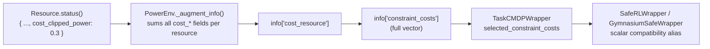

# Reward and Cost Split

PowerZoo treats every task as a **Constrained MDP (CMDP)**: maximise the discounted reward subject to a discounted cost being below a budget.

\[
\max_\pi \; \mathbb{E}_\pi\!\left[\sum_{t=0}^{T} \gamma^t r_t\right]
\quad \text{s.t.} \quad
\mathbb{E}_\pi\!\left[\sum_{t=0}^{T} \gamma^t c_{k,t}\right] \leq d_k
\]

This page explains how that split appears in the codebase and in the `info` dict at every step. The full env API is in [Python contract](python-contract.md); the underlying physics is in [Power systems primer](power-systems-primer.md).

## Why a separate cost channel

Reward shaping cannot guarantee constraint satisfaction. A reward like `economic_value − λ · violation` only biases the policy; under-tuned, it ignores the constraint, and over-tuned, it sacrifices reward to stay safe. By keeping safety in a **separate channel**, you can plug in Lagrangian, primal-dual, CPO or any other constrained-RL algorithm without rewriting the env. A standard reward-only RL agent that ignores the vector cost (or its scalar compatibility alias) still trains — it just produces an unsafe policy.

## What goes into reward

The reward channel carries only the **economic / task objective**:

- **OPF / UC** (`marl_opf`, `opf_118`, `opf_118_7d`, `marl_uc`): negative generation cost (plus startup / shutdown cost for UC).
- **Battery / DER / EV arbitrage** (`battery_arbitrage`, `marl_der_arbitrage`, `marl_ev_v2g`): trading profit (plus departure-readiness bonus for EV).
- **Data center** (`dc_scheduling`): weighted `-(energy + SLA + PUE)`.
- **DC microgrid** (`dc_microgrid`, `dc_microgrid_safe`): scalarised `r_energy + w_cost · r_cost + w_carbon · r_carbon`, with the per-component vector also exposed in `info["reward_vector"]`.
- **Markets** (`gencos_bidding`, `CostBasedMarketEnv`, `BidBasedMarketEnv`): per-step LMP-driven settlement profit.
- **DSO** (`make_dso_env`): network loss (`-loss_penalty_weight * p_loss_MW`).

## What goes into cost

The cost channel carries **physical safety violations** in physical units:

- Line thermal overload (MW), bus voltage violation (pu).
- Battery / EV SOC bound violations, EV departure SOC missed, EV away-but-acted.
- Data-center zone over-temperature (°C above critical).
- Microgrid SLA / power-deficit violations.

## How costs flow from a resource to the agent

PowerZoo uses a simple **prefix convention**: any key returned by `resource.status()` whose name starts with `cost_` is collected automatically.



To add a new cost signal in a custom resource:

```python
def status(self) -> dict:
    return {
        ...,
        'cost_my_new_violation': max(0.0, value),   # non-negative, physical units
    }
```

No registration call is needed.

## Per-task cost components

Different tasks use different subsets:

| Task | Cost components in `info` | Benchmark CMDP selection |
|---|---|---|
| `marl_opf`, `marl_uc`, `opf_118`, `opf_118_7d` | `cost_thermal_overload`, `cost_voltage_violation` | legacy scalar projection only |
| `marl_der_arbitrage` | `cost_voltage_violation`, `cost_clipped_power` (battery SOC clip) | legacy starter task; scalar projection only when wrapped |
| `marl_ev_v2g` | `cost_voltage_violation`, `cost_clipped_power`, EV departure violation, home availability violation | legacy starter task; scalar projection only when wrapped |
| `dc_scheduling` | `cost_overtemp`, grid `cost_*` from PowerEnv | legacy starter task; `cost_sum` diagnostic |
| `dc_microgrid`, `dc_microgrid_safe` | `cost_sla`, `cost_overtemp`, `cost_power_deficit` | `selected_constraint_costs = ['sla', 'overtemp', 'power_deficit']` |
| `make_dso_env(...)` | full vector + task selection | `selected_constraint_costs = ['voltage_violation']` |
| `comparison_tso_centralized` | `cost_thermal_overload`, `cost_reserve_shortfall` | `selected_constraint_costs = ['thermal_overload', 'reserve_shortfall']` |
| `marl_ders_benchmark` | per-agent `voltage_violation`, `thermal_overload`, `resource` | current MARL training = CMDP env + MDP fallback |
| `gencos_bidding` | per-agent `thermal_overload` | current MARL training = CMDP env + MDP fallback |

Where useful, adapters also expose the breakdown through `info['costs']` (a dict of named components).

## Wiring the scalar cost into a Safe-RL algorithm

Two wrappers cover the common interface styles:

| Wrapper | Returns | Use when |
|---|---|---|
| `SafeRLWrapper` | 6-tuple `(obs, reward, cost, terminated, truncated, info)` | Algorithm reads cost as a separate return value (OmniSafe, Safety-Gymnasium). |
| `GymnasiumSafeWrapper` | Standard 5-tuple, but injects the selected scalar projection into `info['cost']` | Algorithm expects the standard 5-tuple and reads cost from `info`. |

Stacking example:

```python
from powerzoo.envs.grid.trans import TransGridEnv
from powerzoo.wrappers import GymnasiumWrapper, SafeRLWrapper

env = SafeRLWrapper(GymnasiumWrapper(TransGridEnv()), cost_threshold=25.0)
obs, info = env.reset(seed=0)
obs, reward, cost, terminated, truncated, info = env.step(env.action_space.sample())
```

`powerzoo.rl.make_env(...)` exposes the same wrappers behind keyword arguments — see [Training · Trainers](../training/trainers.md).

## Anti-patterns

- **Do not move safety into reward.** If you find yourself writing `reward -= w * thermal_violation`, you are pushing the cost channel back into the objective. The right place is `info['constraint_costs']` plus a wrapper-level projection if needed.
- **Do not silently widen voltage / SOC bounds.** The bounds are part of the benchmark contract; if your algorithm cannot satisfy them, that inability is the experimental result.
- **Do not use the soft-penalty path on `DistGridEnv` for benchmark runs.** It exists for compatibility but breaks the CMDP separation when enabled — use the default loss-only reward and read violations from `info`.
