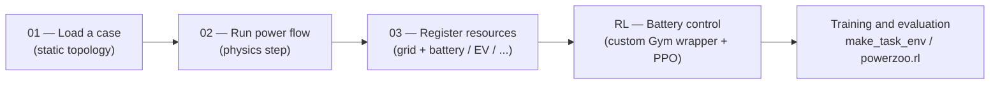

# Examples

PowerZoo ships script examples in `examples/*.py`, mirrored as the four short pages in this section. They are deliberately low-level: they show the underlying grid + resource API and how the pieces fit together before task wrappers are applied.

## How to Read These Examples



In short:

- **Examples 01–03** rebuild the stack from the ground up. They are useful when designing a new task or debugging the physics, and none of them use `make_task_env`.
- **`RL — Battery control`** is the bridge: same low-level wiring, trained with a real RL algorithm. **For benchmark experiments use `make_task_env('battery_arbitrage')` or `powerzoo.rl.make_env(...)` instead**; see [Training · Trainers](../training/trainers.md).
- For benchmark experiments, move from these low-level examples to `make_task_env(...)`, `powerzoo.rl`, and the training pages.

## Online RL benchmark — the basics

PowerZoo is an **online RL benchmark** for power-system environments. Agents learn by interacting with the simulator in real time. The **normalized score** linearly maps mean episode return between a **random-policy baseline** (0) and an **oracle baseline** (1):

> `normalized_score = (policy_score − random_score) / (oracle_score − random_score)`
> 0 = random, 1 = oracle, values > 1 are possible if a policy beats the oracle heuristic.

| Feature | CartPole / MuJoCo | Atari | Offline RL datasets | **PowerZoo** |
|---|---|---|---|---|
| Domain | Robotics / physics | Games | Robotics / locomotion | Power systems |
| RL type | Online | Online | **Offline** (static dataset) | **Online** |
| Agent structure | Single | Single | Single | **MARL-first**[^pz-agents] |
| Action space | Continuous / Discrete | Discrete | Continuous | **Continuous** |
| Physical constraints | Soft (joint limits) | None | Soft | **Hard (grid physics)** |
| Real-world data | No | No | Yes (logged) | **Yes (bundled real grid traces)** |
| Normalized score | No | Yes (human = 1) | Yes (expert = 1) | **Yes (oracle OPF = 1)** |

[^pz-agents]: PowerZoo's public benchmark set includes both single-agent (`battery_arbitrage`, `dc_scheduling`, `dc_microgrid*`) and multi-agent tasks. Use `list_public_tasks()` for the authoritative list.

## Core starter tasks

The four cards below follow the recommended learning path: **single-agent distribution → transmission MARL → distribution MARL (batteries) → distribution MARL (EVs)**.

<div class="grid cards" markdown>

-   **Single-battery arbitrage**

    ---

    - Grid: IEEE 33-bus distribution (`Case33bw`)
    - Agent: 1 — continuous charge / discharge
    - Goal: peak / off-peak arbitrage with SOC kept in band
    - Episode: 48 steps × 30 min = 1 day
    - Difficulty: `simple`

    ```python
    env = make_task_env("battery_arbitrage")
    ```

-   **MARL economic dispatch (OPF)**

    ---

    - Grid: IEEE 5-bus transmission
    - Agents: 5 generators, score-based action
    - Goal: minimise generation cost under line limits
    - Episode: 48 steps × 30 min = 1 day
    - Difficulty: `simple`

    ```python
    env = make_task_env("marl_opf")
    ```

-   **MARL battery arbitrage (DER)**

    ---

    - Grid: IEEE 33-bus distribution
    - Agents: 3 batteries (buses 6 / 12 / 18)
    - Goal: peak / valley arbitrage with voltage and SOC limits
    - Episode: 48 steps × 30 min = 1 day
    - Difficulty: `simple`

    ```python
    env = make_task_env("marl_der_arbitrage")
    ```

-   **EV fleet V2G**

    ---

    - Grid: IEEE 33-bus distribution
    - Agents: 5 EVs with V2G / G2V
    - Goal: arbitrage profit + departure SOC ≥ 80%
    - Episode: 168 steps × 60 min = 1 week
    - Difficulty: `simple`

    ```python
    env = make_task_env("marl_ev_v2g")
    ```

</div>

The full public task list — including `marl_uc`, `opf_118`, `opf_118_7d`, `dc_scheduling`, `dc_microgrid`, `dc_microgrid_safe`, `marl_ders_benchmark` and `gencos_bidding` — lives in [API · Tasks](../api/tasks.md). Run `list_public_tasks()` for the authoritative list at any time:

```python
from powerzoo.tasks import list_public_tasks, get_public_task_catalog
print(list_public_tasks())

for card in get_public_task_catalog():
    print(card['task_id'], card['grid_case'], card['default_episode_horizon_steps'])
```

## Fixed Data Splits

These tasks share the same non-overlapping splits driven by the bundled GB demand trace (`GB_Forecast_Actual_Demand_2023_2025_30min`):

| Split | Date range | Purpose |
|---|---|---|
| `train` | 2023-07-05 – 2024-12-31 | Algorithm training |
| `val` | 2025-01-01 – 2025-06-30 | Hyperparameter tuning |
| `test` | 2025-07-01 – 2025-12-15 | Official benchmark evaluation |

The DSO benchmark (`make_dso_env(...)`) uses Ausgrid splits instead — see [Benchmarks · DSO](../benchmarks/dso.md).

```python
train_env = make_task_env("marl_opf", split="train")
test_env  = make_task_env("marl_opf", split="test")
```
