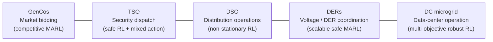

# Getting Started

This page introduces the **five benchmark suites** that define PowerZoo's research scope, then walks you from a clean Python environment to a trained RL agent in four short steps.

## 1. Install

PowerZoo requires **Python 3.11+** and uses [uv](https://github.com/astral-sh/uv) for dependency management.

```bash
conda create -n powerzoo python=3.11 -y
conda activate powerzoo

pip install uv
git clone https://github.com/powerzoojax/PowerZooPy.git
cd PowerZooPy

uv sync --python "$(which python)"

uv sync --python "$(which python)" --extra rl
pip install h5py
```

The `rl` extra brings in Stable-Baselines3, PettingZoo, RLlib, PyTorch, and Gymnasium. `h5py` is only needed if you plan to record offline datasets.

Verify:

```bash
uv run python -c "import powerzoo; print(powerzoo.__version__)"
```

## 2. The Five Benchmark Suites

PowerZoo organises its public benchmark set into **five agent-centric task suites**. Each suite targets a different RL research question and uses a different underlying environment, agent structure, action space and constraint regime; any two suites therefore differ on at least four of these dimensions. The five suites are the recommended starting point for publication-quality experiments.



| Suite | Underlying env | RL question | Public PowerZoo task(s) |
|---|---|---|---|
| **GenCos** — Market bidding | Transmission `Case5` + `BidBasedMarketEnv` | Competitive MARL with private info and ramp-coupled offers | `gencos_bidding` — see [Benchmarks · GenCos](benchmarks/gencos.md) |
| **TSO** — Security dispatch | Transmission `Case5` / `Case118` + DC/AC OPF | Safe RL with mixed discrete-continuous actions | `marl_uc` (UC, `Case5`), `opf_118` / `opf_118_7d` (large-scale ED, `Case118`) — see [Benchmarks · TSO](benchmarks/tso.md) |
| **DSO** — Distribution operations | Distribution `Case33bw` + 6× `FlexLoad` + Ausgrid traces | Non-stationary single-agent RL with operational quality reward | `make_dso_env(...)` factory — see [Benchmarks · DSO](benchmarks/dso.md) |
| **DERs** — Voltage / DER coordination | Distribution `Case33bw` / `Case118zh` + heterogeneous DERs | Scalable safe MARL on Dec-POMDP with hard voltage limits | `marl_der_arbitrage` (`Case33bw`, 3 batteries), `marl_ders_benchmark` (`Case118zh`, 12 heterogeneous DERs) — see [Benchmarks · DERs](benchmarks/ders.md) |
| **DC microgrid** — Data center | Self-contained DC microgrid (`DCMicrogridEnv`, no external grid) | Multi-objective robust RL with workload + thermal + carbon trade-off | `dc_microgrid`, `dc_microgrid_safe` (CMDP variant) — see [Benchmarks · DC microgrid](benchmarks/dc-microgrid.md) |

**How to read this table.** A *suite* groups tasks that share the same RL research question. The right-hand column lists concrete env names you can pass to `make_task_env(...)` (or `make_dso_env(...)` for DSO); the next sections use exactly these names. Per-suite env design, observation / action / reward / cost contracts and OOD splits live in [Benchmarks](benchmarks/overview.md); the underlying physics in [Physics](physics/transmission.md); the env API contract that every benchmark obeys in [Concepts · Python contract](concepts/python-contract.md).

> Smaller starter envs sit outside the five main suites but are still public benchmark tasks: `battery_arbitrage` (single-battery arbitrage), `marl_opf` (5-bus MARL ED), `marl_ev_v2g` (EV fleet V2G), `dc_scheduling` (data-center scheduling under a distribution grid). They are the recommended first targets for unit testing and quick iteration; see [Examples](examples/index.md) for runnable cards.

## 3. First Task — Run a Benchmark Episode

`make_task_env` is PowerZoo's preferred entry point: it builds a benchmark task with a fixed train/val/test split and the right multi-agent or single-agent interface.

```python
from powerzoo.tasks import make_task_env, list_public_tasks

print(list_public_tasks())
```

Run one episode of the multi-agent OPF task on IEEE 5-bus, using the PettingZoo Parallel API:

```python
env = make_task_env("marl_opf", split="train", framework="pettingzoo")
obs, info = env.reset(seed=42)

while env.agents:
    actions = {a: env.action_space(a).sample() for a in env.agents}
    obs, rewards, terminations, truncations, info = env.step(actions)

print("episode done")
```

Single-agent tasks (such as `battery_arbitrage`, `dc_scheduling`, `dc_microgrid`) return a standard Gymnasium env — use the usual five-tuple loop:

```python
env = make_task_env("battery_arbitrage", split="train")
obs, info = env.reset(seed=0)
terminated = truncated = False
while not (terminated or truncated):
    obs, reward, terminated, truncated, info = env.step(env.action_space.sample())
```

> The `framework='pettingzoo'` path clears `env.agents` when the episode ends, which is convenient for the `while env.agents` idiom. The default `framework='auto'` returns the underlying RLlib-style adapter, where you instead check `terminated.get("__all__")` and `truncated.get("__all__")`. Both paths share identical reward, cost and observation semantics — see [Concepts · Python contract](concepts/python-contract.md).

## 4. First Evaluation — Get a Normalized Score

Once you have any policy, `evaluate` produces reproducible benchmark numbers — mean episode return, normalized score (where 0 = random baseline, 1 = oracle baseline) and CMDP cost statistics if cost signals are present.

```python
from powerzoo.wrappers import GymnasiumWrapper
from powerzoo.benchmarks.policies import RandomPolicy
from powerzoo.benchmarks import evaluate

gym_env = GymnasiumWrapper(make_task_env("marl_opf", split="test"))
result = evaluate(
    RandomPolicy(gym_env.action_space),
    gym_env,
    n_episodes=10,
    task_id="marl_opf",
)

print(f"mean reward       : {result['mean_reward']:.2f}")
print(f"normalized score  : {result['normalized_score']}")
print(f"mean episode cost : {result['mean_episode_cost']:.4f}")
print(f"cost violation %  : {result['cost_violation_rate']}")
```

The normalized score lets you compare across tasks without worrying about the raw reward scale of each problem. See the [Examples Overview](examples/index.md) for the formula.

## 5. First Training — One-Liner with `powerzoo.rl`

`powerzoo.rl` is the unified RL entry point. `make_env` produces a ready-to-train env (with optional normalization, forecast window, safe-RL wrapping); `Trainer` wraps Stable-Baselines3 with task-aware defaults.

```python
from powerzoo.rl import make_env, Trainer

env = make_env("battery_arbitrage", split="train", normalize=True, seed=0)
print(env.observation_space, env.action_space)

trainer = Trainer("battery_arbitrage", algorithm="SAC", total_timesteps=100_000)
trainer.train()
results = trainer.evaluate(split="test")
print(results)
```

For full training options — including YAML configs, MARL training and reward overrides — see [Training · Trainers](training/trainers.md) and [Training · Presets](training/presets.md).

## Next Steps

| Topic | Link |
|---|---|
| The three pillars and the python API contract | [Concepts · Overview](concepts/overview.md), [Python contract](concepts/python-contract.md) |
| Why power grids are physically distinct from typical RL benchmarks | [Concepts · Power systems primer](concepts/power-systems-primer.md) |
| Layered architecture (envs / resources / tasks / wrappers) | [Architecture · Environment stack](architecture/env-stack.md), [Repository map](architecture/repo-map.md) |
| Underlying physics (transmission / distribution / resources / markets / microgrid) | [Physics](physics/transmission.md) |
| Per-suite benchmark cards (TSO, DSO, DERs, DC microgrid, GenCos) | [Benchmarks](benchmarks/overview.md) |
| Full RL training reference (wrappers, trainers, YAML presets, custom loops) | [Training](training/trainers.md) |
| Low-level grid + resource API (no task wrapping) | [Examples 01–03](examples/index.md) |

---

## Glossary

A short reference for terms used throughout the docs. Each definition is one sentence; deeper treatment lives in [Concepts · Power systems primer](concepts/power-systems-primer.md) for physics and in [Concepts · Reward and cost split](concepts/reward-cost-split.md) plus [Python contract](concepts/python-contract.md) for the env API.

| Term | One-sentence meaning |
|---|---|
| **PF** (Power Flow) | Solve voltages and line flows given fixed injections — the grid's physics step. |
| **OPF** (Optimal Power Flow) | Solve PF *and* dispatch generators to minimise cost subject to limits. |
| **DCPF / DCOPF** | Linearised PF / OPF (active power only, voltage assumed 1 pu) — fast, convex. |
| **ACPF / ACOPF** | Full nonlinear PF / OPF including reactive power and voltage magnitude. |
| **BFS** (Backward-Forward Sweep) | Iterative PF solver for radial distribution feeders. |
| **PTDF** (Power Transfer Distribution Factor) | Sensitivity matrix `line_flow ≈ PTDF · injection` used by DCPF. |
| **LMP** (Locational Marginal Price) | Dual variable of the nodal power balance — the marginal cost of 1 extra MW at a bus. |
| **UC** (Unit Commitment) | OPF + binary on/off decisions + min up/down-time and ramp constraints. |
| **SCED / SCUC** | Security-Constrained ED / UC: OPF / UC with line and N-1 constraints. |
| **SOC** (State Of Charge) | Battery fill fraction, 0–1; integrator state coupling adjacent steps. |
| **G2V / V2G** | Grid-to-Vehicle (charge) / Vehicle-to-Grid (discharge back to the grid). |
| **DER** (Distributed Energy Resource) | Small generator, battery or controllable load on a distribution feeder. |
| **DSO / TSO** | Distribution / Transmission System Operator — owns the feeder / backbone. |
| **DR** (Demand Response) | Curtailing or shifting load in response to grid signals or prices. |
| **PUE** (Power Usage Effectiveness) | Data-center metric: total facility power / IT equipment power (lower is better). |
| **COP** (Coefficient of Performance) | Cooling efficiency: heat removed per unit electrical input. |
| **CMDP** | Constrained MDP — maximise reward subject to expected cost ≤ budget. |
| **MARL** | Multi-Agent RL — multiple policies acting on a shared environment. |
| **MDP / Dec-POMDP** | (Decentralised, partially observable) Markov Decision Process. |
