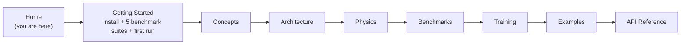
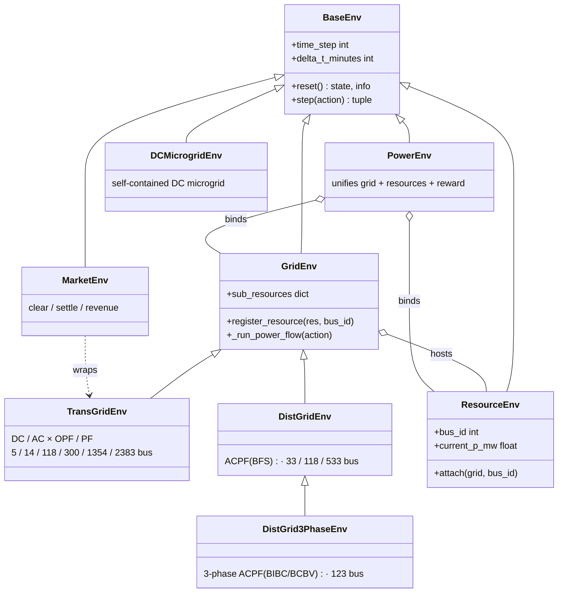

# PowerZoo

**PowerZoo** is a power-system simulation framework for reinforcement learning (RL) research. It exposes Gymnasium / PettingZoo / RLlib-compatible environments for transmission grids, distribution feeders, controllable resources (batteries, EVs, solar, wind, flexible loads, data centers), self-contained DC microgrids, and competitive electricity markets — all built on real, half-hourly grid time series.

## Why Power Grids Are Hard for RL

Power systems combine several open RL problems in one physical model. Each PowerZoo task isolates one or more of them.

| Challenge | Why it is hard | Where it shows up |
|---|---|---|
| **Hard safety constraints** | A single voltage or thermal violation can cascade into a blackout. Reward shaping cannot guarantee feasibility — a CMDP / Safe-RL formulation is needed. | All grid tasks; `SafeRLWrapper` exposes a separate cost channel. |
| **Coupled multi-agent decisions** | Generators share transmission lines; DERs share a feeder. One agent's action shifts every other agent's constraint set through power-flow physics, with no explicit communication channel. | `marl_opf`, `marl_uc`, `opf_118`, `marl_ders_benchmark`. |
| **Long-horizon credit assignment** | A battery charged cheaply at 03:00 earns profit at 18:00, 30+ steps later. An EV must hit a departure SOC several hours ahead. | `battery_arbitrage`, `marl_der_arbitrage`, `marl_ev_v2g`. |
| **Mixed discrete-continuous actions** | Unit commitment (UC) needs on/off (binary) plus power setpoint (continuous) in one step, with minimum up/down-time coupling. | `marl_uc`. |
| **Non-stationary exogenous drivers** | Load, solar, wind and price profiles change with season, weather and day-of-week. Policies must generalise across distribution shifts, not memorise one trajectory. | All tasks (real GB grid traces with fixed train/val/test splits). |
| **Partial observability** | A distribution agent sees local voltage but not upstream state; a transmission agent sees nodal injections but not individual SOC. | All tasks via configurable observation modes. |
| **Competing objectives** | Cost vs safety vs SOC targets vs SLA — Pareto trade-offs with no single optimal policy. | `marl_ev_v2g`, `dc_scheduling`, `dc_microgrid`, Safe-RL tasks. |

These challenges arise **from physics**, not from artificial API complexity. PowerZoo keeps the interface simple so the difficulty stays in the problem, not in the API.

> **Vocabulary check.** *CMDP* = Constrained Markov Decision Process (a standard MDP with one or more cost-budget constraints). *DER* = Distributed Energy Resource (small generator / battery / flexible load on a feeder). *OPF* = Optimal Power Flow (the cheapest dispatch that satisfies grid limits). *SOC* = State Of Charge (battery fill level, 0–1). A short glossary lives at the bottom of [Getting Started](getting-started.md).

## How to Read These Docs



The eight content sections build on each other:

1. **[Getting Started](getting-started.md)** — install, meet the five benchmark suites, run one task, evaluate one policy, train one agent.
2. **[Concepts](concepts/overview.md)** — the three pillars, the Python API contract, the reward / cost split, and the power-systems primer for ML readers.
3. **[Architecture](architecture/repo-map.md)** — repository map, environment stack, data pipeline, training pipeline.
4. **[Physics](physics/transmission.md)** — transmission, distribution, resources, markets, microgrid.
5. **[Benchmarks](benchmarks/overview.md)** — the five main task suites (TSO, DSO, DERs, DC microgrid, GenCos) plus an overview.
6. **[Training](training/wrappers.md)** — wrappers, trainers, presets, custom loops.
7. **[Examples](examples/index.md)** — short scripts ordered from raw grid construction to RL training.
8. **API Reference** — `mkdocstrings`-rendered class signatures.

## 30-second Example

`make_task_env` is the recommended top-level entry. It builds a benchmark task with a fixed train/val/test split:

```python
from powerzoo.tasks import make_task_env

env = make_task_env("marl_opf", split="train", framework="pettingzoo")
obs, info = env.reset(seed=42)

while env.agents:
    actions = {a: env.action_space(a).sample() for a in env.agents}
    obs, rewards, terminations, truncations, info = env.step(actions)

print("episode finished")
```

To get raw grid + resource handles (no task wrapping) — for example when designing a new benchmark — see [Example 03 — Register Resources](examples/03_register_resource.md).

## Architecture at a Glance



The full design — including the `PowerEnv` orchestration layer, the resource cost convention and the data-loading utilities — is documented in [Architecture · Environment stack](architecture/env-stack.md).
