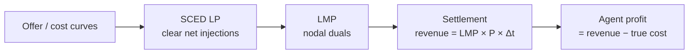

# Markets

PowerZoo's market layer wraps `TransGridEnv` with a clearing / settlement loop and exposes Locational Marginal Prices (LMPs) as the main agent-facing signal. Three envs cover three different research questions:

| Env / task | Who decides the offer? | What the LMP reflects | Typical research target |
|---|---|---|---|
| `CostBasedMarketEnv` | nobody (flat true marginal cost `mc_c · p`) | true system marginal cost | clean DER arbitrage on uncongested LMPs |
| `BidBasedMarketEnv` | static piecewise offers (cost + optional markup, frozen per episode) | offer-based dispatch (decoupled from cost) | DER arbitrage with realistic LMPs |
| `GenCosMARLEnv` (`gencos_bidding`) | each agent, every step, via a 3-segment markup vector | offer-based dispatch under MARL bidding | strategic bidding, market power, learned price-making |

> **Vocabulary check.** *LMP* (Locational Marginal Price) is the dual variable of the nodal power-balance constraint: how much total system cost would rise if 1 extra MW of demand appeared at that bus. It equals system marginal cost when no line is congested; under congestion, buses on the constrained side have higher LMPs. *SCED* (Security-Constrained Economic Dispatch) is OPF using submitted offers as the LP objective.

The shared dispatch loop is the same across all three:



What changes between the three envs is **only who supplies the offer curve and how often**. The grid solve, LMP computation and settlement formulas are shared.

## `CostBasedMarketEnv` — clean LMP arbitrage

This is the simplest market. Generator costs are flat (`C_i(P) = mc_{c,i} \cdot P`), no offers are submitted, and the LMP is the dual of the resulting cost-based DC-OPF. A battery is attached at a chosen bus, and the agent decides its power setpoint at each step.

- **Action.** `Box(1)` battery setpoint in `[-power_mw, +power_mw]`.
- **Observation.** `[soc, lmp_norm, time_sin, time_cos, total_demand_norm]`.
- **Reward.** `LMP × P_net × Δt`. Safety violations stay in `info['cost_*']`.

```python
from powerzoo import CostBasedMarketEnv
env = CostBasedMarketEnv(difficulty='medium')
obs, info = env.reset(seed=42)
obs, reward, terminated, truncated, info = env.step(env.action_space.sample())
```

Use this env to study temporal arbitrage on a clean price signal: the LMP equals the system's true marginal value of energy at each bus.

## `BidBasedMarketEnv` — realistic LMP, static offers

`BidBasedMarketEnv` adds **piecewise-linear offer curves**. By default, offers are derived from true costs with an optional random markup; you can also supply them externally. Offers are **frozen for the duration of an episode**: generated once at `reset()` and kept until the next `reset()`. The market then clears via a network-constrained SCED on those offers, and LMPs come from the LP duals of the offer-based dispatch.

The battery here is a **prosumer**: it does not submit offers, but its net injection enters the SCED as a nodal load offset and therefore *does* influence the LMP. Discharging at a bus reduces local net load and can lower the LMP there; charging does the opposite.

- **Action.** Same as cost-based — battery setpoint.
- **Observation.** `[soc, lmp_norm, time_sin, time_cos, demand_norm, mean_offer_price_norm]`.
- **Reward.** `LMP × P × Δt` (settlement-based; battery has no "true cost").

Use this env when you want a more realistic LMP series for DER arbitrage research — one that decouples LMP from true cost without yet introducing strategic bidding.

## `GenCosMARLEnv` — strategic bidding (`gencos_bidding`)

`GenCosMARLEnv` is the only market env where multiple **independent agents** submit offers every step. There is one agent per generator on `Case5` (5 agents), and each one outputs a `Box(3)` markup vector that is sorted into a 3-segment monotone offer curve. The market clears with `solve_piecewise_ed_opf`; ramp constraints couple consecutive steps so dispatch decisions cannot be reset between rounds.

- **Action.** `Box(3) ∈ [-1, 1]` markup scalars per agent. Sort enforces monotonicity.
- **Observation.** 12-D private vector — own cost / capacity / last dispatch / last profit / ramp headroom, demand forecast, time, and a 4-step LMP history.
- **Reward.** Per-agent dispatch profit `LMP[node_i] · P_i · Δt - TC_i(P_i) · Δt`.
- **Episode.** 48 steps × 30 min (rolling market). Ramp limits at step `t` constrain `[p_min_rt, p_max_rt]` at step `t+1`.

```python
from powerzoo.envs.market import make_gencos_env

env = make_gencos_env()
obs, info = env.reset(seed=0)
while env.agents:
    actions = {ag: env.action_spaces[ag].sample() for ag in env.agents}
    obs, rewards, terms, truncs, info = env.step(actions)
```

Or via the task registry:

```python
from powerzoo.tasks import make_task_env
env = make_task_env('gencos_bidding', framework='pettingzoo')
```

The full benchmark card for this task — including baselines, OOD splits and metrics — is in [Benchmarks · GenCos](../benchmarks/gencos.md).

## Choosing between the three

```mermaid
flowchart TB
    Q1{Do you want to learn\nthe offer curve itself?}
    Q1 -->|yes| GC["GenCosMARLEnv\n(gencos_bidding)"]
    Q1 -->|no| Q2{Do you want LMP to be\noffer-based (realistic)?}
    Q2 -->|yes| BB[BidBasedMarketEnv]
    Q2 -->|no, prefer true cost| CB[CostBasedMarketEnv]
```

In short: **cost-based** for clean arbitrage research, **bid-based** for realistic LMPs without bidding agents, **GenCos** for strategic bidding MARL.

## See also

- [Transmission physics](transmission.md) — the underlying DC / AC OPF that LMPs come from.
- [Resources](resources.md) — `BatteryEnv` and `FlexLoad` interactions with markets.
- [Benchmarks · GenCos](../benchmarks/gencos.md) — the agent-facing benchmark card.
- [API · Markets](../api/market.md) — class signatures.
