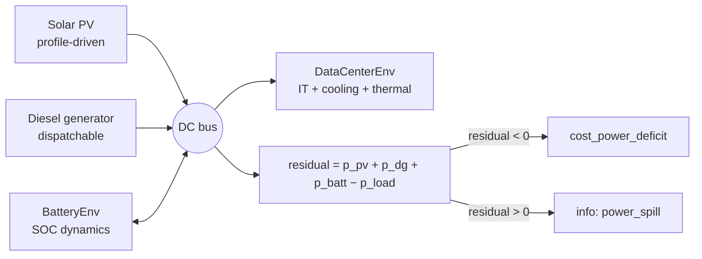

# Microgrid

`DCMicrogridEnv` (`powerzoo/envs/microgrid/dc_microgrid_env.py`) is a **self-contained behind-the-meter microgrid** environment. Unlike every other PowerZoo env, it has **no external grid connection**. Power balance is enforced internally; a power deficit is a real CMDP cost, not a setpoint that the bulk grid absorbs.

The env composes existing PowerZoo resources (`DataCenterEnv`, `BatteryEnv`) with inline solar PV and a diesel generator:



## Power balance

At every step, the DC bus enforces:

```
residual      = p_pv + p_dg + p_batt − p_load
power_deficit = max(−residual, 0)   → cost_power_deficit
power_spill   = max(+residual, 0)   → info only
```

There is no slack node. A naive policy that overcommits IT load while solar is low and the battery is empty pays the deficit cost directly.

## Action and observation spaces

| Dim | Action | Range | Meaning |
|---|---|---|---|
| 0 | `train_sched_rate` | `[0, 1]` | Fraction of training jobs scheduled this step. |
| 1 | `ft_sched_rate` | `[0, 1]` | Fraction of finetuning jobs scheduled. |
| 2 | `cooling_setpoint_norm` | `[0, 1]` | Normalised cooling-setpoint thermostat. |
| 3 | `battery_power_norm` | `[-1, 1]` | Battery power; positive = discharge. |
| 4 | `dg_power_norm` | `[0, 1]` | Diesel generator output (off when 0). |

The 18-D observation packs IT (CPU / memory utilisation), workload queues (training / finetuning fill, urgency), thermal state (zone temperature, outdoor temperature, COP ratio), generation (solar capacity factor, SOC, diesel headroom), the previous action vector and time encoding (sin / cos):

```
[cpu_util, mem_util,
 q_train_fill, q_ft_fill, queue_urgency,
 zone_temp_norm, outdoor_temp_norm, cop_ratio,
 solar_cf, soc, dg_margin_norm,
 last_action_norm[5],
 sin(t), cos(t)]
```

## Reward and cost

The scalar reward is a **scalarised three-term objective**:

\[
r_t \;=\; r_{\text{energy}} \;+\; w_{\text{cost}} \cdot r_{\text{cost}} \;+\; w_{\text{carbon}} \cdot r_{\text{carbon}}
\]

with the per-component vector also exposed in `info["reward_vector"] = [r_energy, r_cost, r_carbon]`. The components are:

- `r_energy = -(p_dc_mw * dt_h)` — total IT energy in MWh (negative).
- `r_cost = -(fuel_cost + |p_batt| * dt_h * battery_deg_cost_per_mwh)` — fuel + battery wear (negative).
- `r_carbon = -carbon_kg` — diesel CO₂ emissions in kg (negative).

The CMDP cost channel uses three separated components:

| Key | Unit | Meaning |
|---|---|---|
| `info["cost_sla"]` | count | Number of SLA violations this step. |
| `info["cost_overtemp"]` | °C | `max(t_zone − t_critical, 0)`. |
| `info["cost_power_deficit"]` | – | `max(p_load − p_supply, 0) / max(p_load, 1e-6)` (normalised). |
| `info["cost"]` | – | Sum of the three components. `info["cost_sum"]` is a backwards-compat alias. |

A typical episode is **288 steps × 5 min = 24 h**.

## Exogenous profiles

Profiles can be injected via `set_profiles(cpu, solar, temp)` or at construction time. All are 1-D NumPy float32 arrays cyclically indexed at each step. `None` falls back to a synthetic diurnal profile.

`powerzoo.data.dc_microgrid_profiles` provides the canonical profile loader, including OOD transforms used by the benchmark's evaluation splits — see [Benchmarks · DC microgrid](../benchmarks/dc-microgrid.md).

## Why this is a distinct benchmark

- **No grid backstop.** Power deficit is a hard cost, not a setpoint. Naive policies that overcommit IT load cannot fall back on the grid for the missing power.
- **Multi-objective by construction.** `info["reward_vector"]` is a real three-vector — energy, monetary cost and carbon are not the same thing and cannot be tuned away by a single weight.
- **Heterogeneous action vector.** One 5-D action mixes scheduling, thermostat and generation set-points, giving a small-scale benchmark for hybrid control architectures.

## See also

- [Resources](resources.md) — `DataCenterEnv` and `BatteryEnv` inside the microgrid.
- [Benchmarks · DC microgrid](../benchmarks/dc-microgrid.md) — the agent-facing benchmark card with splits, baselines and metrics.
- [Reward and cost split](../concepts/reward-cost-split.md) — how the scalar `info["cost"]` flows into Safe-RL wrappers.
