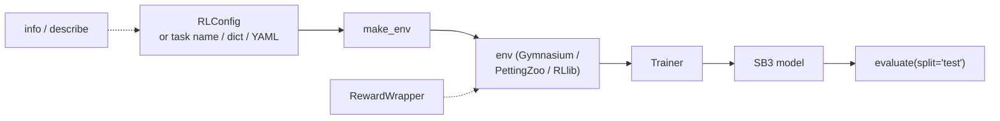

# Trainers

`powerzoo.rl` is the **unified RL entry point**. It hides the differences between single-agent / multi-agent tasks, between framework choices (Gymnasium / PettingZoo / RLlib), and between common wrapper stacks (forecast, normalisation, safe-RL).



| Symbol | One-line role |
|---|---|
| `make_env` | Build a ready-to-train env from a task name, a dict, or a YAML / `RLConfig`. |
| `RLConfig` | Dataclass that captures task + wrappers + reward + trainer + framework + seed. |
| `RewardWrapper` | Replace the reward of a single-agent env without touching the cost channel. |
| `Trainer` | Thin SB3 wrapper with `train`, `train_il`, `train_marl_simultaneous`, `evaluate`, `save`, `load`. |
| `info` / `describe` | Structured / human-readable task introspection (spaces, contracts, config template). |

> **Vocabulary check.** *SB3* = Stable-Baselines3 (a popular PyTorch-based RL library used here for SAC / PPO / TD3). *IL* = Independent Learners (one SB3 model per agent, others held fixed during training).

## `make_env` — one-line env construction

`make_env` accepts four input forms, applies the standard wrapper stack and returns a Gymnasium env (single-agent) or PettingZoo / RLlib env (multi-agent).

```python
from powerzoo.rl import make_env

env = make_env('battery_arbitrage', split='train')
env = make_env('marl_opf', framework='pettingzoo')
env = make_env(
    {'grid': {'type': 'transmission', 'case': 'case5'}, 'resources': []},
    reward={'type': 'zero'},
)
env = make_env('my_experiment.yaml')
```

The wrapper stack (applied to single-agent envs only; silently ignored for MARL):

| Argument | Effect |
|---|---|
| `reward=...` | `RewardWrapper` replaces the reward (callable or reward-type dict). |
| `forecast_horizon=N` | `ForecastWrapper` appends `N` future demand values. |
| `normalize=True` | `NormalizationWrapper` rescales obs (and optionally action) to `[-1, 1]`. |
| `safe_rl=True` | `GymnasiumSafeWrapper` projects `selected_constraint_costs` to scalar `info['cost']`. |
| `cost_threshold=...` | Forwarded to `GymnasiumSafeWrapper`. |
| `seed=...` | Calls `env.reset(seed=...)` immediately. |

For multi-agent envs, single-agent-only wrappers raise a warning and are skipped. To override the reward of a multi-agent task, set the `reward` key in the task config before `make_env` builds it.

## `RLConfig` — one place for all hyperparameters

`RLConfig` is a dataclass. The recommended pattern is to keep one YAML per experiment and load it; concrete templates live in [Presets](presets.md).

```python
from powerzoo.rl import RLConfig

cfg = RLConfig.from_yaml('battery_sac.yaml')
cfg.validate()

cfg = RLConfig(
    task_name='battery_arbitrage',
    algorithm='SAC',
    total_timesteps=200_000,
    save_path='./results/',
)
```

`RLConfig.validate()` checks five conditions:

1. Exactly one of `task_name` / `task_config` is set.
2. `algorithm ∈ {SAC, PPO, TD3}`.
3. `framework ∈ {auto, rllib, pettingzoo}`.
4. `split ∈ {train, val, test}`.
5. `safe_rl=True` is paired with a `cost_threshold` (warns if not).

## `RewardWrapper` — swap the reward, keep the cost

`RewardWrapper` replaces the scalar reward of a single-agent env. The CMDP cost signal (`info['constraint_costs']`, `info['selected_constraint_costs']`, `info['cost_sum']`) passes through untouched, and scalar `info['cost']` is still available when a compatibility wrapper adds it.

```python
from powerzoo.rl import make_env, RewardWrapper

env = make_env('battery_arbitrage')
env = RewardWrapper(env, {'type': 'lmp_arbitrage', 'profit_weight': 2.0})

def my_reward(state, info):
    return -abs(state['grid']['line_flow_norm']).sum()

env = RewardWrapper(env, my_reward)
```

For MARL envs the reward is computed inside the task adapter — override it at the task / adapter layer, not here.

`MDPFallbackRewardWrapper` is the honest baseline path for current reward-only / MARL benchmark training:

```python
from powerzoo.rl import MDPFallbackRewardWrapper, make_env

env = make_env('dc_microgrid')
env = MDPFallbackRewardWrapper(env)  # reward_fallback = env_reward - w·selected_constraint_costs
```

## `Trainer` — Stable-Baselines3 in one line

`Trainer` lazily imports SB3 (`SAC`, `PPO`, `TD3`). The single-agent flow is the simplest:

```python
from powerzoo.rl import Trainer

t = Trainer('battery_arbitrage', algorithm='SAC', total_timesteps=200_000)
t.train()
results = t.evaluate(split='test')
t.save('./results/')
```

For MARL tasks there are two training strategies:

```python
t = Trainer('marl_opf', framework='pettingzoo')
t.train_il(total_timesteps=50_000)

t = Trainer('marl_opf', framework='pettingzoo', algorithm='SAC')
t.train_marl_simultaneous(total_timesteps=200_000)
```

- `train_il` runs sequential SB3 `.learn()` per agent (others act with their default policy). Requires homogeneous agent spaces.
- `train_marl_simultaneous` performs one PettingZoo step per env step and updates all agents at once (SAC only). Implementation lives in `powerzoo/rl/marl_simultaneous_sb3.py`.

For other frameworks (EPyMARL, MAPPO, custom loops) just call `t.get_env()` and plug it in — see [Custom loops](custom-loops.md).

## `info` / `describe` — task introspection

```python
from powerzoo.rl import info, describe

print(describe('marl_opf'))
d = info('battery_arbitrage')
print(d['observation_space'])
print(d['reward'])
print(d['config_template'])
```

`info(...)` returns a dict with `task_id`, `description`, `agent_mode`, `difficulty`, `observation_space`, `action_space`, `reward`, `cost`, `splits`, `eval_protocol` and a YAML-ready `config_template`. Set `format='json'` for a string. `describe(...)` returns the same content as a printable summary.

Use these to bootstrap a new experiment YAML, or for AI-driven config generation.

## Recommended workflows

```mermaid
flowchart TB
    A[Pick task name] --> B{single-agent?}
    B -->|yes| C["Trainer(name, algorithm='SAC')\n.train().evaluate('test')"]
    B -->|no| D["Trainer(name, framework='pettingzoo')\n.train_il() or .train_marl_simultaneous()"]
    A --> E[Or write YAML, load with RLConfig.from_yaml]
    E --> F[Trainer(cfg).train().evaluate()]
```

Quick rules of thumb:

- **Single-agent task, fast iteration.** `make_env(name, normalize=True)` + your own SB3 loop, or just `Trainer(name).train()`.
- **MARL task with ready-made SB3 algorithm.** `Trainer(name, framework='pettingzoo').train_il(...)`.
- **Custom MARL framework (EPyMARL, MAPPO, JaxMARL, …).** `Trainer(name, framework='pettingzoo').get_env()` and use it directly.
- **Safe RL.** `make_env(name, safe_rl=True, cost_threshold=...)` and read the scalar compatibility alias `info['cost']` from each step.

## See also

- [Wrappers](wrappers.md) — what `make_env`'s arguments map to under the hood.
- [Presets](presets.md) — ready-to-use YAML configs for each benchmark suite.
- [Custom loops](custom-loops.md) — how to bypass `Trainer` and write your own loop.
- [API · Wrappers](../api/wrappers.md), [API · Tasks](../api/tasks.md), [API · Offline](../api/offline.md).
