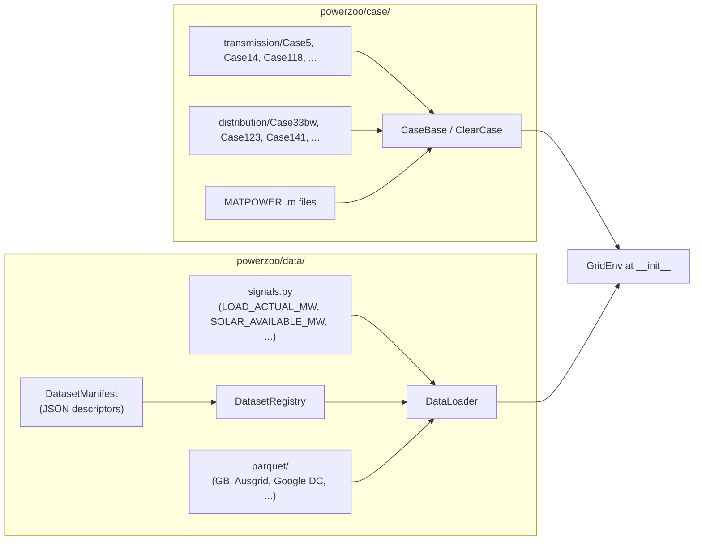

# 数据管线

PowerZoo 把 **case 数据**（静态拓扑与各资产参数）和**时序数据**（负荷、可再生、电价、workload）分开管理。两者分别位于 `powerzoo/case/` 与 `powerzoo/data/`。两者都在 env 构造时一次性加载；内层 `step()` 循环不会触碰磁盘。



## Case 数据

`load_case` 是公共入口：

```python
from powerzoo.case import load_case, list_cases

case = load_case(5)                        # integer shorthand
case = load_case("Case5")                  # explicit name
case = load_case("case33bw", grid_type="distribution")
case = load_case("path/to/case30.m")       # MATPOWER .m file

print(list_cases())                        # everything under transmission/ + distribution/
```

加载后的 case 是一个 `ClearCase` 实例，包含四张 DataFrame（`nodes`、`lines`、`units`、`loads`）；调用 `case.init()` 后，还会暴露预计算的 PTDF / 关联矩阵。内置 case（目前约 14 个）是 `powerzoo/case/transmission/` 或 `…/distribution/` 下的纯 Python 文件；MATPOWER `.m` 文件会即时转换为同样的 DataFrame schema。

case 对象由 `GridEnv` 持有，构造完成后不再修改；每次 reset 都复用同一个 case。各方法签名见 [API · Cases](../api/case.md)。

## 时序数据

`DataLoader` 是**唯一的公开数据入口**。提供两个加载 API：

- **语义 API**（推荐）：`load_signals`——按信号名加载（如 `LOAD_ACTUAL_MW`、`SOLAR_AVAILABLE_MW`），跨异构源自动对齐。
- **遗留 API**：`load_data`——按原始列名加载；为向后兼容保留。

两者都支持重采样、日期范围筛选与线性插值：

```python
from powerzoo.data import DataLoader
from powerzoo.data.signals import LOAD_ACTUAL_MW, SOLAR_AVAILABLE_MW, WIND_AVAILABLE_MW

dl = DataLoader()
df = dl.load_signals(
    [LOAD_ACTUAL_MW, SOLAR_AVAILABLE_MW, WIND_AVAILABLE_MW],
    start_date="2024-01-01",
    end_date="2024-01-31",
    resample="30min",
)
```

底层：

- **`signals.py`** — 每个命名信号的冻结字符串常量（`LOAD_ACTUAL_MW`、`LOAD_FORECAST_DA_MW`、`SOLAR_AVAILABLE_MW`、`WIND_AVAILABLE_MW`、GB market MID 价格/成交量、GPU 利用率、天气……）。
- **`manifest.py`** — `DatasetManifest` 描述一个数据集（parquet 位置、列 → 信号映射、时间索引约定）。
- **`registry.py`** — `DatasetRegistry` 索引 `powerzoo/data/manifests/` 下所有 manifest。
- **`alignment.py`** — 把多源信号重采样并对齐到一个公共索引。
- **`parquet/`** — 实际数据文件（GB demand、GB gen-by-type、GB market MID 数据、Ausgrid zone substations、Google DC 2019……）。
- **`dc_microgrid_profiles.py`** — DC microgrid 基准的便捷加载器，含 OOD 变换。

## `GridEnv` 如何使用这条管线

`__init__` 时：

1. case 被加载成 `ClearCase`，调用 `init()`（PTDF、关联矩阵、归一化）。
2. 通过 `DataLoader` 按 `start_date` / `end_date` 加载所需信号，并按 `delta_t_minutes` 重采样。
3. 从 case 派生出每节点的负荷比例（`d_max / total_d_max`）并缓存。

`reset(day_id=None, randomize_start_time=False)` 时：

1. 未提供时随机采样 `day_id`。
2. 把对应的时序切片绑定到 env state。
3. 重置 `time_step`，构建首个 observation。

`step(action)` 时：

1. **没有 I/O**——只按索引读取已缓存的时序数组。
2. 执行 PF；resource 更新内部状态。
3. 返回 `state` 与 `info`。

也就是说，数据管线只在构造时执行一次、每次 reset 执行一次；内层训练循环纯 CPU 运行（同级 JAX 项目中则在 GPU 上）。

## 各任务的数据来源

| 任务系列 | 主要信号 | 数据来源 |
|---|---|---|
| **GenCos / TSO / DERs（负荷）** | `LOAD_ACTUAL_MW`、`LOAD_FORECAST_DA_MW` | GB 全国需求 2023–2026（30 min） |
| **DERs / TSO（可再生）** | `SOLAR_AVAILABLE_MW`、`WIND_AVAILABLE_MW` | GB 分类发电出力（30 min） |
| **Market Lite / 价格研究** | `MARKET_MID_PRICE_APX`、`MARKET_MID_PRICE_N2EX`、`MARKET_MID_VOLUME_APX`、`MARKET_MID_VOLUME_N2EX` | 与 GB forecast/actual demand 时间线对齐的 GB MID 市场指数数据（30 min） |
| **DSO** | 每个 Ausgrid 区域变电站的 `LOAD_ACTUAL_MW` | Ausgrid FY25（15 min → 30 min） |
| **DC microgrid** | GPU 利用率、太阳辐照容量因子、室外温度 | Google DC 2019 + 合成 / 公共天气数据（5 min） |

## 另见

- [Repository map](repo-map.md) — 数据文件与 loader 的位置。
- [API · Cases](../api/case.md)、[API · Orchestration & data](../api/orchestration.md)。
- [Benchmarks · DSO](../benchmarks/dso.md) — Ausgrid 馈线形状如何映射到 `Case33bw`。
- [Benchmarks · DC microgrid](../benchmarks/dc-microgrid.md) — Google DC 轨迹如何驱动 IT workload。
