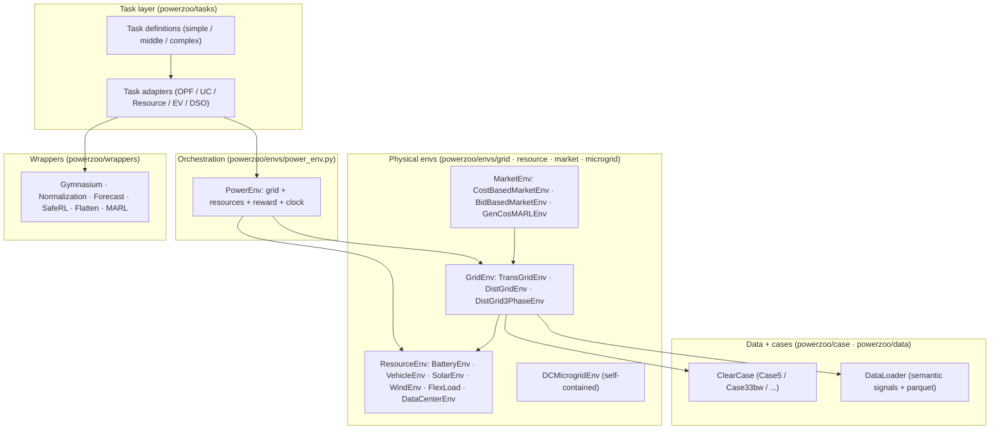
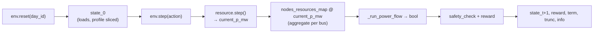
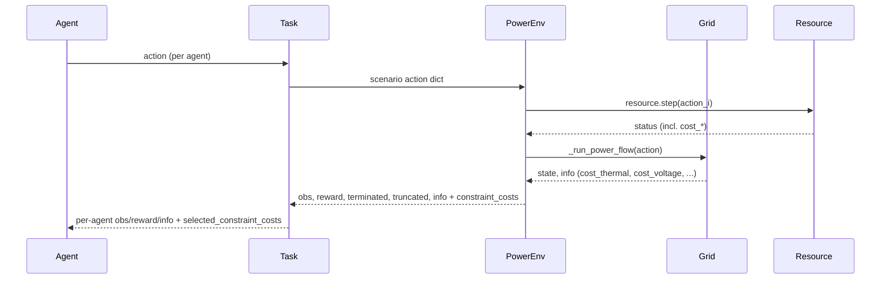

# 环境栈

PowerZoo 构建为一**分层的栈**，每一层都可以独立使用。下层对 RL 一无所知；上层加上 RL agent 与基准依赖的约定。本页聚焦 runtime 各层——源码树视图见 [Repository map](repo-map.md)。

下面用 1–2 段简短介绍每个 runtime 层，并指向负责细节的页面。

---

## 1. `BaseEnv` — 公共接口

`BaseEnv`（`powerzoo/envs/base.py`）是所有 PowerZoo 环境的抽象父类。它继承自 `gymnasium.Env`，加了两个 PowerZoo 专属属性：

| 属性 / 方法 | 用途 |
|---|---|
| `time_step` | 当前 episode 内的步数计数。 |
| `delta_t_minutes` | 步长（分钟），必须能整除 1440。默认 30。 |
| `action_space` / `observation_space` | 由子类填充。 |
| `reset(seed, options)` | 重置 `time_step`，返回 `(state, info)`（具体内容由子类决定）。 |
| `step(action)` | 由子类决定。在任务层返回 Gymnasium 风格五元组。 |
| `obs()` / `reward()` / `cost()` | 钩子方法；`cost()` 默认返回 0（CMDP 友好）。 |

子类不会把可变状态存放在任意属性中——`GridEnv` 与 `ResourceEnv` 把状态保存在定义明确的字段（case 数据、`current_p_mw`、`soc`……）中，因此 reset 是可复现的。

## 2. `GridEnv` — 物理电网

`GridEnv`（`powerzoo/envs/grid/base.py`）是输电与配电电网的抽象父类。它的职责是：

1. 持有一个 `ClearCase`（拓扑 + 各资产参数）。
2. 维护已挂载资源的注册表（`sub_resources`、`nodes_resources_map`）。
3. 从打包的数据中取出下一段需求 / 可再生时序。
4. 执行潮流求解，生成 `state` dict 与结构化的 `info` dict。

reset → step 数据流在所有 grid 类型中一致：

目前提供三个具体子类：

| 类 | Solver | 默认 case | 说明 |
|---|---|---|---|
| `TransGridEnv` | DC / AC × OPF / PF（4 种模式） | `Case5` | `physics ∈ {dc, ac}` × `solver_mode ∈ {opf, pf}`。OPF LP 后端由 `solver_type ∈ {auto, gurobi, scipy, cvxpy}` 决定。 |
| `DistGridEnv` | 单相 BFS（DistFlow） | `Case33bw` | 资源建模为 PQ 注入；非辐射输入会自动剪成生成树。 |
| `DistGrid3PhaseEnv` | 三相 BIBC/BCBV | `Case123` | 分相电压、VUF 与分相热稳限制。 |

每个类的完整参数表见 [Physics · Transmission](../physics/transmission.md) 与 [Physics · Distribution](../physics/distribution.md)。`info` schema 与 CMDP cost 规则见 [Reward and cost split](../concepts/reward-cost-split.md)。

## 3. `ResourceEnv` — 可控资产

`ResourceEnv`（`powerzoo/envs/resource/base.py`）是所有可控资产的父类。**Resource 是物理子组件，不是独立的 RL env**：resource 的 `step()` 更新内部状态（SOC、温度、队列……），但本身不产生 reward 或终止信号。Gymnasium step 元组与 `info` 中的 CMDP cost 向量由 `PowerEnv` 加上一个 `Task` 组装。

| 类 | 动作维度 | 说明 |
|---|---|---|
| `BatteryEnv` | 1D（启用 `enable_q_control` 时 2D） | SOC 积分器 + 充放效率；默认单向 `eta_charge=eta_discharge=0.95`。 |
| `VehicleEnv` | 1D | 电池 + 通勤日程 + 出发 SOC 要求（G2V / V2G）。 |
| `SolarEnv` / `WindEnv` | 1D（弃光/弃风） | 曲线驱动，可选无功控制。 |
| `FlexLoad` | 2D | 削减 + 带延迟需求缓冲的需求转移（DR 资源）。 |
| `DataCenterEnv` | 3D | GPU 训练 / 微调比例 + 制冷设定，带一阶热动力学。 |

**Cost 约定**：`resource.status()` 中任何以 `cost_` 开头的键都被当作非负的 CMDP cost 分量（物理单位）。`PowerEnv` 收集它们并合并到 `info['cost_resource']` 与固定顺序 `constraint_costs` 向量；`info['cost_resource_violation']` 只是旧别名——见 [Reward and cost split](../concepts/reward-cost-split.md)。这是新增 resource cost 时唯一需要的注册步骤。

详细参数表见 [Physics · Resources](../physics/resources.md) 与 [API · Resources](../api/resource.md)。

## 4. `PowerEnv` — 编排

`PowerEnv`（`powerzoo/envs/power_env.py`）把一个 grid 与一组 resource 绑定成单个 Gymnasium 风格 env。它持有统一的 episode 时钟，构建 dict observation（`grid` + 每个 resource 的 observation + `time` 特征），接受 dict action（`unit_power_mw` + 每个 resource），并产生一个完整增广的 `info` dict——把两层的 cost 贡献都聚合在一起。

`PowerEnv.from_yaml(path)` 用 YAML scenario 配置构建同一个对象。多数用户不会直接实例化 `PowerEnv`；而是通过 `make_task_env(...)` 或 `powerzoo.rl.make_env(...)`，这两个函数会自动构建合适的 `PowerEnv` 与对应 adapter。

## 5. Task 与 adapter

一个 **task**（`powerzoo/tasks/`）是一个基准 preset：scenario 配置（grid + resources）、agent 设计（per-agent obs / action）、reward / cost 合约、评估协议、（适用时）固定 train / val / test 窗口的 `SPLIT_DATES`。任务按难度组织：

- `simple/` — `battery_arbitrage`、`marl_opf`、`marl_der_arbitrage`、`marl_ders_benchmark`、`marl_ev_v2g`、`dc_scheduling`、`dc_microgrid`、`dc_microgrid_safe`、`gencos_bidding`。
- `middle/` — `marl_uc`、`comparison_tso_centralized`。
- `complex/` — `opf_118`、`opf_118_7d`、`joint_trans_dist*`（实验性）。

一个 **task adapter**（`powerzoo/tasks/adapters/`）把 task 转换为面向 RL 的具体 env（如 `TaskOPFMultiAgentEnv`、`TaskUCMultiAgentEnv`、`TaskResourceMultiAgentEnv`、`TaskEVMultiAgentEnv`）。

`envs / tasks / wrappers` 边界、各任务的 adapter 路由、公开基准面（稳定 vs 实验性）都记录在 [Python contract](../concepts/python-contract.md) §6–§7。每个任务的超参表见 [API · Tasks](../api/tasks.md)。

## 6. Wrappers

`powerzoo/wrappers/` 提供通用的 env-API 适配器。它们假设 task 合约已经满足，本身不包含 task 语义。完整清单——`GymnasiumWrapper`、`NormalizationWrapper`、`ForecastWrapper`、`SafeRLWrapper`、`GymnasiumSafeWrapper`、`MARLWrapper`、`TaskPettingZooWrapper`、`FlattenWrapper`——见 [Training · Wrappers](../training/wrappers.md)；各类签名见 [API · Wrappers](../api/wrappers.md)。

## 7. 可选层

上面描述的是默认基准栈。还有若干可选层在它之上扩展：

- **Markets** — `CostBasedMarketEnv`、`BidBasedMarketEnv` 与 `GenCosMARLEnv` 在 `TransGridEnv` 之上加入 LMP 驱动的结算。见 [Physics · Markets](../physics/markets.md) 与 [Benchmarks · GenCos](../benchmarks/gencos.md)。
- **DC microgrid** — `DCMicrogridEnv` 是一个自包含的表后基准，没有外部电网；它把 `DataCenterEnv` + `BatteryEnv` + 内联 PV + 柴油机组合在一起。见 [Physics · Microgrid](../physics/microgrid.md) 与 [Benchmarks · DC microgrid](../benchmarks/dc-microgrid.md)。
- **DSO benchmark** — `make_dso_env(...)` 是独立工厂，把 `Case33bw` + 6× `FlexLoad` + Ausgrid 时序组合起来用于配电系统运营商研究。见 [Benchmarks · DSO](../benchmarks/dso.md)。
- **RL trainer** — `powerzoo.rl` 提供 `make_env`、`RLConfig`、`Trainer`、`RewardWrapper` 与 `describe` / `info`，支持一行式训练流程。见 [Training · Trainers](../training/trainers.md)。

---

## 另见

- [Repository map](repo-map.md) — 同一组层的源码视图。
- [Data pipeline](data-pipeline.md) — `case/` 与 `data/` 实际如何为 env 提供数据。
- [Training pipeline](training-pipeline.md) — env → wrappers → trainer 流程。
- [Python contract](../concepts/python-contract.md)、[Reward and cost split](../concepts/reward-cost-split.md)。
