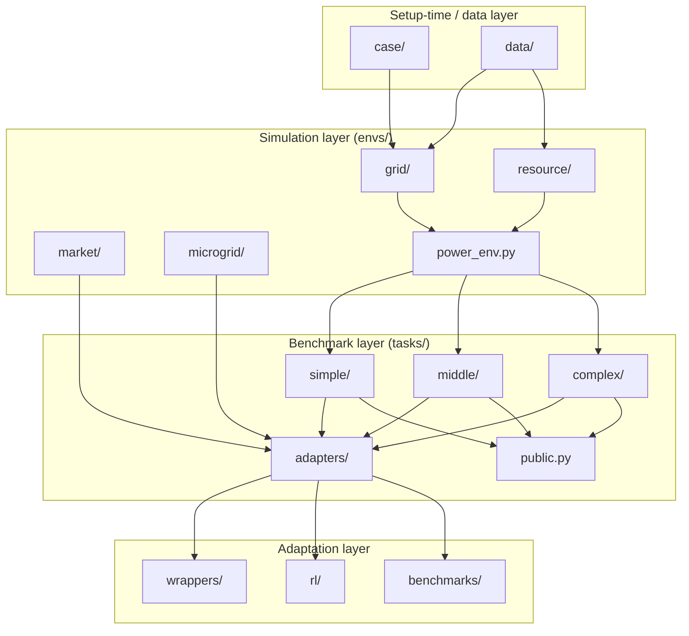

# 仓库地图

本页是源码树的导览。开始用 PowerZoo 时读一次；之后你应该能直接定位到任意功能所在的目录。

## 顶层布局

```
PowerZoo/
├── powerzoo/            <- 包本体
│   ├── case/            <- 网络数据与 case 加载器（Case5、Case33bw 等）
│   ├── data/            <- DataLoader、语义信号、parquet manifest
│   ├── envs/            <- 物理环境（仿真核心）
│   │   ├── grid/        <- TransGridEnv、DistGridEnv、DistGrid3PhaseEnv + solver
│   │   ├── resource/    <- BatteryEnv、VehicleEnv、SolarEnv、WindEnv、FlexLoad、DataCenterEnv
│   │   ├── market/      <- CostBasedMarketEnv、BidBasedMarketEnv、GenCosMARLEnv
│   │   ├── microgrid/   <- DCMicrogridEnv（自包含）
│   │   ├── base.py      <- BaseEnv 抽象类
│   │   └── power_env.py <- PowerEnv 编排入口
│   ├── tasks/           <- 基准 preset、adapter、registry、公开面
│   │   ├── simple/      <- battery_arbitrage、marl_opf、marl_der_arbitrage 等
│   │   ├── middle/      <- marl_uc 等
│   │   ├── complex/     <- opf_118、opf_118_7d、joint_trans_dist*
│   │   ├── adapters/    <- TaskOPFMultiAgentEnv、TaskUCMultiAgentEnv 等
│   │   ├── registry.py  <- register_task、make_task_env、list_tasks
│   │   └── public.py    <- PUBLIC_TASKS、list_public_tasks、get_public_task_catalog
│   ├── wrappers/        <- Gymnasium、Normalization、Forecast、SafeRL、Flatten、MARL
│   ├── benchmarks/      <- evaluate、normalized_score、policies、viz、offline
│   ├── rl/              <- powerzoo.rl: make_env、RLConfig、Trainer、RewardWrapper、describe
│   └── registration.py  <- gym.register 入口（PowerZoo/...-v0）
├── examples/            <- 可运行脚本（每个文件一个示例）
├── tests/               <- pytest 套件
├── docs/                <- 本文档（en + zh）
├── pyproject.toml       <- 依赖清单
└── mkdocs.yml           <- 文档构建配置
```

`PowerZooJax/`（同级项目）是同样五大基准系列的 JAX 重现版本；它不是运行时依赖。

## 各顶层包负责什么



箭头是单向的。下层不 import 上层——`envs/` 不需要 `tasks/`，`tasks/` 不需要 `wrappers/`，依此类推。这让每一层都能独立测试。

## 各类工作去哪里找

| 你要做的事 | 对应位置 |
|---|---|
| 加一个新的 IEEE / MATPOWER case | `powerzoo/case/transmission/` 或 `…/distribution/` |
| 加载真实时序（GB 需求、Ausgrid、Google DC） | `powerzoo/data/`（`DataLoader`、`signals.py`、`manifests/`、`parquet/`） |
| 实现一个新的物理求解器 | `powerzoo/envs/grid/`（如 `cal_dcopf_trans.py`、`_dist_pf.py`） |
| 实现一个新的可控资源 | `powerzoo/envs/resource/`（继承 `ResourceEnv`） |
| 添加一个新的基准任务 | `powerzoo/tasks/<difficulty>/`，并在包的 `__init__.py` 中 `register_task(...)` |
| 添加一个任务 adapter | `powerzoo/tasks/adapters/` |
| 添加一个通用 env wrapper | `powerzoo/wrappers/` |
| 添加一个训练入口 | `powerzoo/rl/`（`env.py`、`trainer.py`、`config.py`、`reward.py`、`describe.py`） |
| 运行内置策略 / 评估 | `powerzoo/benchmarks/`（`evaluate`、`RandomPolicy`、`OraclePolicy`） |

## Setup-time vs runtime

两个顶层目录只在初始化阶段使用，不会出现在内层训练循环中：

- `powerzoo/case/` 构建静态拓扑与参数表（`ClearCase`）。
- `powerzoo/data/` 解析 manifest、读取 parquet 文件到内存。

`powerzoo/envs/` 下的所有内容都在**热路径**上：每次 `step()` 都会经过它。`wrappers/` 与 `rl/` 在热路径外做包装，不会重复它的工作。

## 另见

- [Environment stack](env-stack.md) — runtime 各层如何组合起来。
- [Data pipeline](data-pipeline.md) — `case/` 和 `data/` 实际如何为 env 提供数据。
- [Training pipeline](training-pipeline.md) — env → wrappers → trainer 流程。
