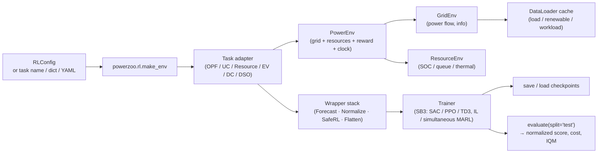

# 训练管线

本页给出一个 RL agent 如何接入 PowerZoo env、拿回 reward 与 cost、并完成权重更新的**端到端视图**。它把 [Environment stack](env-stack.md)、[Data pipeline](data-pipeline.md) 与 [Training](../training/trainers.md) 各页中分别介绍的部分整合起来。

## 完整管线



设计新实验时从左往右读，调试已完成的实验时从右往左读。

## 单智能体流程（Gymnasium）

```python
from powerzoo.rl import Trainer

t = Trainer("battery_arbitrage", algorithm="SAC", total_timesteps=200_000)
t.train()
results = t.evaluate(split="test")
t.save("./results/")
```

内部流程：

1. `Trainer.__init__` 把输入（task 名 / dict / YAML / `RLConfig`）解析为单个 `RLConfig`，并调用 `cfg.validate()`。
2. SB3 采用延迟导入；并填充 `ALGORITHMS = {SAC, PPO, TD3}`。
3. `t.train()` 调用 `self.get_env()` → `make_env(...)` → task adapter → `PowerEnv` → grid + resources，再套上指定的 wrapper。
4. SB3 模型用 `cfg.policy`（默认 `'MlpPolicy'`）、`cfg.hyperparams`、`seed` 构造，调用 `model.learn(total_timesteps, progress_bar, callback)` 开始训练。
5. `t.evaluate(split='test')` 在 test 切分上重建 env 并调用 `powerzoo.benchmarks.evaluate`，返回 mean reward、normalized score、mean episode cost 与 cost-violation rate。

## 多智能体流程（PettingZoo Parallel）

```python
from powerzoo.rl import Trainer

t = Trainer("marl_opf", framework="pettingzoo")
t.train_il(total_timesteps=50_000)

t = Trainer("marl_opf", framework="pettingzoo", algorithm="SAC")
t.train_marl_simultaneous(total_timesteps=200_000)
```

- `train_il` 依次对每个 agent 调用 SB3 `.learn()`（其他 agent 使用默认策略）。要求各 agent 的 space 同构。
- `train_marl_simultaneous` 每个 env step 执行一次 PettingZoo step，并同时更新所有 agent（仅 SAC）。实现位于 `powerzoo/rl/marl_simultaneous_sb3.py`。
- 其他框架（EPyMARL、MAPPO、自定义循环）调用 `t.get_env()` 直接接入即可。

## Wrapper 栈

`make_env(...)` 接收一组关键字参数，映射到对应 wrapper（仅作用于单智能体 env；对 MARL 静默忽略）：

| 参数 | 作用 |
|---|---|
| `reward=...` | `RewardWrapper` 替换 reward（callable 或 reward-type dict）。 |
| `forecast_horizon=N` | `ForecastWrapper` 在 obs 末尾追加 `N` 个未来需求值。 |
| `normalize=True` | `NormalizationWrapper` 把 obs（可选 action）缩放到 `[-1, 1]`。 |
| `safe_rl=True` | `GymnasiumSafeWrapper` 把 `info['cost_sum']` 注入 `info['cost']`。 |
| `cost_threshold=...` | 转发给 `GymnasiumSafeWrapper`。 |
| `seed=...` | 立刻调用 `env.reset(seed=...)`。 |

每个 wrapper 的完整参考（堆叠顺序、`SafeRLWrapper` 6 元组 vs `GymnasiumSafeWrapper` 5 元组、`ForecastWrapper` 的 `perfect`/`noisy`/`none` 模式）见 [Training · Wrappers](../training/wrappers.md)。

## 各部分的文档位置

- [Environment stack](env-stack.md) — `BaseEnv`、`GridEnv`、`ResourceEnv`、`PowerEnv` 语义。
- [Data pipeline](data-pipeline.md) — `DataLoader`、signals、parquet、对齐。
- [Python contract](../concepts/python-contract.md) — `step()` 的返回内容、5 种 observation 模式、`framework='auto' / 'pettingzoo' / 'rllib'`。
- [Reward and cost split](../concepts/reward-cost-split.md) — reward vs CMDP cost、`cost_*` 前缀规则。
- [Training · Trainers](../training/trainers.md) — `Trainer.train`、`train_il`、`train_marl_simultaneous`、`evaluate`、`save`、`load`。
- [Training · Wrappers](../training/wrappers.md) — 每个 wrapper 的签名。
- [Training · Presets](../training/presets.md) — 现成的 YAML 配置。
- [Training · Custom loops](../training/custom-loops.md) — 绕过 `Trainer` 自定义循环。

## 性能注意事项

- 热路径（env + wrappers）纯 CPU 运行。PowerZoo 自身不做 env 向量化——批量 rollout 请用 SB3 的 `make_vec_env` 或 RLlib 的 worker pool。
- 数据管线只在构造时执行一次、每次 reset 执行一次；内层循环不会触碰 parquet 或磁盘。
- 大规模 case 上，OPF LP 后端（`solver_type ∈ {auto, gurobi, scipy, cvxpy}`）主导 step 时间。`Case118` 及以上场景，有 Gurobi 时优先用 `gurobi`；`scipy`（HiGHS）是次优的免费选项。
- 需要 GPU 向量化 rollout 与 `lax.scan` 流水线，请使用同级 [PowerZooJax](https://github.com/powerzoojax/PowerZooJax) 项目，它用纯 JAX 重现了同样的五大基准系列。
