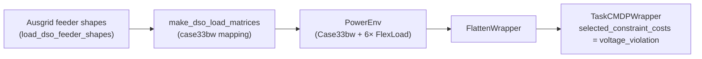

# DSO — 配电运行

DSO 基准把 `Case33bw` + 6× `FlexLoad` + Ausgrid 区域变电站负荷曲线组装成一个开箱即训的环境。统一的 RL 问题是**非平稳单 agent RL**：episode 由真实 Ausgrid 馈线曲线驱动，跨季节、跨变电站存在分布漂移；agent 必须用柔性负荷把电压保持在带内，同时最小化网损。

> **术语速查**。*DSO*（Distribution System Operator，配电系统运营商）负责运行连接终端用户的中低压馈线；它的主要 RL 问题是"在上游需求遵循真实外生曲线的情况下，用柔性负荷把电压保持在带内"。*FlexLoad* 是 PowerZoo 的需求响应资源：每台设备有削减额度与延迟需求缓冲区。*Ausgrid* 是一家澳大利亚配电公司，公开 30 分钟分辨率的区域变电站负荷曲线，在本基准中作为外生驱动使用。

本基准以**独立工厂**形式构建（`powerzoo.tasks.dso_task.make_dso_env`），而不是放入 `register_task` 入口，因为它有自己的数据管线（Ausgrid 馈线曲线）和自己的 task-level CMDP 选择（从配电网完整 cost 向量中选择电压违反）。



## 为什么是这个系列

- 唯一一个由**真实配电级区域变电站负荷**驱动的系列，而不是输电级聚合数据。
- 内置**时间维度上的分布漂移**：train、IID-test、summer-OOD-test 与 zone-holdout 切分分别覆盖季节 OOD 与变电站 OOD。
- Reward 表征的是**运行质量**（网损 + 削减），不是安全或成本——这与其他四个系列在目标维度上完全不同。

## 物理设置

| 项 | 默认值 |
|---|---|
| 载体 | `Case33bw`（33-bus 单相 BFS 配电）。 |
| 资源 | 6 个 `FlexLoad`，挂在 bus `[6, 14, 18, 22, 28, 33]`。 |
| 电压限制 | `v_min = 0.94 pu`，`v_max = 1.06 pu`。 |
| Episode | 48 步 × 30 min = 1 天。 |

`Case33bw` 上三段馈线分别由**不同的** Ausgrid 馈线曲线驱动（这样负荷形状沿馈线变化，而不仅是幅度变化）：

| 馈线 | Bus 范围 |
|---|---|
| `feeder_A` | 2 – 18 |
| `feeder_B` | 19 – 22 |
| `feeder_C` | 23 – 33 |

这与 JAX 版的馈线分段完全一致。

## Agent 设计

| 项 | 值 |
|---|---|
| Action | `Box(2*N)` = `Box(12,)` — 每台设备 `[curtail_fraction, shift_out_fraction]`。 |
| Observation | 扁平形式（经 `FlattenWrapper`）—— bus 电压、支路负载率、时间、各设备 FlexLoad 状态。 |
| Reward | `-loss_penalty_weight * p_loss_MW`（仅网损；默认 `loss_penalty_weight = 0.1`）。 |
| Core constraints | `constraint_names = ("voltage_violation", "thermal_overload", "resource")`；`info["constraint_costs"]` 按这个顺序排列。 |
| Task constraints | `selected_constraint_names = ("voltage_violation",)`，threshold `(5.0,)`，fallback weight `(1.0,)`。 |
| 标量兼容 | `info["cost"]` 只由 safe-RL 兼容 wrapper 生成，不再是 core env 合约。 |

为方便快速迭代，提供单设备变体：

```python
from powerzoo.tasks.dso_task import make_dso_1flex_env
env = make_dso_1flex_env(bus_id=18)   # action_space = Box(2,)
```

## 切分

Ausgrid 数据池按四种角色划分。`train` / `iid` / `summer_ood` 是**时间**切分；`zone_holdout` 在与 `train` 相同的日期范围内替换为**留出的变电站**。

| 切分 | 日期范围 | 馈线池 |
|---|---|---|
| `train` | 2024-05-01 – 2024-11-30 | 每条馈线（A / B / C）3 个变电站。 |
| `iid` | 2024-12-01 – 2025-02-28 | 与 `train` 相同的变电站。 |
| `summer_ood` | 2025-03-01 – 2025-04-30 | 与 `train` 相同的变电站。 |
| `zone_holdout` | 2024-05-01 – 2024-11-30 | 每条馈线 2 个不同的变电站。 |

这套四切分设计可以在同一任务上分别衡量纯时间 OOD（`summer_ood`）、纯变电站 OOD（`zone_holdout`）以及分布内基线（`iid`）。

## 代码配方

```python
from powerzoo.tasks.dso_task import make_dso_env, make_dso_1flex_env
from powerzoo.data import DataLoader

env = make_dso_env(split="train", data_loader=DataLoader())
obs, info = env.reset(seed=0)
obs, reward, terminated, truncated, info = env.step(env.action_space.sample())
```

## Baseline

`dso_task.py` 内置三个参考 baseline 与一个 metrics helper，因此一份 baseline 表不需要额外代码：

```python
from powerzoo.tasks.dso_task import (
    make_dso_env,
    dso_no_control_rollout,
    dso_tou_heuristic_rollout,
    dso_droop_heuristic_rollout,
    compute_dso_metrics,
    rollout_dso,
)

env = make_dso_env(split="iid")
no_ctrl = dso_no_control_rollout(env)
tou     = dso_tou_heuristic_rollout(env)
droop   = dso_droop_heuristic_rollout(env)
metrics = compute_dso_metrics(no_ctrl, tou, droop)
```

`rollout_dso(env, policy_fn, n_steps=...)` 用任意可调用 policy 运行一个 episode，并返回逐步的诊断量。

## 应报告的指标

- `network_loss_reduction_pct` — `(loss_no_control - loss_rl) / loss_no_control`。
- `served_flexible_demand_ratio` — FlexLoad 缓冲区中实际服务（而非溢出）的比例。
- `peak_shaving_effectiveness` — `(peak_no_control - peak_rl) / peak_no_control`。
- `voltage_violation_rate` — 从 `selected_constraint_costs` 派生，正常情况下应接近零。
- `drift_tracking_gap` — `NormScore(iid) - NormScore(summer_ood)`，鲁棒性的核心指标。
- `NormScore` — 相对于 no-control baseline 的标准归一化得分。

## 另见

- [Distribution physics](../physics/distribution.md) — 驱动本基准的 BFS solver。
- [Resources · FlexLoad](../physics/resources.md#flexload-需求响应) — 本任务使用的可控资产。
- [Architecture · Data pipeline](../architecture/data-pipeline.md) — Ausgrid 数据如何流入 env。
- `powerzoo/tasks/dso_task.py` — 完整源码（factory + baselines + metrics）。
