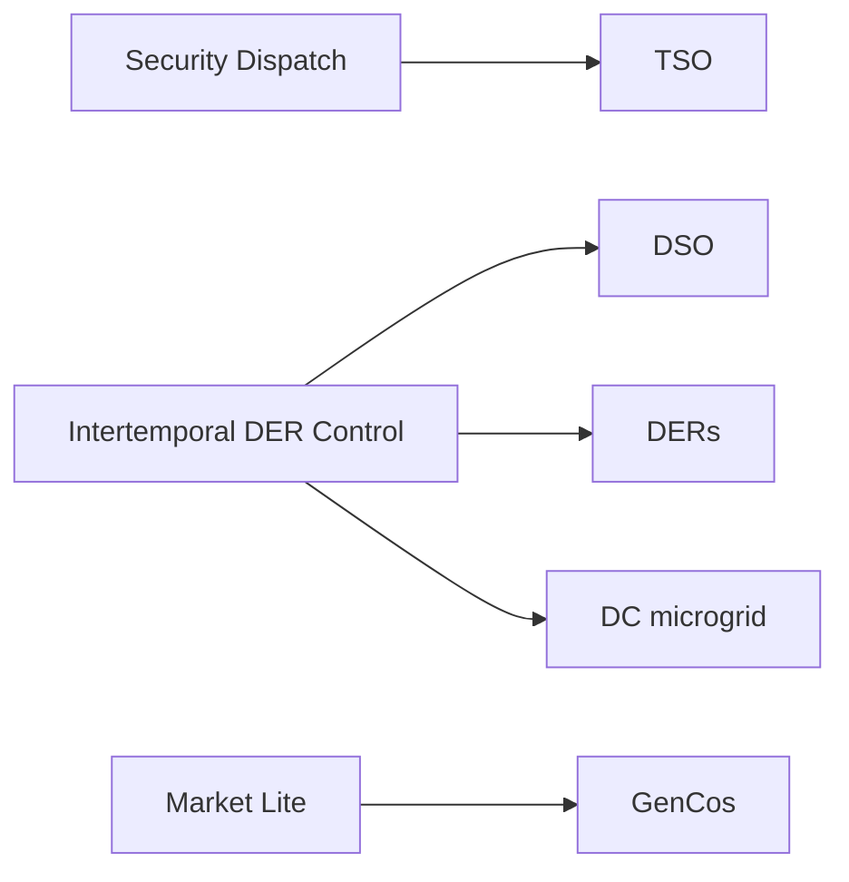

# 基准总览

PowerZoo 的基准面围绕**五个以 agent 为中心的任务系列**组织。每个系列针对不同的 RL 研究问题，并使用不同的物理载体、agent 结构、动作空间和约束类型；因此任意两个系列至少在其中四个维度上不同。

## 五大系列

| 系列 | 主线 | 载体 | Agent 数 | Steps × Δt | RL 范式 |
|---|---|---|---|---|---|
| [TSO](tso.md) | Security dispatch | 输电网 `Case5` / `Case118` | 1（UC）/ 54（`opf_118`） | 48 × 30 min（7d 为 336 × 30 min） | 含离散-连续混合动作的 Safe RL |
| [DSO](dso.md) | DER control | 配电网 `Case33bw` + 6× `FlexLoad` + Ausgrid | 1 | 48 × 30 min | 非平稳 RL（最小化网损） |
| [DERs](ders.md) | DER control | 配电网 `Case33bw` / `Case118zh` + 异构 DER | 3 / 5 / 12 | 48 × 30 min（EV 168） | 可扩展 Safe MARL |
| [DC microgrid](dc-microgrid.md) | DER control | 自包含直流微电网 | 1 | 288 × 5 min | 多目标稳健 RL |
| [GenCos](gencos.md) | Market lite | 输电网 `Case5` + 市场清算 | 5 | 48 × 30 min | 竞争式 MARL |

每个系列对应不同的 RL 范式，但五者共享同一个 `make_task_env` 接口和同一套 reward / cost 分离约定。没有任何算法能在五个系列上同时取胜；这正是基准设计的目的。



## 每个系列下的公开 PowerZoo 任务名

| 系列 | PowerZoo 任务 |
|---|---|
| TSO | [`marl_uc`](tso.md)（UC, `Case5`）、[`opf_118`](tso.md)、[`opf_118_7d`](tso.md)（大规模 ED, `Case118`） |
| DSO | [`make_dso_env(...)`](dso.md) 工厂（在标准 registry 之外组装） |
| DERs | [`marl_der_arbitrage`](ders.md)（`Case33bw`，3 个电池）、[`marl_ders_benchmark`](ders.md)（`Case118zh`，12 个异构 DER）、[`marl_ev_v2g`](ders.md)（5 辆 EV） |
| DC microgrid | [`dc_microgrid`](dc-microgrid.md)、[`dc_microgrid_safe`](dc-microgrid.md) |
| GenCos | [`gencos_bidding`](gencos.md) |

较小的起步任务不在旗舰基准内、但仍属于公开面：`battery_arbitrage`、`marl_opf`（5-bus MARL ED）、`dc_scheduling`。它们是单元测试和快速迭代的首选起点；可运行示例见 [Examples](../examples/index.md)。

## 一个基准页怎么读

每个系列页都遵循同一模板：

1. **设计意图与研究问题** — 这个系列针对的是哪种 RL 难度。
2. **物理设置** — case、resource、约束。
3. **Agent 设计** — observation、action、reward、cost。
4. **变体** — 系列内部的难度阶梯。
5. **切分** — train / val / test（DSO 为 train / iid / OOD）。
6. **Baseline** — 随机、规则、可能的 oracle 参考。
7. **指标** — 应当报告的指标。
8. **代码配方** — `make_task_env(name)` + 一段最小训练 stub。

## 五个系列覆盖的难度维度

五个系列合起来覆盖五个正交的难度维度。论文中可引用这张矩阵，说明基准的多样性：

| 维度 | 最简单 | → | 最难 |
|---|---|---|---|
| 信息结构 | TSO（中心化全信息） | DSO（单 agent 非平稳）→ DERs（Dec-POMDP） | GenCos（私有信息竞争） |
| 动作复杂度 | DSO（连续） | DC（多维连续）→ DERs（per-agent 联合）→ TSO（混合） | GenCos（多 agent 策略性博弈） |
| 安全要求 | GenCos（仅追求利润） | DSO（运行质量）→ DC（SLA + 热稳 + 功率平衡） | DERs（硬电压）→ TSO（完整安全约束） |
| 外生不确定性 | TSO（日内波动） | DSO（数据漂移）→ DERs（可再生波动） | DC（workload + 太阳 + 热）→ GenCos（+ 自适应对手） |
| 目标复杂度 | GenCos（利润） | DSO（网损 + 供电质量）→ TSO（成本 + 安全） | DERs（安全 + 公平）→ DC（3 维向量 + 约束） |

每个维度在五个系列上都呈单调排序，因此选择不同系列就能得到真正不同的 RL 难度，而不是同一个问题的不同包装。

## 公开面 helper 提供哪些信息

```python
from powerzoo.tasks import PUBLIC_TASKS, list_public_tasks, get_public_task_catalog

print(PUBLIC_TASKS)
print(list_public_tasks())
catalog = get_public_task_catalog()
print(catalog[0]['task_id'], catalog[0]['default_episode_horizon_steps'])
```

`PUBLIC_TASKS` 包含五大旗舰系列与较小的起步任务。`make_dso_env(...)` 是唯一不在 `PUBLIC_TASKS` 中的旗舰任务：它使用自己的工厂，而不走标准 registry。

## 另见

- [Concepts · Overview](../concepts/overview.md) — 三条主线的视图。
- [Python contract](../concepts/python-contract.md) — 每个基准都遵循的 env API。
- [Reward and cost split](../concepts/reward-cost-split.md) — 所有基准共享的 CMDP 视角。
- [Training · Trainers](../training/trainers.md) — 如何用一行代码在任意任务上训练 agent。
