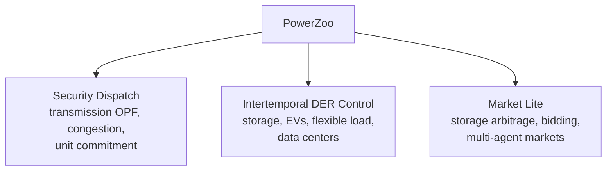
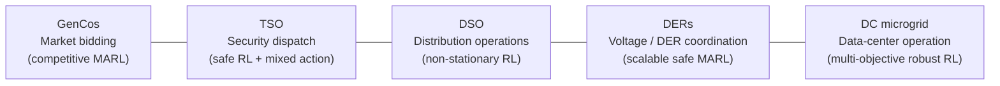

# 总览

PowerZoo 是一个面向强化学习（RL）研究的电力系统仿真框架。它不是通用电力仿真平台；目标是提供少量物理建模可靠的基准，让 ML 研究者直接用已有的 Gymnasium / PettingZoo / RLlib 管线进行训练。

本页给出一份简短的概念框架；本层后续几页会对每个概念做更详细的展开。

## 这套基准面向谁

这份文档面向两类读者：

- **ML 读者**：希望有一个 Gymnasium 兼容的基准，包含真实的物理动态、硬安全约束、真实时序驱动，以及清晰的 reward / cost 接口。
- **电力系统读者**：希望用 PyTorch、RLlib 或 Stable-Baselines3 驱动已有的物理模型，而不必从头写一个仿真器。

两类读者想要的是同一件事：物理本身带来难度，API 不引入额外复杂度。

## 三条主线

PowerZoo 的环境分成三条基准主线。每条主线对应一种不同的物理类型，带来不同种类的 RL 难度。

- **Security Dispatch**（安全调度）围绕共享的网络约束——一个发电机的动作通过潮流求解器改变所有其他发电机看到的可行集。
- **Intertemporal DER Control**（跨时段 DER 控制）把物理记忆（SOC、延迟需求、排队任务、热惯性）作为 RL state 的一部分，因而信用分配是延迟的、部分可观测的。
- **Market Lite**（轻量市场）在调度之上叠加简化的节点电价，因而 reward 同时取决于电价时机与物理可行性。

> **术语速查**。*DER*（Distributed Energy Resource，分布式能源资源）——配电层的小机组、储能、EV 或可控负荷。*SOC*（State Of Charge，荷电状态）——电池当前储能占容量的比例。*LMP*（Locational Marginal Price，节点边际电价）——某个节点上多 1 MWh 的边际成本。*CMDP*（Constrained MDP）——除 reward 目标外，还显式带有 cost 预算约束的 MDP。

## 五大基准系列

三条主线具体对应到**五个以 agent 为中心的任务系列**。每个系列都有自己的物理载体、agent 结构、动作空间和约束类型；任意两个系列至少在四个维度上不同。

每个系列都通过一个稳定的 PowerZoo 任务名（或工厂）访问。汇总表见 [Benchmarks · Overview](../benchmarks/overview.md)；每个系列也各有一页详解。

## 难度到底来自哪里

许多 "RL for power" 基准把难度隐藏在不透明的求解器或不一致的 state 里。PowerZoo 采取相反做法：难度应来自物理本身，而不是来自 API。四个难度来源：

1. **硬物理约束**。电压、热稳、SOC、EV 出发约束都不能放宽。Reward shaping 无法保证可行性——Safe-RL 是更合适的建模方式。
2. **耦合的多智能体决策**。发电机共享输电线路；DER 共享同一馈线。一个 agent 的动作会通过潮流物理改变所有其他 agent 的可行集，并且没有显式通信通道。
3. **长时序信用分配**。凌晨 3 点充电的电池要到傍晚 18 点才能获利；EV 必须提前数小时达到出发 SOC。标准折扣因子会让这种信号变模糊。
4. **非平稳的外生驱动**。真实的英国负荷、光伏、风电曲线（DSO 还叠加 Ausgrid 馈线形状，DC microgrid 还叠加 Google / Azure / Alibaba 轨迹）使每个 episode 都不一样。

后续几页将这四点逐一落到具体合约：

- [Python contract](python-contract.md) — 每个 PowerZoo env 必须实现什么，agent 从 `step()` 得到什么。
- [Reward and cost split](reward-cost-split.md) — PowerZoo 如何用 CMDP 分离经济目标和物理安全。
- [Power systems primer](power-systems-primer.md) — 面向 ML 读者写的底层物理。
