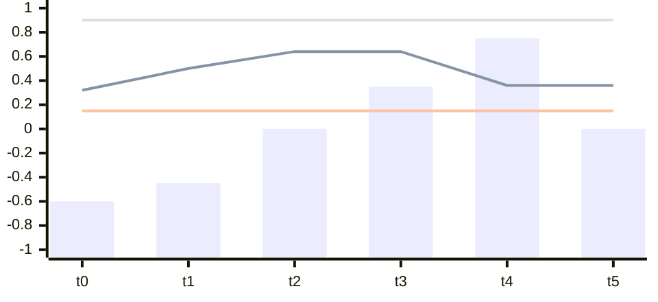

# 面向 ML 研究者的电力系统入门

本页介绍支撑 PowerZoo 各环境的基本电力系统概念。不要求电气工程背景——每个概念都从它对 RL 问题的影响出发说明。

推荐阅读顺序：先建立对电网与潮流的直觉，再看调度问题，然后是电池、EV 等带状态设备，最后回到安全约束与真实时序驱动。

下面的对照图列出后续每个物理对象对应到哪个常见 RL 概念，可作为速查。

```mermaid
flowchart LR
    subgraph Phys ["Physical object"]
      P1[Bus / line / PF solve]
      P2[Generator + cost curve]
      P3[Battery / EV SOC]
      P4[Voltage / thermal limits]
      P5[Real load · solar · wind traces]
    end
    subgraph RL ["RL concept"]
      R1[Coupled state transition\n(physics-mediated agent coupling)]
      R2[Per-agent action + shared reward]
      R3[Hidden integrator state\n(long-horizon credit assignment)]
      R4[CMDP cost channel\n(safety constraint)]
      R5[Non-stationary exogenous process\n(distribution shift)]
    end
    P1 --> R1
    P2 --> R2
    P3 --> R3
    P4 --> R4
    P5 --> R5
```


如果你已经熟悉电力物理，可直接跳到 [Python contract](python-contract.md) 查看 env API，再到 [Reward and cost split](reward-cost-split.md) 了解 CMDP 视角。更深入的物理推导见 [Physics](../physics/transmission.md)。

---

## 1. 网络与物理

先建立对"电网是什么"以及"环境每一步在算什么"的直觉。本节从静态结构开始，逐步过渡到把所有注入耦合在一起的物理求解。

<a id="1-the-power-grid-as-a-graph"></a>
### 1.1 电网作为一张图

电网可以表示为一张**图**：

- **Bus**（节点，图中标记为 **B1–B4**）是连接点——每个资源都在某个 bus 上注入或抽取功率。
- **Line**（边，标记为 **L1–L4**）在 bus 之间传输功率。每条线都有一个**热稳额定值**（最大 MW）和一个**阻抗**（电阻 + 电抗）。
- **Generator**（标记为 **G**，画成带正弦符号的圆）把功率*注入*某个 bus——箭头指向母线。
- **Load / demand**（标记为 **D**）从某个 bus *抽取*功率——箭头从母线指出。

<div style="margin: 1.25rem 0 1rem;">
  <svg
    viewBox="0 0 760 500"
    role="img"
    aria-labelledby="power-grid-graph-title power-grid-graph-desc"
    style="display: block; width: 100%; max-width: 760px; height: auto; margin: 0 auto;"
  >
    <title id="power-grid-graph-title">4-bus power grid example</title>
    <desc id="power-grid-graph-desc">
      A 4-bus ring network: generator G1 and load D1 at Bus 1 (top-left), load D2 at Bus 2 (top-right),
      load D3 at Bus 3 (bottom-left), generator G2 and load D4 at Bus 4 (bottom-right).
      Lines L1 (B1–B2), L2 (B1–B3), L3 (B2–B4), and L4 (B3–B4) form the ring.
    </desc>
    <defs>
      <marker id="arr-en" viewBox="0 0 10 10" refX="9" refY="5" markerWidth="7" markerHeight="7" orient="auto">
        <path d="M 0 0 L 10 5 L 0 10 z" fill="currentColor"></path>
      </marker>
    </defs>

    <g style="color: var(--md-default-fg-color); font-family: var(--md-text-font, -apple-system, BlinkMacSystemFont, 'Segoe UI', sans-serif);">

      <!-- Transmission lines (behind bus bars) -->
      <!-- L1: B1–B2, U-path -->
      <path d="M 258,165 V 210 H 502 V 165" fill="none" stroke="currentColor" stroke-width="2" stroke-linecap="round" stroke-linejoin="round"></path>
      <!-- L2: B1–B3, vertical left -->
      <line x1="145" y1="165" x2="145" y2="370" stroke="currentColor" stroke-width="2" stroke-linecap="round"></line>
      <!-- L3: B2–B4, vertical right -->
      <line x1="615" y1="165" x2="615" y2="370" stroke="currentColor" stroke-width="2" stroke-linecap="round"></line>
      <!-- L4: B3–B4, U-path -->
      <path d="M 258,370 V 415 H 502 V 370" fill="none" stroke="currentColor" stroke-width="2" stroke-linecap="round" stroke-linejoin="round"></path>

      <!-- Bus bars -->
      <line x1="88" y1="165" x2="268" y2="165" stroke="currentColor" stroke-width="8" stroke-linecap="round"></line>
      <line x1="492" y1="165" x2="672" y2="165" stroke="currentColor" stroke-width="8" stroke-linecap="round"></line>
      <line x1="88" y1="370" x2="268" y2="370" stroke="currentColor" stroke-width="8" stroke-linecap="round"></line>
      <line x1="492" y1="370" x2="672" y2="370" stroke="currentColor" stroke-width="8" stroke-linecap="round"></line>

      <!-- G1: generator at B1 (top-left) -->
      <circle cx="112" cy="94" r="29" fill="var(--md-default-bg-color, white)" stroke="currentColor" stroke-width="2"></circle>
      <path d="M 98,94 C 104,83 120,105 126,94" fill="none" stroke="currentColor" stroke-width="1.8"></path>
      <line x1="112" y1="123" x2="112" y2="158" stroke="currentColor" stroke-width="2" stroke-linecap="round" marker-end="url(#arr-en)"></line>

      <!-- D1: demand arrow up from B1 -->
      <line x1="200" y1="165" x2="200" y2="65" stroke="currentColor" stroke-width="2" stroke-linecap="round" marker-end="url(#arr-en)"></line>

      <!-- D2: demand arrow up from B2 -->
      <line x1="570" y1="165" x2="570" y2="65" stroke="currentColor" stroke-width="2" stroke-linecap="round" marker-end="url(#arr-en)"></line>

      <!-- D3: demand arrow down from B3 -->
      <line x1="190" y1="370" x2="190" y2="455" stroke="currentColor" stroke-width="2" stroke-linecap="round" marker-end="url(#arr-en)"></line>

      <!-- G2: generator at B4 (bottom-right) -->
      <circle cx="648" cy="436" r="29" fill="var(--md-default-bg-color, white)" stroke="currentColor" stroke-width="2"></circle>
      <path d="M 634,436 C 640,425 656,447 662,436" fill="none" stroke="currentColor" stroke-width="1.8"></path>
      <line x1="648" y1="407" x2="648" y2="377" stroke="currentColor" stroke-width="2" stroke-linecap="round" marker-end="url(#arr-en)"></line>

      <!-- D4: demand arrow down from B4 -->
      <line x1="548" y1="370" x2="548" y2="455" stroke="currentColor" stroke-width="2" stroke-linecap="round" marker-end="url(#arr-en)"></line>

      <!-- Bus labels -->
      <text x="70" y="172" text-anchor="end" font-size="19" font-weight="600" fill="currentColor">B1</text>
      <text x="690" y="172" font-size="19" font-weight="600" fill="currentColor">B2</text>
      <text x="70" y="377" text-anchor="end" font-size="19" font-weight="600" fill="currentColor">B3</text>
      <text x="690" y="377" font-size="19" font-weight="600" fill="currentColor">B4</text>

      <!-- Component labels -->
      <text x="150" y="82" font-size="17" fill="currentColor">G1</text>
      <text x="212" y="58" font-size="17" fill="currentColor">D1</text>
      <text x="582" y="58" font-size="17" fill="currentColor">D2</text>
      <text x="202" y="473" font-size="17" fill="currentColor">D3</text>
      <text x="560" y="473" font-size="17" fill="currentColor">D4</text>
      <text x="686" y="454" font-size="17" fill="currentColor">G2</text>

      <!-- Line labels -->
      <text x="380" y="204" text-anchor="middle" font-size="17" fill="currentColor">L1</text>
      <text x="102" y="272" text-anchor="end" font-size="17" fill="currentColor">L2</text>
      <text x="628" y="272" font-size="17" fill="currentColor">L3</text>
      <text x="380" y="432" text-anchor="middle" font-size="17" fill="currentColor">L4</text>

    </g>
  </svg>
</div>


图中是一个 4-bus 环网：两台发电机（G1 在 B1，G2 在 B4）、四个需求点（D1–D4，每个 bus 一个）、四条线（L1–L4）连接相邻 bus。每个 bus 至少挂一个资源；每条线都是功率可以流过的物理路径。

**这件事对 RL 为什么重要**：没有哪个 bus 是独立运行的。提高发电机 G1 的出力会同时增加 L1（B1 → B2）与 L2（B1 → B3）的潮流，进而改变 B2、B3、B4 的运行条件——但这些 bus 之间并没有任何直接信号传递。这种**通过物理介导的耦合**正是多智能体电网控制与 StarCraft、交通控制等典型 MARL 基准的根本区别——后者中 agent 仅通过显式的游戏机制相互作用。

---

<a id="2-power-flow-the-physics-engine"></a>
### 1.2 潮流：物理引擎

潮流（也称 load flow）是电网的**物理 step**。给定所有注入（发电、负荷、储能），它求出：

- 每个 bus 的**电压**（幅值与相角）
- 每条线路的**电流 / 功率潮流**
- **网损**（在线路阻抗中耗散的有功）

#### DC 潮流（线性近似）

假设所有电压都是 1.0 pu，忽略无功和损耗：

$$P_{\text{line}} = \text{PTDF} \times P_{\text{injection}}$$

其中 PTDF（Power Transfer Distribution Factor）是由线路阻抗推出的常量矩阵。整个计算就是**一次矩阵-向量乘法**——速度快、可微，但只是近似。

**RL 含义**：DC 潮流给出线性约束。可行动作集是一个多面体，约束满足可解析验证。

#### AC 潮流（非线性、完整物理）

在每个 bus 上求解非线性的功率平衡方程：

$$P_i = V_i \sum_j V_j (G_{ij} \cos\theta_{ij} + B_{ij} \sin\theta_{ij})$$

$$Q_i = V_i \sum_j V_j (G_{ij} \sin\theta_{ij} - B_{ij} \cos\theta_{ij})$$

其中 $V_i$ 是电压幅值，$\theta_{ij}$ 是电压相角差，$G_{ij}$、$B_{ij}$ 来自导纳矩阵的电导与电纳。

**RL 含义**：AC 潮流使转移函数变得**非线性且非凸**。小幅动作变化可能引起较大的电压摆动。求解器在分配不可行时可能不收敛——环境必须妥善处理这种情况。

#### 配电 vs 输电


| 性质     | 输电（HV）                | 配电（MV/LV）        |
| ------ | --------------------- | ---------------- |
| 拓扑     | 网状（含环）                | 辐射状（树）           |
| 电压等级   | 110–765 kV            | 0.4–33 kV        |
| 求解器    | PTDF / Newton–Raphson | 前推回代（BFS）        |
| 关键约束   | 线路热稳限制                | 电压幅值限制           |
| R/X 比  | 低（≈0.1）——电抗主导         | 高（≈1.0）——电阻和电抗相当 |
| DER 渗透 | 低（大机组）                | 高（光伏、电池、EV）      |


**RL 含义**：输电任务强调大机组之间的**全局协调**；配电任务强调多个小资源的**本地电压调节**。PowerZoo 两类都提供。

---

## 2. 调度问题：系统如何决定出力

理清网络与物理之后，基准中的主要决策问题就更容易定位：单步 OPF 与跨时段 UC。

<a id="3-optimal-power-flow-opf"></a>
### 2.1 最优潮流（OPF）

OPF 要回答的是：*在给定需求下，最便宜的可行发电分配是什么？*

$$\min_{P_g} \sum_i C_i(P_{g,i}) \quad \text{s.t.} \quad \text{power balance, line limits, voltage limits}$$

其中 $C_i(P_{g,i}) = mc\_a_i P_{g,i}^2 + mc\_b_i P_{g,i} + mc\_c_i$ 是发电机 $i$ 的二次总成本曲线。在 PowerZoo 中，`mc_a`、`mc_b`、`mc_c` 是这条总成本多项式的系数。当 `mc_a = mc_b = 0`（如 Case5）时，`mc_c` 就是 $/MWh 的常值边际成本，cost 简化为 $C(P) = mc\_c \cdot P$。

OPF 解在 PowerZoo `marl_opf` 与 `opf_118` 任务中作为 **oracle baseline**。一个完美的 RL 策略可以在不调用求解器的前提下复现 OPF 分配。

**为什么不直接跑 OPF**？现实中存在以下限制：

- OPF 需要完整的系统知识（所有成本、所有限制）——而 RL agent 可能只有部分可观测信息。
- OPF 是单步静态优化——不考虑跨时段约束（电池 SOC、爬坡、启停成本）。
- 大规模 AC-OPF 是 NP 难问题；RL 提供了一条实时近似的解决路径。

#### 节点边际电价（LMP）

LMP 是每个 bus 上功率平衡约束的对偶变量（影子价格）。它表示：*如果 bus $i$ 的需求增加 1 MW，系统总成本会增加多少？*

$$\text{LMP}_i = \lambda + \sum_k \mu_k \cdot \text{PTDF}_{k,i}$$

其中 $\lambda$ 是系统能量价格，$\mu_k$ 是绑定线路约束的拥塞乘子。

**RL 含义**：LMP 是储能与 DER agent 直接可用的价格信号。在 `marl_der_arbitrage`、`CostBasedMarketEnv` 与 `BidBasedMarketEnv` 中，agent 观测从 LMP 派生的信号，必须学会"低买高卖"——这是一个典型的时间信用分配问题。

---

<a id="4-unit-commitment-uc"></a>
### 2.2 机组组合（UC）

UC 在 OPF 上加二元开/关决策与跨时段约束：

$$\min \sum_{t} \sum_{i} \bigl[ C_i(P_{g,i,t}) \cdot u_{i,t} + S_i^{\text{up}} \cdot z_{i,t} + S_i^{\text{dn}} \cdot w_{i,t} \bigr]$$

约束：

- 每个时刻的**功率平衡**
- **发电限制**：$P_{\min} \cdot u_{i,t} \leq P_{g,i,t} \leq P_{\max} \cdot u_{i,t}$
- **最小开/停机时间**：启动后机组必须保持 on 至少 $T_{\text{up}}$ 步；停机后必须保持 off 至少 $T_{\text{dn}}$ 步
- **爬坡速率**：$|P_{g,i,t} - P_{g,i,t-1}| \leq R_i$
- **启停指示**：$z_{i,t} \geq u_{i,t} - u_{i,t-1}$，$w_{i,t} \geq u_{i,t-1} - u_{i,t}$

**RL 含义**：`marl_uc` 任务需要**离散-连续混合动作**——每个 agent 输出 `[score, on_off]`。最小开/停机时间会在相邻步之间引入**时间耦合**。忽略未来需求的贪心策略可能产生大量启停成本。这是验证混合动作空间与长时序规划算法的合适场景。

---

## 3. 柔性设备与跨时段状态

这一层关注那些会把状态跨时间传递的资源。它们的动作不仅决定当前是否可行，还会影响 episode 后续步骤的可行域。

<a id="5-battery-storage-and-soc-dynamics"></a>
### 3.1 电池储能与 SOC 动力学

电池 SOC 演化：

$$\text{SOC}_{t+1} = \text{SOC}_t + \frac{\Delta t}{E_{\text{cap}}} \begin{cases} -P_t \cdot \eta_{\text{charge}} & \text{if charging } (P_t < 0) \\ -P_t / \eta_{\text{discharge}} & \text{if discharging } (P_t > 0) \end{cases}$$

约束 $\text{SOC}_{\min} \leq \text{SOC}_{t+1} \leq \text{SOC}_{\max}$ 与 $P_{\min} \leq P_t \leq P_{\max}$。

下面这张草图有意做得简化：柱子表示功率动作，三条线分别是 SOC、`SOC_min` 与 `SOC_max`。重点不在精确单位，而在于"先充后放"的结构，以及当前动作如何影响后续的可行域。




**RL 含义**：SOC 是**隐藏的积分器状态**——当前动作会约束未来的可行域。在 $t$ 时刻完全放空电池的 agent，将无法响应 $t+1$ 时刻的电价尖峰。这要求**长时序信用分配**，类似库存管理，但额外带有效率损失、功率上限与电网耦合。

---

<a id="6-electric-vehicles-g2v-v2g"></a>
### 3.2 电动汽车（G2V / V2G）

EV 在电池动力学之上增加了若干调度约束：

- **可用度**：EV 只有停在家时才能充/放电。在通勤时段，agent 的动作必须为零。
- **出发 SOC**：EV 出发前必须达到 $\text{SOC} \geq \text{SOC}_{\text{departure}}$。错过该截止时间记为硬约束违反。
- **随机日程**：出发 / 到达时间在不同 episode 之间可能不同。

下图把 EV 专属的两个约束分开展示：可用窗口决定何时允许动作；`departure deadline` 与出发 SOC 要求决定电池何时必须达到目标值。

```mermaid
gantt
    title EV timeline: availability constraint and departure deadline
    dateFormat HH:mm
    axisFormat %H:%M
    section Available windows
    Home / available     :home1, 08:00, 2h
    Home / available     :home2, 11:00, 2h
    section Unavailable
    Commute / unavailable :away1, 10:00, 1h
    section Constraints
    Departure SOC req.    :milestone, soc1, 09:50, 10m
    EV departure deadline :vert, dep1, 10:00, 1m
```




**RL 含义**：`marl_ev_v2g` 任务把**时间信用分配**（现在充电以备稍后出发）、**硬截止约束**（出发 SOC）与**可用度屏蔽**（零动作时段）三者结合在一起。Agent 不能只学一条静态充电曲线——必须在每个 episode 内适应变化的日程。

---

## 4. 安全约束与外生驱动

前面的网络、调度与设备都运行在两类更高层的条件下：硬安全边界，以及使环境非平稳的真实时序输入。

<a id="7-voltage-and-thermal-limits-safety-constraints"></a>
### 4.1 电压与热稳限制——安全约束

电力系统会执行**硬物理约束**：

| 约束 | 物理含义 | 违反后果 |
|---|---|---|
| **电压**（$V_{\min} \leq V_i \leq V_{\max}$） | bus 电压必须在标称值的 ±5% 内 | 设备损坏、连锁停电 |
| **热稳**（$\lvert S_k\rvert \leq S_k^{\max}$） | 线路视在功率不得超过额定值 | 导线下垂、绝缘失效、起火 |
| **SOC 边界** | 电池不得超出物理容量 | 电芯衰退、安全隐患 |
| **发电限制**（$P_{\min} \leq P_g \leq P_{\max}$） | 发电机出力在铭牌范围内 | 机械应力、汽轮机损坏 |

在 PowerZoo 中，这些违反**不**通过 reward 进行惩罚，而是流入独立的 CMDP cost 通道（`constraint_costs` 加命名 `cost_*` 分量）；标量 `info['cost']` 只保留给兼容 wrapper。完整规则——每个任务使用哪些 cost 分量、resource 如何暴露、wrapper 如何转换——见 [Reward and cost split](reward-cost-split.md)。

**RL 含义**：标准 reward shaping（在 reward 上加惩罚项）会把经济目标与安全要求混在一起。CMDP 分离允许研究者使用 Lagrangian 方法、约束策略优化（CPO）或 primal-dual 方法。`SafeRLWrapper` 以 OmniSafe 兼容格式提供 cost 信号。

---

<a id="8-time-series-data-and-non-stationarity"></a>
### 4.2 时序数据与非平稳性

PowerZoo 打包了来自 GB（英国）电力系统的真实半小时分辨率时序：

- **系统需求**：全国总负荷（MW），呈现日 / 周 / 季节模式
- **光伏容量因子**：装机光伏中实际发电的比例（0–1）
- **风电容量因子**：装机风电中实际发电的比例（0–1）

它们驱动每个任务的外生动力学。关键性质：


| 性质                          | 对 RL 的影响                      |
| --------------------------- | ----------------------------- |
| **昼夜周期**（峰值 18:00，低谷 04:00） | 策略必须学会 time-of-day 模式         |
| **周季节性**（工作日 vs 周末）         | 跨周结构泛化                        |
| **季节变化**（冬季峰值 ≈ 1.5× 夏季）    | train/val/test 切分跨越不同季节——分布漂移 |
| **天气相关**（光伏 ↔ 云、风 ↔ 风暴）     | 多变量外生 state、不完美预测             |
| **趋势**（可再生增长、基荷下降）          | 年度概念漂移                        |


**RL 含义**：在夏季数据上训练的策略到了冬季可能失败。固定的 train/val/test 日期切分（不重叠，跨越 2023–2025）用于检验 agent 是否学到了鲁棒策略，而不是记住特定的负荷模式。

---

<a id="9-summary-what-makes-this-domain-unique-for-rl"></a>
## 5. 为什么这是一个独特的 RL 问题


| 电力性质            | RL 挑战         | PowerZoo 任务                        |
| --------------- | ------------- | ---------------------------------- |
| 潮流耦合所有 bus      | 隐式 agent 耦合   | 所有电网任务                             |
| 非线性 AC 方程       | 非凸转移          | AC 模式任务                            |
| 硬电压 / 热稳限制      | CMDP、safe RL  | 所有任务通过 `SafeRLWrapper`             |
| 发电机成本曲线         | 多智能体信用分配      | `marl_opf`、`opf_118`               |
| SOC 积分器动力学      | 长时序规划         | `marl_der_arbitrage`、`marl_ev_v2g` |
| 开/关 + 连续调度      | 混合动作空间        | `marl_uc`                          |
| 真实时序驱动负荷        | 分布漂移、泛化       | 所有任务（train/val/test 切分）            |
| EV 出发截止         | 硬截止约束         | `marl_ev_v2g`                      |
| 成本 vs 安全冲突      | Pareto 权衡、多目标 | EV、safe RL 任务                      |
| 电网拓扑（网状 vs 辐射状） | 不同约束结构        | Trans vs Dist 环境                   |


这些性质**来自物理本身**，不是人为的基准设计。PowerZoo 的工作是通过清晰的 RL 接口把它们呈现出来，同时保留其物理真实性。

---

## 另见

- [Python contract](python-contract.md) 与 [Reward and cost split](reward-cost-split.md) — env API 与 CMDP 视角。
- [Physics · Transmission](../physics/transmission.md)、[Distribution](../physics/distribution.md)、[Resources](../physics/resources.md) — 各层的实现级物理。
- [Benchmarks · Overview](../benchmarks/overview.md) — 每个任务如何把这些物理实例化成 MDP。
- 反复出现的缩略语速查见 [术语表](../getting-started.md#术语表)（PF、OPF、BFS、LMP、SOC、V2G ……）。
