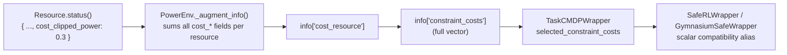

# 奖励与代价分离

PowerZoo 把每个任务都视作一个**约束 MDP（CMDP）**：在期望折扣 cost 不超过预算的前提下，最大化期望折扣 reward。

\[
\max_\pi \; \mathbb{E}_\pi\!\left[\sum_{t=0}^{T} \gamma^t r_t\right]
\quad \text{s.t.} \quad
\mathbb{E}_\pi\!\left[\sum_{t=0}^{T} \gamma^t c_{k,t}\right] \leq d_k
\]

本页说明这种分离在代码中、以及在每一步 `info` 字典中如何体现。完整 env API 见 [Python contract](python-contract.md)；底层物理见 [Power systems primer](power-systems-primer.md)。

## 为什么要单独的 cost 通道

Reward shaping 无法保证约束满足。形如 `economic_value − λ · violation` 的 reward 只能引导策略；λ 太小会忽略约束，太大则会为安全过度牺牲 reward。把安全放进**独立的 cost 通道**之后，就能接入 Lagrangian、primal-dual、CPO 等约束 RL 算法，而不必改动 env。一个忽略向量 cost（或其标量兼容别名）的标准 reward-only RL agent 仍然可以训练，只不过会得到一个不安全的策略。

## reward 里放什么

reward 通道只承载**经济 / 任务目标**：

- **OPF / UC**（`marl_opf`、`opf_118`、`opf_118_7d`、`marl_uc`）：负发电成本（UC 还包括启停成本）。
- **电池 / DER / EV 套利**（`battery_arbitrage`、`marl_der_arbitrage`、`marl_ev_v2g`）：交易利润（EV 还包括出发就绪奖励）。
- **数据中心**（`dc_scheduling`）：加权 `-(energy + SLA + PUE)`。
- **直流微电网**（`dc_microgrid`、`dc_microgrid_safe`）：标量化的 `r_energy + w_cost · r_cost + w_carbon · r_carbon`，分量向量同时在 `info["reward_vector"]` 中给出。
- **市场**（`gencos_bidding`、`CostBasedMarketEnv`、`BidBasedMarketEnv`）：每步 LMP 驱动的结算利润。
- **DSO**（`make_dso_env`）：网损（`-loss_penalty_weight * p_loss_MW`）。

## cost 里放什么

cost 通道以物理单位记录**物理安全违反**：

- 线路热稳越限（MW），节点电压越限（pu）。
- 电池 / EV SOC 边界违反，EV 出发 SOC 未达成，EV 离家但仍下达动作。
- 数据中心区域温度过高（高于临界值的 °C 数）。
- 微电网 SLA / 功率缺额违反。

## cost 如何从 resource 流到 agent

PowerZoo 采用一条简单的**前缀约定**：`resource.status()` 返回的字典中，键名以 `cost_` 开头的字段都会被自动收集。



要在自定义 resource 中新增一个 cost 信号：

```python
def status(self) -> dict:
    return {
        ...,
        'cost_my_new_violation': max(0.0, value),   # non-negative, physical units
    }
```

不需要任何注册调用。

## 各任务的 cost 分量

不同任务使用不同子集：

| 任务 | `info` 中的 cost 分量 | Benchmark CMDP 选择 |
|---|---|---|
| `marl_opf`、`marl_uc`、`opf_118`、`opf_118_7d` | `cost_thermal_overload`、`cost_voltage_violation` | legacy scalar projection only |
| `marl_der_arbitrage` | `cost_voltage_violation`、`cost_clipped_power`（电池 SOC 截断） | legacy starter task；只有 wrapper 才生成标量投影 |
| `marl_ev_v2g` | `cost_voltage_violation`、`cost_clipped_power`、EV 出发违反、家中可用度违反 | legacy starter task；只有 wrapper 才生成标量投影 |
| `dc_scheduling` | `cost_overtemp`、来自 PowerEnv 的电网 `cost_*` | legacy starter task；`cost_sum` 作为诊断 |
| `dc_microgrid`、`dc_microgrid_safe` | `cost_sla`、`cost_overtemp`、`cost_power_deficit` | `selected_constraint_costs = ['sla', 'overtemp', 'power_deficit']` |
| `make_dso_env(...)` | 完整向量 + task 选择 | `selected_constraint_costs = ['voltage_violation']` |
| `comparison_tso_centralized` | `cost_thermal_overload`、`cost_reserve_shortfall` | `selected_constraint_costs = ['thermal_overload', 'reserve_shortfall']` |
| `marl_ders_benchmark` | per-agent `voltage_violation`、`thermal_overload`、`resource` | 当前 MARL 训练 = CMDP env + MDP fallback |
| `gencos_bidding` | per-agent `thermal_overload` | 当前 MARL 训练 = CMDP env + MDP fallback |

在有用的情况下，adapter 还会通过 `info['costs']`（按名称组织的 dict）给出分项明细。

## 把标量 cost 接入 Safe-RL 算法

下面两个 wrapper 覆盖常见的接口形式：

| Wrapper | 返回 | 何时使用 |
|---|---|---|
| `SafeRLWrapper` | 6 元组 `(obs, reward, cost, terminated, truncated, info)` | 算法把 cost 当作单独的返回值读取（OmniSafe、Safety-Gymnasium）。 |
| `GymnasiumSafeWrapper` | 标准 5 元组，但把选中约束的标量投影注入到 `info['cost']` | 算法期望标准 5 元组，从 `info` 中读取 cost。 |

堆叠示例：

```python
from powerzoo.envs.grid.trans import TransGridEnv
from powerzoo.wrappers import GymnasiumWrapper, SafeRLWrapper

env = SafeRLWrapper(GymnasiumWrapper(TransGridEnv()), cost_threshold=25.0)
obs, info = env.reset(seed=0)
obs, reward, cost, terminated, truncated, info = env.step(env.action_space.sample())
```

`powerzoo.rl.make_env(...)` 通过关键字参数暴露同样的 wrapper——见 [Training · Trainers](../training/trainers.md)。

## 反模式

- **不要把安全并入 reward**。如果你写出 `reward -= w * thermal_violation`，等于又把 cost 通道合并回目标函数。正确做法是放在 `info['constraint_costs']`，需要时再由 wrapper 做兼容投影。
- **不要私下放宽 voltage / SOC 边界**。这些边界是基准合约的一部分；算法无法满足这件事，就是实验结果本身。
- **基准实验时不要使用 `DistGridEnv` 的 soft-penalty 路径**。它仅为兼容目的保留，启用后会破坏 CMDP 分离——请使用默认的"仅网损"reward，并从 `info` 读取违反量。
