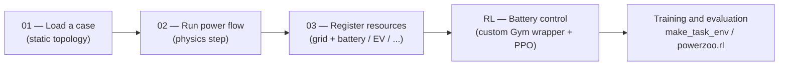

# 示例

PowerZoo 提供 `examples/*.py` 中的**脚本**示例，并在本节以四个简短页面对应呈现。脚本有意保持在较低层：展示底层 grid + resource API，以及任务封装之前各组件如何连接。

## 阅读顺序



简要说明：

- **示例 01–03** 从底层一步步搭建栈。它们适合在设计新任务或调试物理时阅读，并且都不使用 `make_task_env`。
- **`RL — Battery control`** 起承上启下作用：使用相同的低层接线，并用真实 RL 算法训练。**基准实验请使用 `make_task_env('battery_arbitrage')` 或 `powerzoo.rl.make_env(...)`**；见 [Training · Trainers](../training/trainers.md)。
- 做基准实验时，可从这些底层示例继续转向 `make_task_env(...)`、`powerzoo.rl` 与训练页面。

## 关于 Online RL 基准

PowerZoo 是一个面向电力系统环境的**在线 RL 基准**。Agent 通过实时与仿真器交互来学习。**Normalized score** 把平均 episode return 在**随机策略 baseline**（0）和 **oracle baseline**（1）之间做线性映射：

> `normalized_score = (policy_score − random_score) / (oracle_score − random_score)`
> 0 表示等同随机，1 表示等同 oracle，> 1 表示策略超过了 oracle 启发式。

| 特性 | CartPole / MuJoCo | Atari | 离线 RL 数据集 | **PowerZoo** |
|---|---|---|---|---|
| 领域 | 机器人 / 物理 | 游戏 | 机器人 / 移动 | 电力系统 |
| RL 类型 | Online | Online | **Offline**（静态数据集） | **Online** |
| Agent 结构 | Single | Single | Single | **MARL-first**[^pz-agents] |
| 动作空间 | 连续 / 离散 | 离散 | 连续 | **连续** |
| 物理约束 | 软（关节限制） | 无 | 软 | **硬（电网物理）** |
| 真实数据 | 无 | 无 | 有（日志） | **有（打包的真实电网数据）** |
| Normalized score | 无 | 有（人 = 1） | 有（专家 = 1） | **有（oracle OPF = 1）** |

[^pz-agents]: PowerZoo 的公开面同时包含单 agent（`battery_arbitrage`、`dc_scheduling`、`dc_microgrid*`）和多 agent 任务。正式列表请使用 `list_public_tasks()`。

## 核心起步任务

下面四张卡片对应推荐的学习路径：**单 agent 配电 → 输电 MARL → 配电 MARL（电池）→ 配电 MARL（EV）**。

<div class="grid cards" markdown>

-   **单电池套利**

    ---

    - Grid: IEEE 33-bus 配电（`Case33bw`）
    - Agent: 1 — 连续充 / 放电
    - Goal: 峰谷套利同时把 SOC 保持在带内
    - Episode: 48 步 × 30 min = 1 天
    - 难度: `simple`

    ```python
    env = make_task_env("battery_arbitrage")
    ```

-   **MARL 经济调度（OPF）**

    ---

    - Grid: IEEE 5-bus 输电
    - Agents: 5 个发电机，score-based 动作
    - Goal: 在线路限制下最小化发电成本
    - Episode: 48 步 × 30 min = 1 天
    - 难度: `simple`

    ```python
    env = make_task_env("marl_opf")
    ```

-   **MARL 电池套利（DER）**

    ---

    - Grid: IEEE 33-bus 配电
    - Agents: 3 个电池（bus 6 / 12 / 18）
    - Goal: 峰谷套利，受电压与 SOC 限制
    - Episode: 48 步 × 30 min = 1 天
    - 难度: `simple`

    ```python
    env = make_task_env("marl_der_arbitrage")
    ```

-   **EV 车队 V2G**

    ---

    - Grid: IEEE 33-bus 配电
    - Agents: 5 辆带 V2G / G2V 的 EV
    - Goal: 套利利润 + 出发 SOC ≥ 80%
    - Episode: 168 步 × 60 min = 1 周
    - 难度: `simple`

    ```python
    env = make_task_env("marl_ev_v2g")
    ```

</div>

完整公开任务列表——含 `marl_uc`、`opf_118`、`opf_118_7d`、`dc_scheduling`、`dc_microgrid`、`dc_microgrid_safe`、`marl_ders_benchmark` 与 `gencos_bidding`——见 [API · Tasks](../api/tasks.md)。任何时候都可通过 `list_public_tasks()` 查询正式列表：

```python
from powerzoo.tasks import list_public_tasks, get_public_task_catalog
print(list_public_tasks())

for card in get_public_task_catalog():
    print(card['task_id'], card['grid_case'], card['default_episode_horizon_steps'])
```

## 固定数据切分

下列任务共享同一组不重叠切分，由打包的 GB 需求数据（`GB_Forecast_Actual_Demand_2023_2025_30min`）作为驱动：

| 切分 | 日期范围 | 用途 |
|---|---|---|
| `train` | 2023-07-05 – 2024-12-31 | 算法训练 |
| `val` | 2025-01-01 – 2025-06-30 | 超参调优 |
| `test` | 2025-07-01 – 2025-12-15 | 官方基准评估 |

DSO 基准（`make_dso_env(...)`）改用 Ausgrid 切分——见 [Benchmarks · DSO](../benchmarks/dso.md)。

```python
train_env = make_task_env("marl_opf", split="train")
test_env  = make_task_env("marl_opf", split="test")
```
