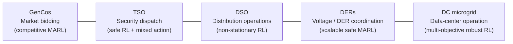

# 快速开始

本页先介绍构成 PowerZoo 研究面的**五大基准系列**，再用四步演示如何从一个空白 Python 环境得到一个训练好的 RL agent。

## 1. 安装

PowerZoo 需要 **Python 3.11+**，使用 [uv](https://github.com/astral-sh/uv) 做依赖管理。

```bash
conda create -n powerzoo python=3.11 -y
conda activate powerzoo

pip install uv
git clone https://github.com/powerzoojax/PowerZooPy.git
cd PowerZooPy

uv sync --python "$(which python)"

uv sync --python "$(which python)" --extra rl
pip install h5py
```

`rl` 这个 extra 会装上 Stable-Baselines3、PettingZoo、RLlib、PyTorch 和 Gymnasium。`h5py` 仅在你要录制离线数据集时才需要。

验证：

```bash
uv run python -c "import powerzoo; print(powerzoo.__version__)"
```

## 2. 五大基准系列

PowerZoo 把旗舰基准面组织成**五个以 agent 为中心的任务系列**。每个系列针对一个不同的 RL 研究问题，并使用不同的物理载体、agent 结构、动作空间和约束类型；因此任意两个系列至少在四个维度上不同。这五个系列是论文级实验的推荐起点。



| 系列 | 物理载体 | RL 研究问题 | PowerZoo 公开任务 |
|---|---|---|---|
| **GenCos** — 市场竞价 | 输电网 `Case5` + `BidBasedMarketEnv` | 含私有信息与爬坡耦合报价的竞争式 MARL | `gencos_bidding` — 见 [Benchmarks · GenCos](benchmarks/gencos.md) |
| **TSO** — 安全调度 | 输电网 `Case5` / `Case118` + DC/AC OPF | 含离散-连续混合动作的 Safe RL | `marl_uc`（UC, `Case5`）、`opf_118` / `opf_118_7d`（大规模经济调度, `Case118`） — 见 [Benchmarks · TSO](benchmarks/tso.md) |
| **DSO** — 配电运行 | 配电网 `Case33bw` + 6× `FlexLoad` + Ausgrid 实测曲线 | 带运行质量 reward 的非平稳单智能体 RL | `make_dso_env(...)` 工厂 — 见 [Benchmarks · DSO](benchmarks/dso.md) |
| **DERs** — 电压 / DER 协调 | 配电网 `Case33bw` / `Case118zh` + 异构 DER | Dec-POMDP 上带硬电压约束的可扩展 Safe MARL | `marl_der_arbitrage`（`Case33bw`，3 个电池）、`marl_ders_benchmark`（`Case118zh`，12 个异构 DER） — 见 [Benchmarks · DERs](benchmarks/ders.md) |
| **DC microgrid** — 数据中心 | 自包含直流微电网（`DCMicrogridEnv`，无外部电网） | 含 workload + 热力 + 碳排权衡的多目标稳健 RL | `dc_microgrid`、`dc_microgrid_safe`（CMDP 变体） — 见 [Benchmarks · DC microgrid](benchmarks/dc-microgrid.md) |

**表格阅读说明**：一个**系列**汇集共享同一个 RL 研究问题的若干任务。右侧列出的是具体 env 名称，可以直接传给 `make_task_env(...)`（DSO 用 `make_dso_env(...)`）；下文都使用这些名字。每个系列的 env 设计、observation / action / reward / cost 合约与 OOD 切分见 [Benchmarks](benchmarks/overview.md)；底层物理见 [Physics](physics/transmission.md)；所有基准都遵守的 env API 合约见 [Concepts · Python contract](concepts/python-contract.md)。

> 较小的起步 env 不在五大旗舰系列中、但仍然是公开基准任务：`battery_arbitrage`（单电池套利）、`marl_opf`（5-bus MARL 经济调度）、`marl_ev_v2g`（EV 车队 V2G）、`dc_scheduling`（配电网下的数据中心调度）。它们是单元测试和快速迭代的首选起点；可运行示例见 [Examples](examples/index.md)。

## 3. 第一个任务 — 跑一个基准 episode

`make_task_env` 是 PowerZoo 的推荐入口：它构造一个带固定 train/val/test 切分的基准任务，并自动给出正确的多智能体或单智能体接口。

```python
from powerzoo.tasks import make_task_env, list_public_tasks

print(list_public_tasks())
```

在 IEEE 5-bus 上用 PettingZoo Parallel API 跑一个 multi-agent OPF episode：

```python
env = make_task_env("marl_opf", split="train", framework="pettingzoo")
obs, info = env.reset(seed=42)

while env.agents:
    actions = {a: env.action_space(a).sample() for a in env.agents}
    obs, rewards, terminations, truncations, info = env.step(actions)

print("episode done")
```

单智能体任务（如 `battery_arbitrage`、`dc_scheduling`、`dc_microgrid`）返回标准 Gymnasium env，照常用五元组循环：

```python
env = make_task_env("battery_arbitrage", split="train")
obs, info = env.reset(seed=0)
terminated = truncated = False
while not (terminated or truncated):
    obs, reward, terminated, truncated, info = env.step(env.action_space.sample())
```

> `framework='pettingzoo'` 这条路径会在 episode 结束时清空 `env.agents`，方便用 `while env.agents` 这种写法。默认的 `framework='auto'` 返回底层的 RLlib 风格 adapter，需要你检查 `terminated.get("__all__")` 和 `truncated.get("__all__")`。两条路径的 reward、cost、observation 语义完全一致——见 [Concepts · Python contract](concepts/python-contract.md)。

## 4. 第一次评估 — 得到一个 normalized score

只要有任意策略，`evaluate` 就能给出可复现的基准数字——平均 episode return、normalized score（0 = random baseline，1 = oracle baseline），以及在有 cost 信号时的 CMDP 成本统计。

```python
from powerzoo.wrappers import GymnasiumWrapper
from powerzoo.benchmarks.policies import RandomPolicy
from powerzoo.benchmarks import evaluate

gym_env = GymnasiumWrapper(make_task_env("marl_opf", split="test"))
result = evaluate(
    RandomPolicy(gym_env.action_space),
    gym_env,
    n_episodes=10,
    task_id="marl_opf",
)

print(f"mean reward       : {result['mean_reward']:.2f}")
print(f"normalized score  : {result['normalized_score']}")
print(f"mean episode cost : {result['mean_episode_cost']:.4f}")
print(f"cost violation %  : {result['cost_violation_rate']}")
```

normalized score 可以让你跨任务比较，无需关心每个问题的原始 reward 量级。计算公式见 [Examples Overview](examples/index.md)。

## 5. 第一次训练 — 一行 `powerzoo.rl` 代码

`powerzoo.rl` 是统一的 RL 入口。`make_env` 生成一个可直接训练的 env（可选归一化、预测窗口、Safe-RL 包装）；`Trainer` 在 Stable-Baselines3 之上提供任务感知的默认配置。

```python
from powerzoo.rl import make_env, Trainer

env = make_env("battery_arbitrage", split="train", normalize=True, seed=0)
print(env.observation_space, env.action_space)

trainer = Trainer("battery_arbitrage", algorithm="SAC", total_timesteps=100_000)
trainer.train()
results = trainer.evaluate(split="test")
print(results)
```

完整的训练选项——包括 YAML 配置、MARL 训练和 reward 覆盖——见 [Training · Trainers](training/trainers.md) 和 [Training · Presets](training/presets.md)。

## 下一步

| 主题 | 链接 |
|---|---|
| 三条主线与 Python API 合约 | [Concepts · Overview](concepts/overview.md)、[Python contract](concepts/python-contract.md) |
| 为什么电网在物理上不同于典型 RL 基准 | [Concepts · Power systems primer](concepts/power-systems-primer.md) |
| 分层架构（envs / resources / tasks / wrappers） | [Architecture · Environment stack](architecture/env-stack.md)、[Repository map](architecture/repo-map.md) |
| 底层物理（输电 / 配电 / 资源 / 市场 / 微电网） | [Physics](physics/transmission.md) |
| 各系列的基准卡片（TSO、DSO、DERs、DC microgrid、GenCos） | [Benchmarks](benchmarks/overview.md) |
| 完整的 RL 训练参考（wrappers、trainers、YAML 预设、自定义循环） | [Training](training/trainers.md) |
| 底层 grid + resource API（不经过任务封装） | [Examples 01–03](examples/index.md) |

---

## 术语表

文档中反复出现的术语速查。每条定义只写一句；更深入的解释，物理部分见 [Concepts · Power systems primer](concepts/power-systems-primer.md)，env API 部分见 [Concepts · Reward and cost split](concepts/reward-cost-split.md) 与 [Python contract](concepts/python-contract.md)。

| 术语 | 一句话含义 |
|---|---|
| **PF**（Power Flow，潮流） | 在固定注入下求解电压和线路潮流——电网的物理 step。 |
| **OPF**（Optimal Power Flow，最优潮流） | 求解 PF *并且* 调度发电机以在限制下最小化成本。 |
| **DCPF / DCOPF** | 线性化的 PF / OPF（只考虑有功，电压假设 1 pu）——快速、凸。 |
| **ACPF / ACOPF** | 包含无功和电压幅值的完整非线性 PF / OPF。 |
| **BFS**（Backward-Forward Sweep，前推回代） | 辐射状配电馈线的迭代潮流求解器。 |
| **PTDF**（Power Transfer Distribution Factor，功率传输分布因子） | 灵敏度矩阵，`line_flow ≈ PTDF · injection`，DCPF 使用。 |
| **LMP**（Locational Marginal Price，节点边际电价） | 节点功率平衡约束的对偶变量——某个节点多 1 MW 的边际成本。 |
| **UC**（Unit Commitment，机组组合） | OPF 加上二元开/关决策、最小开停机时间和爬坡约束。 |
| **SCED / SCUC** | Security-Constrained ED / UC：带线路与 N-1 约束的 OPF / UC。 |
| **SOC**（State Of Charge，荷电状态） | 电池储能与容量之比，0–1；是耦合相邻 step 的积分器状态。 |
| **G2V / V2G** | Grid-to-Vehicle（充电）/ Vehicle-to-Grid（放电回送电网）。 |
| **DER**（Distributed Energy Resource，分布式能源资源） | 配电馈线上的小机组、电池或可控负荷。 |
| **DSO / TSO** | Distribution / Transmission System Operator——配电 / 输电系统运营商。 |
| **DR**（Demand Response，需求响应） | 根据电网信号或电价削减或转移负荷。 |
| **PUE**（Power Usage Effectiveness） | 数据中心指标：总设施功率 / IT 设备功率（越低越好）。 |
| **COP**（Coefficient of Performance，性能系数） | 制冷效率：每单位电输入移除的热量。 |
| **CMDP** | 约束 MDP——在期望 cost ≤ 预算下最大化 reward。 |
| **MARL** | Multi-Agent RL，多个策略在一个共享环境中行动。 |
| **MDP / Dec-POMDP** | （去中心化、部分可观测的）马尔可夫决策过程。 |
