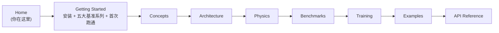
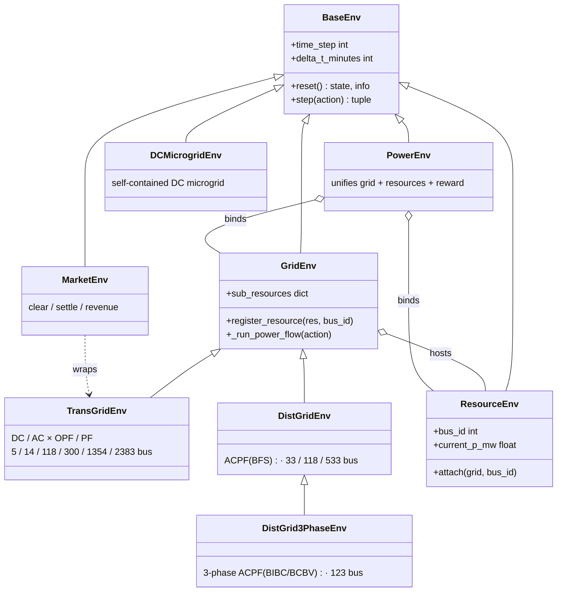

# PowerZoo

**PowerZoo** 是一个面向强化学习（RL）研究的电力系统仿真框架。它把输电网、配电馈线、可控资源（电池、电动汽车、光伏、风电、柔性负荷、数据中心）、独立的直流微电网、以及竞争式电力市场都封装成 Gymnasium / PettingZoo / RLlib 兼容的环境，全部基于真实的半小时分辨率电网时序数据。

## 为什么电力系统对 RL 来说很难

电力系统在一个物理模型中同时包含了若干 RL 研究的开放问题。PowerZoo 的每个任务都聚焦其中的一个或几个。

| 难点 | 为什么难 | 出现在哪里 |
|---|---|---|
| **硬安全约束** | 一次电压或热稳越限就可能引发连锁停电。reward shaping 无法保证可行性——需要 CMDP / Safe-RL 的形式化框架。 | 所有电网任务；`SafeRLWrapper` 暴露独立的 cost 通道。 |
| **耦合的多智能体决策** | 发电机共享输电线路；DER 共享同一条馈线。某个 agent 的动作会通过潮流物理改变所有其他 agent 的可行集，且没有显式通信通道。 | `marl_opf`、`marl_uc`、`opf_118`、`marl_ders_benchmark`。 |
| **长时序信用分配** | 凌晨 3 点低价充满电池，傍晚 18 点才能卖出获利，跨越 30+ 步。EV 必须提前数小时达到出发 SOC。 | `battery_arbitrage`、`marl_der_arbitrage`、`marl_ev_v2g`。 |
| **离散-连续混合动作** | 机组组合（UC）一步内既要决定开/关（二元），又要决定功率设定（连续），还要满足最小开/停机时间。 | `marl_uc`。 |
| **非平稳的外生驱动** | 负荷、光伏、风电、电价随季节、天气、星期变化。策略必须在分布漂移下泛化，而不是记住一条轨迹。 | 所有任务（基于真实英国电网数据，固定 train/val/test 切分）。 |
| **部分可观测** | 配电网 agent 看得到本地电压，但看不到上游状态；输电网 agent 看到节点注入，但看不到各 DER 的 SOC。 | 所有任务，可配置的观测模式。 |
| **目标冲突** | 经济成本 vs 安全 vs SOC 目标 vs SLA——存在 Pareto 权衡，没有单一最优策略。 | `marl_ev_v2g`、`dc_scheduling`、`dc_microgrid`、Safe-RL 任务。 |

这些难点**来自物理**，而不是来自人为复杂的 API。PowerZoo 把接口设计得尽量简洁，难度留在问题本身、而不在 API。

> **术语速查**：*CMDP* = Constrained Markov Decision Process，带一个或多个 cost 预算约束的标准 MDP。*DER* = Distributed Energy Resource，分布式能源资源，配电网级别的小机组、电池、柔性负荷等。*OPF* = Optimal Power Flow，最优潮流，在满足电网约束下最便宜的发电分配。*SOC* = State Of Charge，电池荷电状态，0–1 之间。完整术语表见[快速开始](getting-started.md)末尾。

## 文档怎么阅读



八个内容板块层层递进：

1. **[Getting Started](getting-started.md)** — 安装、认识五大基准系列、跑通一个任务、评估一个策略、训练一个 agent。
2. **[Concepts](concepts/overview.md)** — 三条主线、Python API 合约、reward / cost 分离、面向 ML 读者的电力系统入门。
3. **[Architecture](architecture/repo-map.md)** — 仓库地图、环境栈、数据管线、训练管线。
4. **[Physics](physics/transmission.md)** — 输电网、配电网、资源、市场、微电网。
5. **[Benchmarks](benchmarks/overview.md)** — 五个旗舰任务系列（TSO、DSO、DERs、DC microgrid、GenCos）以及总览。
6. **[Training](training/wrappers.md)** — wrappers、trainers、presets、自定义循环。
7. **[Examples](examples/index.md)** — 简短脚本，覆盖从原始电网搭建到 RL 训练的流程。
8. **API Reference** — 由 `mkdocstrings` 渲染的类签名。

## 30 秒示例

`make_task_env` 是推荐的顶层入口。它构造一个带固定 train/val/test 切分的基准任务：

```python
from powerzoo.tasks import make_task_env

env = make_task_env("marl_opf", split="train", framework="pettingzoo")
obs, info = env.reset(seed=42)

while env.agents:
    actions = {a: env.action_space(a).sample() for a in env.agents}
    obs, rewards, terminations, truncations, info = env.step(actions)

print("episode finished")
```

要拿到原始的 grid + resource handle（不经过任务封装）——例如设计一个新基准时——见 [Example 03 — Register Resources](examples/03_register_resource.md)。

## 架构一览



完整设计——包括 `PowerEnv` 编排层、resource 的 cost 约定、数据加载工具——记录在 [Architecture · Environment stack](architecture/env-stack.md)。
