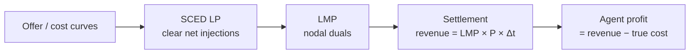

# 市场

PowerZoo 的市场层在 `TransGridEnv` 之上叠加一个清算 / 结算循环，并把节点边际电价（LMP）作为 agent 主要可见的信号。三个 env 分别面向三个不同的研究问题：

| Env / 任务 | 谁决定报价？ | LMP 反映什么 | 典型研究目标 |
|---|---|---|---|
| `CostBasedMarketEnv` | 没人（恒为真实边际成本 `mc_c · p`） | 真实的系统边际成本 | 在无拥塞 LMP 上做 DER 套利 |
| `BidBasedMarketEnv` | 每 episode 内冻结的静态分段报价（成本 + 可选加成） | 基于报价的分配（与成本解耦） | 带真实 LMP 的 DER 套利 |
| `GenCosMARLEnv`（`gencos_bidding`） | 每个 agent 每步通过一个 3 段加成向量决定 | MARL 报价下的分配 | 策略性报价、市场力、习得式定价 |

> **术语速查**。*LMP*（Locational Marginal Price，节点边际电价）是节点功率平衡约束的对偶变量：当某个 bus 多出 1 MW 需求时系统总成本会增加多少。无拥塞时它等于系统边际成本；拥塞时，被约束侧的 bus LMP 更高。*SCED*（Security-Constrained Economic Dispatch）是把提交的报价作为 LP 目标函数的 OPF。

三种 env 共享同一套调度循环：



三者间唯一变化的是**谁提供报价曲线，以及多久提供一次**。电网求解、LMP 计算与结算公式三者共用。

## `CostBasedMarketEnv` — 无拥塞 LMP 上的套利

这是最简单的市场。发电机成本恒定（`C_i(P) = mc_{c,i} \cdot P`），不提交报价，LMP 直接来自基于成本的 DC-OPF 对偶。一台电池挂在指定 bus 上，agent 在每个 step 决定其功率设定。

- **Action**：`Box(1)` 电池设定，范围 `[-power_mw, +power_mw]`。
- **Observation**：`[soc, lmp_norm, time_sin, time_cos, total_demand_norm]`。
- **Reward**：`LMP × P_net × Δt`。安全违反留在 `info['cost_*']`。

```python
from powerzoo import CostBasedMarketEnv
env = CostBasedMarketEnv(difficulty='medium')
obs, info = env.reset(seed=42)
obs, reward, terminated, truncated, info = env.step(env.action_space.sample())
```

适合在干净的价格信号上研究时间套利：此时 LMP 等于系统在每个 bus 上对能量的真实边际估值。

## `BidBasedMarketEnv` — 真实 LMP，静态报价

`BidBasedMarketEnv` 引入**分段线性报价曲线**。默认报价由真实成本派生，可附加随机加成；也支持从外部提供。报价**在一个 episode 内冻结**：在 `reset()` 时生成一次，直到下一次 `reset()` 都保持不变。市场以网络约束 SCED 在这些报价上清算，LMP 来自基于报价分配的 LP 对偶。

这里的电池是**产消者**：它不提交报价，但其净注入作为节点负荷偏移进入 SCED，因而*会*影响 LMP。在某 bus 放电会减少本地净负荷，可能拉低当地 LMP；充电则相反。

- **Action**：与 cost-based 相同——电池设定。
- **Observation**：`[soc, lmp_norm, time_sin, time_cos, demand_norm, mean_offer_price_norm]`。
- **Reward**：`LMP × P × Δt`（基于结算；电池本身没有"真实成本"）。

当你希望在不引入策略性报价 agent 的前提下，用更真实的 LMP 序列做 DER 套利研究时，使用这个 env。

## `GenCosMARLEnv` — 策略性报价（`gencos_bidding`）

`GenCosMARLEnv` 是唯一由多个**独立 agent** 每步提交报价的市场 env。`Case5` 上每台发电机对应一个 agent（共 5 个），每个 agent 输出一个 `Box(3)` 加成向量，排序后形成 3 段单调报价曲线。市场用 `solve_piecewise_ed_opf` 清算；爬坡约束耦合相邻 step，分配决策不会在每步之间被重置。

- **Action**：每 agent 一个 `Box(3) ∈ [-1, 1]` 加成标量，排序后保证单调。
- **Observation**：12 维私有向量——自身成本 / 容量 / 上轮分配 / 上轮利润 / 爬坡余量、需求预测、时间，以及 4 步 LMP 历史。
- **Reward**：每 agent 的分配利润 `LMP[node_i] · P_i · Δt - TC_i(P_i) · Δt`。
- **Episode**：48 步 × 30 min（滚动市场）。`t` 步的爬坡限制约束 `t+1` 步的 `[p_min_rt, p_max_rt]`。

```python
from powerzoo.envs.market import make_gencos_env

env = make_gencos_env()
obs, info = env.reset(seed=0)
while env.agents:
    actions = {ag: env.action_spaces[ag].sample() for ag in env.agents}
    obs, rewards, terms, truncs, info = env.step(actions)
```

或通过 task registry：

```python
from powerzoo.tasks import make_task_env
env = make_task_env('gencos_bidding', framework='pettingzoo')
```

完整的基准卡片——含 baseline、OOD 切分与指标——见 [Benchmarks · GenCos](../benchmarks/gencos.md)。

## 三者怎么选

```mermaid
flowchart TB
    Q1{Do you want to learn\nthe offer curve itself?}
    Q1 -->|yes| GC["GenCosMARLEnv\n(gencos_bidding)"]
    Q1 -->|no| Q2{Do you want LMP to be\noffer-based (realistic)?}
    Q2 -->|yes| BB[BidBasedMarketEnv]
    Q2 -->|no, prefer true cost| CB[CostBasedMarketEnv]
```

简而言之：**cost-based** 用于无拥塞场景下的套利研究；**bid-based** 用于在不引入报价 agent 的前提下获得更真实的 LMP；**GenCos** 用于策略性报价 MARL。

## 另见

- [Transmission physics](transmission.md) — LMP 所依赖的底层 DC / AC OPF。
- [Resources](resources.md) — `BatteryEnv` 与 `FlexLoad` 与市场的交互方式。
- [Benchmarks · GenCos](../benchmarks/gencos.md) — 面向 agent 的基准卡片。
- [API · Markets](../api/market.md) — 类签名。
