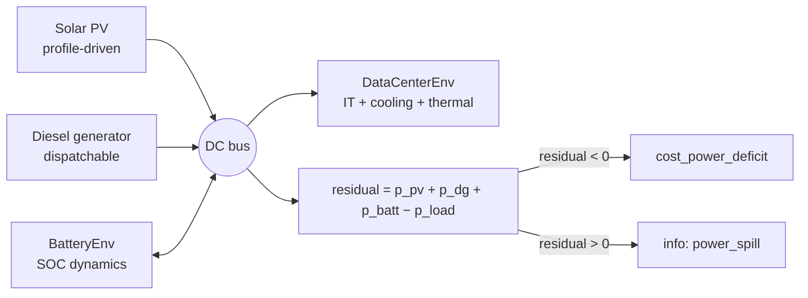

# 微电网

`DCMicrogridEnv`（`powerzoo/envs/microgrid/dc_microgrid_env.py`）是一个**自包含的表后微电网**环境。与其他所有 PowerZoo env 不同，它**没有外部电网连接**。功率平衡在内部强制满足；功率缺额是真实的 CMDP cost，而不是被大电网吸收的设定值。

env 把已有的 PowerZoo 资源（`DataCenterEnv`、`BatteryEnv`）与内联光伏、柴油机组合在一起：



## 功率平衡

每一步，DC 母线强制满足：

```
residual      = p_pv + p_dg + p_batt − p_load
power_deficit = max(−residual, 0)   → cost_power_deficit
power_spill   = max(+residual, 0)   → info only
```

没有 slack 节点。如果策略在光伏低、电池接近空载时仍过度承诺 IT 负荷，就会直接付出 deficit cost。

## 动作与观测空间

| 维 | 动作 | 范围 | 含义 |
|---|---|---|---|
| 0 | `train_sched_rate` | `[0, 1]` | 本步调度的训练任务比例。 |
| 1 | `ft_sched_rate` | `[0, 1]` | 本步调度的微调任务比例。 |
| 2 | `cooling_setpoint_norm` | `[0, 1]` | 归一化的冷却设定值。 |
| 3 | `battery_power_norm` | `[-1, 1]` | 电池功率；正值 = 放电。 |
| 4 | `dg_power_norm` | `[0, 1]` | 柴油机出力（0 表示关闭）。 |

18 维 observation 包含 IT（CPU / 内存利用率）、workload 队列（训练 / 微调充满度、紧急度）、热状态（区域温度、室外温度、COP 比）、发电（光伏容量因子、SOC、柴油机余量）、上一步动作向量与时间编码（sin / cos）：

```
[cpu_util, mem_util,
 q_train_fill, q_ft_fill, queue_urgency,
 zone_temp_norm, outdoor_temp_norm, cop_ratio,
 solar_cf, soc, dg_margin_norm,
 last_action_norm[5],
 sin(t), cos(t)]
```

## Reward 与 cost

标量 reward 是**标量化的三项目标**：

\[
r_t \;=\; r_{\text{energy}} \;+\; w_{\text{cost}} \cdot r_{\text{cost}} \;+\; w_{\text{carbon}} \cdot r_{\text{carbon}}
\]

分量向量同时在 `info["reward_vector"] = [r_energy, r_cost, r_carbon]` 中给出。各分量：

- `r_energy = -(p_dc_mw * dt_h)` — IT 总能量（MWh，负值）。
- `r_cost = -(fuel_cost + |p_batt| * dt_h * battery_deg_cost_per_mwh)` — 燃料 + 电池磨损（负值）。
- `r_carbon = -carbon_kg` — 柴油 CO₂ 排放（kg，负值）。

CMDP cost 通道使用三个独立分量：

| 键 | 单位 | 含义 |
|---|---|---|
| `info["cost_sla"]` | 计数 | 本步 SLA 违反次数。 |
| `info["cost_overtemp"]` | °C | `max(t_zone − t_critical, 0)`。 |
| `info["cost_power_deficit"]` | – | `max(p_load − p_supply, 0) / max(p_load, 1e-6)`（归一化）。 |
| `info["cost"]` | – | 三项之和。`info["cost_sum"]` 是向后兼容的别名。 |

典型 episode 长度为 **288 步 × 5 min = 24 h**。

## 外生曲线

曲线可通过 `set_profiles(cpu, solar, temp)` 注入，或在构造时传入。全部为 1-D NumPy float32 数组，按步循环索引。`None` 时回退到合成的昼夜曲线。

`powerzoo.data.dc_microgrid_profiles` 提供规范的曲线 loader，包含基准评估切分所用的 OOD 变换——见 [Benchmarks · DC microgrid](../benchmarks/dc-microgrid.md)。

## 为什么这是一个独立基准

- **没有外部电网作为后备**。功率缺额是硬 cost，不是设定值。过度承诺 IT 负荷的朴素策略无法依赖电网兜底。
- **本身就是多目标**。`info["reward_vector"]` 是真正的三维向量——能量、货币成本、碳排放属于不同维度，无法用单一权重合并。
- **异构动作向量**。一个 5 维动作把调度、温控、发电设定组合在一起，构成混合控制架构的小规模基准。

## 另见

- [Resources](resources.md) — 微电网中使用的 `DataCenterEnv` 与 `BatteryEnv`。
- [Benchmarks · DC microgrid](../benchmarks/dc-microgrid.md) — 面向 agent 的基准卡片，含切分、baseline 与指标。
- [Reward and cost split](../concepts/reward-cost-split.md) — 标量 `info["cost"]` 如何接入 Safe-RL wrapper。
