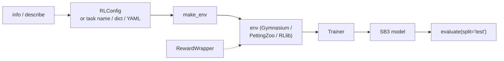

# Trainers

`powerzoo.rl` 是**统一的 RL 入口**。它隐藏了单 agent / 多 agent 任务、framework 选择（Gymnasium / PettingZoo / RLlib）、常见 wrapper 栈（forecast、normalisation、safe-RL）之间的差异。



| 符号 | 一句话说明 |
|---|---|
| `make_env` | 从 task 名、dict 或 YAML / `RLConfig` 构建一个可直接训练的 env。 |
| `RLConfig` | 一个 dataclass，统一保存 task + wrappers + reward + trainer + framework + seed。 |
| `RewardWrapper` | 替换单 agent env 的 reward，但不修改 cost 通道。 |
| `Trainer` | SB3 的轻量封装，提供 `train`、`train_il`、`train_marl_simultaneous`、`evaluate`、`save`、`load`。 |
| `info` / `describe` | 结构化 / 可读形式的任务自省（spaces、合约、配置模板）。 |

> **术语速查**。*SB3* = Stable-Baselines3（一个常用的 PyTorch RL 库，这里用于 SAC / PPO / TD3）。*IL* = Independent Learners（每个 agent 一个独立 SB3 模型，训练时其他 agent 保持固定）。

## `make_env` — 一行构建 env

`make_env` 接受四种输入形式，应用标准 wrapper 栈，返回 Gymnasium env（单 agent）或 PettingZoo / RLlib env（多 agent）。

```python
from powerzoo.rl import make_env

env = make_env('battery_arbitrage', split='train')
env = make_env('marl_opf', framework='pettingzoo')
env = make_env(
    {'grid': {'type': 'transmission', 'case': 'case5'}, 'resources': []},
    reward={'type': 'zero'},
)
env = make_env('my_experiment.yaml')
```

Wrapper 栈（仅作用于单智能体 env；对 MARL 静默忽略）：

| 参数 | 作用 |
|---|---|
| `reward=...` | `RewardWrapper` 替换 reward（callable 或 reward-type dict）。 |
| `forecast_horizon=N` | `ForecastWrapper` 在 obs 末尾追加 `N` 个未来需求值。 |
| `normalize=True` | `NormalizationWrapper` 把 obs（可选 action）缩放到 `[-1, 1]`。 |
| `safe_rl=True` | `GymnasiumSafeWrapper` 把 `selected_constraint_costs` 投影成标量 `info['cost']`。 |
| `cost_threshold=...` | 转发给 `GymnasiumSafeWrapper`。 |
| `seed=...` | 立即调用 `env.reset(seed=...)`。 |

对 MARL env，单 agent 专用的 wrapper 会发出警告并被跳过。若要覆盖多智能体任务的 reward，请在 `make_env` 构建之前在 task 配置里设置 `reward` 键。

## `RLConfig` — 统一管理超参

`RLConfig` 是一个 dataclass。推荐做法是每个实验保留一份 YAML 后加载使用；具体模板见 [Presets](presets.md)。

```python
from powerzoo.rl import RLConfig

cfg = RLConfig.from_yaml('battery_sac.yaml')
cfg.validate()

cfg = RLConfig(
    task_name='battery_arbitrage',
    algorithm='SAC',
    total_timesteps=200_000,
    save_path='./results/',
)
```

`RLConfig.validate()` 检查 5 个条件：

1. `task_name` / `task_config` 恰好设置了一个。
2. `algorithm ∈ {SAC, PPO, TD3}`。
3. `framework ∈ {auto, rllib, pettingzoo}`。
4. `split ∈ {train, val, test}`。
5. `safe_rl=True` 时配套给出 `cost_threshold`（未给出会发出警告）。

## `RewardWrapper` — 替换 reward，保留 cost

`RewardWrapper` 替换单 agent env 的标量 reward。CMDP cost 信号（`info['constraint_costs']`、`info['selected_constraint_costs']`、`info['cost_sum']`）原样透传；兼容 wrapper 生成的标量 `info['cost']` 也会保留。

```python
from powerzoo.rl import make_env, RewardWrapper

env = make_env('battery_arbitrage')
env = RewardWrapper(env, {'type': 'lmp_arbitrage', 'profit_weight': 2.0})

def my_reward(state, info):
    return -abs(state['grid']['line_flow_norm']).sum()

env = RewardWrapper(env, my_reward)
```

对 MARL env，reward 在 task adapter 内部计算——应在 task / adapter 层覆盖 reward，而不是在这里。

## `MDPFallbackRewardWrapper` — reward-only / MARL 的诚实 fallback

没有一阶 constrained optimizer 的训练路径使用标准化 fallback：

```python
from powerzoo.rl import MDPFallbackRewardWrapper

env = MDPFallbackRewardWrapper(env)  # reward_fallback = env_reward - w·selected_constraint_costs
```

wrapper 会把原始 reward 保存在 `info["env_reward"]`，并把 fallback 后的 reward 写成 `info["reward_fallback"]`，便于区分“CMDP env + MDP fallback”和真正的 constrained optimizer。

## `Trainer` — 一行调用 Stable-Baselines3

`Trainer` 对 SB3（`SAC`、`PPO`、`TD3`）做了延迟导入。单 agent 流程最简单：

```python
from powerzoo.rl import Trainer

t = Trainer('battery_arbitrage', algorithm='SAC', total_timesteps=200_000)
t.train()
results = t.evaluate(split='test')
t.save('./results/')
```

MARL 任务有两种训练策略：

```python
t = Trainer('marl_opf', framework='pettingzoo')
t.train_il(total_timesteps=50_000)

t = Trainer('marl_opf', framework='pettingzoo', algorithm='SAC')
t.train_marl_simultaneous(total_timesteps=200_000)
```

- `train_il` 依次对每个 agent 调用 SB3 `.learn()`（其他 agent 使用默认策略）。要求各 agent 的 space 同构。
- `train_marl_simultaneous` 每个 env step 执行一次 PettingZoo step，并同时更新所有 agent（仅 SAC）。实现位于 `powerzoo/rl/marl_simultaneous_sb3.py`。

其他 framework（EPyMARL、MAPPO、自定义循环）请调 `t.get_env()` 直接接入——见 [Custom loops](custom-loops.md)。

## `info` / `describe` — 任务自省

```python
from powerzoo.rl import info, describe

print(describe('marl_opf'))
d = info('battery_arbitrage')
print(d['observation_space'])
print(d['reward'])
print(d['config_template'])
```

`info(...)` 返回一个 dict，含 `task_id`、`description`、`agent_mode`、`difficulty`、`observation_space`、`action_space`、`reward`、`cost`、`splits`、`eval_protocol` 以及可直接用作 YAML 的 `config_template`。设 `format='json'` 可得到字符串形式。`describe(...)` 返回与之等价的可打印摘要。

可用它们快速生成新实验的 YAML，或用于 AI 驱动的配置生成。

## 推荐工作流

```mermaid
flowchart TB
    A[Pick task name] --> B{single-agent?}
    B -->|yes| C["Trainer(name, algorithm='SAC')\n.train().evaluate('test')"]
    B -->|no| D["Trainer(name, framework='pettingzoo')\n.train_il() or .train_marl_simultaneous()"]
    A --> E[Or write YAML, load with RLConfig.from_yaml]
    E --> F[Trainer(cfg).train().evaluate()]
```

经验法则：

- **单 agent 任务、需要快速迭代**：`make_env(name, normalize=True)` + 自定义 SB3 循环，或直接 `Trainer(name).train()`。
- **MARL 任务、使用现成的 SB3 算法**：`Trainer(name, framework='pettingzoo').train_il(...)`。
- **自定义 MARL framework（EPyMARL、MAPPO、JaxMARL……）**：`Trainer(name, framework='pettingzoo').get_env()` 后直接接入。
- **Safe RL 兼容接口**：`make_env(name, safe_rl=True, cost_threshold=...)`，每步从兼容别名 `info['cost']` 中读取选中约束的标量投影。

## 另见

- [Wrappers](wrappers.md) — `make_env` 的参数对应到哪些 wrapper。
- [Presets](presets.md) — 每个基准系列的现成 YAML 配置。
- [Custom loops](custom-loops.md) — 如何绕过 `Trainer` 自定义循环。
- [API · Wrappers](../api/wrappers.md)、[API · Tasks](../api/tasks.md)、[API · Offline](../api/offline.md)。
